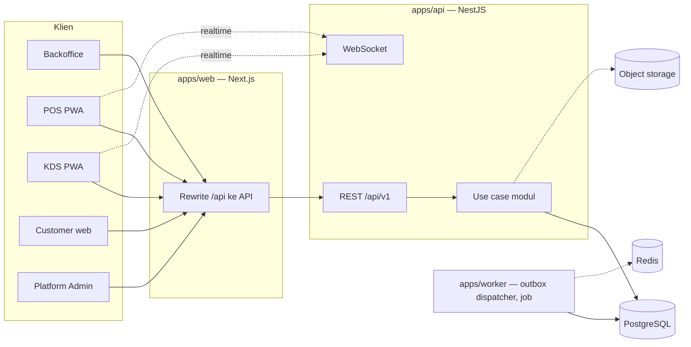

# Architecture — Cafe Companion Pro

**Status:** Kontrak arsitektur
**Tanggal:** 2 Oktober 2026
**Bentuk:** TypeScript modular monolith, multi-workspace, PostgreSQL, web/PWA online-first

Dokumen ini menetapkan batas teknis. Rincian per lapisan ada di dokumen pendamping:

| Topik                             | Dokumen                                  |
| --------------------------------- | ---------------------------------------- |
| Tabel, kolom, relasi              | [`schema.md`](./schema.md)               |
| Struktur dan aturan kode backend  | [`backend.md`](./backend.md)             |
| Struktur dan aturan kode frontend | [`frontend.md`](./frontend.md)           |
| Kontrol keamanan                  | [`security.md`](./security.md)           |
| Lingkungan dan rilis              | [`deploy.md`](./deploy.md)               |
| Cakupan produk                    | [`../product/prd.md`](../product/prd.md) |

Bila dokumen ini bertentangan dengan dokumen produk, dokumen produk berlaku untuk cakupan, capability, dan limit. Perubahan teknis yang menyimpang dicatat sebagai keputusan di bagian 15.

---

## 1. Tujuan

- Satu codebase melayani paket F&B dan pembelian satu modul.
- Satu modul berjalan mandiri maupun terintegrasi tanpa logika bisnis kedua.
- Mengaktifkan modul tidak membutuhkan fork, deploy, atau skema khusus pelanggan.
- Backend yang sama melayani web, POS, KDS, API, dan kelak mobile.
- Data, izin, audit, entitlement, dan limit tidak tercampur.
- Deployment Release 1 tetap sederhana.

## 2. Gambaran sistem



Web dan API diakses dari origin yang sama: Next.js meneruskan `/api/*` ke API, sehingga cookie sesi bersifat first-party.

## 3. Stack

Stack sudah terpasang dan tidak diganti. Versi dikunci di `pnpm-lock.yaml`.

| Area             | Pilihan                                                | Status di repo                                                       |
| ---------------- | ------------------------------------------------------ | -------------------------------------------------------------------- |
| Bahasa           | TypeScript strict                                      | Terpasang (6.0)                                                      |
| Runtime          | Node.js 24                                             | Terpasang                                                            |
| Monorepo         | pnpm workspace + Turborepo                             | Terpasang                                                            |
| Web              | Next.js App Router + React 19                          | Terpasang (Next 16)                                                  |
| API              | NestJS 11                                              | Terpasang                                                            |
| Validasi/kontrak | Zod 4 di `packages/contracts`                          | Terpasang                                                            |
| Database         | PostgreSQL + Prisma 7 (adapter `pg`)                   | Terpasang                                                            |
| Styling          | Tailwind CSS 4 + CSS variables                         | Terpasang                                                            |
| Perilaku UI      | Radix primitives                                       | Terpasang                                                            |
| Tema             | `next-themes`                                          | Terpasang                                                            |
| Font             | Geist                                                  | Terpasang                                                            |
| Chart            | ApexCharts + `react-apexcharts`                        | Terpasang di `packages/ui`                                           |
| Drag-and-drop    | `@dnd-kit/react` + `@dnd-kit/dom`                      | Terpasang                                                            |
| Realtime         | Socket.IO (server dan klien)                           | Paket terpasang; gateway belum dibuat                                |
| Component bank   | Storybook 10 + Playwright smoke                        | Terpasang                                                            |
| Test             | Vitest + Testing Library + axe (UI); `node:test` (API) | Terpasang                                                            |
| Ikon             | Tabler Icons (`@tabler/icons-react`)                   | Terpasang                                                            |
| i18n             | `next-intl` (tanpa plugin build)                       | Terpasang                                                            |
| Server state     | TanStack Query                                         | Terpasang                                                            |
| Form             | React Hook Form + Zod                                  | **Belum**                                                            |
| State lokal      | Zustand (hanya keranjang POS dan editor tata letak)    | **Belum**                                                            |
| Queue            | Redis + BullMQ                                         | **Ditunda** sampai ada job pertama                                   |
| Object storage   | S3-compatible                                          | **Ada** — unggah lewat URL bertanda tangan (`core/files`), tanpa SDK |

Empat paket yang belum terpasang dipasang pada tahap fondasi UI, bukan sebelumnya.

## 4. Struktur repositori

```text
apps/
  web/          Next.js: semua surface web
  api/          NestJS: REST + WebSocket
  worker/       Proses latar: outbox dispatcher, job
  storybook/    Component bank + smoke test
packages/
  contracts/    Skema Zod dan tipe bersama (API, event, command)
  database/     Skema Prisma, migrasi, klien
  ui/           Token, primitive, komponen domain
  eslint-config/
  typescript-config/
infrastructure/
  docker/       (kosong) Dockerfile dan compose
  deployment/   (kosong) konfigurasi rilis
scripts/        Penjaga warna
docs/
```

Arah ketergantungan:

```text
apps/web      -> packages/ui, packages/contracts
apps/api      -> packages/contracts, packages/database
apps/worker   -> packages/contracts, packages/database
packages/ui   -> (tidak bergantung pada domain atau contracts)
packages/contracts -> (tidak mengimpor dari apps/*)
```

## 5. Prinsip wajib

1. Satu modular monolith backend pada Release 1.
2. Satu database PostgreSQL untuk semua modul.
3. `workspace_id` adalah batas keamanan utama; `location_id` adalah cakupan operasional.
4. Setiap modul memiliki data, use case, repository, izin, manifest, dan kontrak event sendiri.
5. Modul hanya menulis tabel miliknya.
6. Baca lintas modul melalui facade publik; reaksi setelah commit melalui event.
7. Banyak adapter, satu use case per aksi bisnis.
8. Entitlement, izin, feature flag, instalasi, binding, limit, dan pemakaian adalah konsep terpisah — tidak pernah satu boolean `moduleEnabled`.
9. Paket adalah snapshot konfigurasi, bukan fork kode.
10. Mengaktifkan modul tidak membuat atau menghapus tabel.
11. Transaksi final dikoreksi dengan pembalikan, bukan dihapus.
12. Event lintas modul dikirim minimal sekali; konsumen wajib idempotent.
13. REST dan database adalah sumber kebenaran; realtime hanya distribusi pembaruan.
14. Uang tidak memakai floating point.
15. Waktu disimpan UTC; zona waktu IANA berada pada lokasi.
16. Otorisasi ada di backend; UI yang disembunyikan bukan otorisasi.
17. Server mengirim kode error stabil; teks pengguna diterjemahkan di klien.

## 6. Lapisan modul

```text
Core Platform (selalu aktif)
  auth, workspace, membership, permission, subscription, entitlement,
  installation, integration, metering, device, audit, idempotency, outbox/inbox

Kernel internal (otomatis bila dibutuhkan)
  catalog, order-intake, billing-payment-ledger, finance-core, reporting-projection

Modul produk (dijual)
  catalog-profile, pos-sales, floor-self-order, kds, inventory,
  business-finance, human-capital, customer, analytics, personal-finance (nanti)
```

Rantai konfigurasi:

```text
Versi paket -> tier modul + capability + limit bawaan
            -> snapshot entitlement
            -> instalasi modul
            -> binding integrasi (opsional)
            -> izin efektif per pengguna
```

### 6.1 Lifecycle instalasi

```text
NOT_INSTALLED -> PROVISIONING -> SETUP_REQUIRED -> ACTIVE
                                      |              |
                                    ERROR <----- SUSPENDED
```

Provisioning idempotent. Suspend dan uninstall tidak menghapus data. Aktivasi ulang memakai instalasi dan data lama.

### 6.2 Lifecycle binding

`DRAFT`, `SETUP_REQUIRED`, `ACTIVE`, `PAUSED`, `ERROR`, `DISABLED`. Binding menyimpan modul sumber, event dan versinya, modul target, handler, konfigurasi pemetaan, waktu efektif, dan status kesehatan. Menambah modul tidak memproses data lama secara otomatis.

### 6.3 Urutan pemeriksaan akses

```text
1. Sesi valid
2. Keanggotaan aktif pada workspace
3. Langganan workspace dapat dipakai
4. Modul termasuk langganan, lalu instalasinya aktif (kepemilikan diperiksa lebih dulu: modul yang tidak dibeli tidak mungkin dipasang, jadi alasannya `ENTITLEMENT_REQUIRED`, bukan `INSTALLATION_SETUP_REQUIRED`)
5. Tier dan capability ter-entitle
6. Pengguna punya izin
7. Lokasi dalam cakupan pengguna
8. Feature flag membuka fitur
9. Limit (hanya untuk pembuatan resource)
```

Setiap kegagalan menghasilkan kode error berbeda (lihat `backend.md` bagian 9).

## 7. Komunikasi antarmodul

| Kebutuhan                        | Mekanisme               | Contoh                                       |
| -------------------------------- | ----------------------- | -------------------------------------------- |
| Butuh jawaban sebelum lanjut     | Facade publik sinkron   | POS memeriksa produk dapat dijual di Catalog |
| Bereaksi setelah sumber berhasil | Event setelah commit    | Pesanan dikirim → ticket dapur               |
| Tampilan gabungan                | Read model / projection | Dashboard lintas modul                       |

Dilarang: POS menulis tabel KDS, Finance, atau Inventory; KDS mengubah tabel pesanan; HC menulis tabel Finance; join ORM lintas modul untuk mutasi; modul mengimpor repository modul lain.

### 7.1 Outbox dan inbox

```text
BEGIN
  simpan aggregate sumber
  tambah event ke outbox
COMMIT
--- setelah commit ---
dispatcher (worker) -> handler terdaftar
handler: cek inbox (workspace_id, consumer, event_id) -> proses -> catat
```

- Kegagalan konsumen tidak membatalkan transaksi sumber.
- Coba ulang hanya untuk error sementara; error konfigurasi masuk `BLOCKED` dengan alasan aman dan dapat dicoba ulang setelah diperbaiki.
- Perubahan payload yang memutus kompatibilitas membuat versi event baru.
- Payload adalah kontrak, bukan salinan baris database; tanpa secret, token, atau PII yang tidak dibutuhkan.

### 7.2 Katalog event Release 1

| Event                                                | Penghasil            | Konsumen potensial                    |
| ---------------------------------------------------- | -------------------- | ------------------------------------- |
| `order.submitted.v1`                                 | Order/POS/Self-Order | KDS, laporan                          |
| `order.accepted.v1`                                  | Order                | Inventory                             |
| `order.cancelled.v1`                                 | Order                | KDS, Inventory, laporan               |
| `kitchen_ticket.started.v1`                          | KDS                  | Order, Inventory                      |
| `kitchen_ticket.ready.v1`                            | KDS                  | Order, Customer, POS                  |
| `kitchen_ticket.served.v1`                           | KDS                  | Order                                 |
| `sale.completed.v1`                                  | POS                  | Finance, Inventory, Customer, laporan |
| `payment.recorded.v1`                                | Payment Ledger       | Finance, laporan                      |
| `sale.refunded.v1`                                   | POS                  | Finance, Inventory, Customer, laporan |
| `shift.closed.v1`                                    | POS                  | Finance, laporan                      |
| `table_session.opened.v1` / `moved.v1` / `closed.v1` | Floor                | Order, POS, laporan                   |
| `stock.movement_recorded.v1`                         | Inventory            | Finance, laporan                      |
| `attendance.approved.v1`                             | HC                   | Laporan, payroll (nanti)              |
| `schedule.published.v1`                              | HC                   | Notifikasi                            |
| `module.installed.v1`, `subscription.changed.v1`     | Core                 | Projection entitlement                |

## 8. Kepemilikan data

| Domain                             | Pemilik                         |
| ---------------------------------- | ------------------------------- |
| Workspace, business unit, location | Core Organization               |
| User, membership, role             | Core Identity/Permission        |
| Paket, langganan, limit, pemakaian | Core Subscription/Metering      |
| Instalasi, konfigurasi, binding    | Core Installation/Integration   |
| Produk, menu                       | Catalog                         |
| Pesanan                            | Order Kernel                    |
| Bill, pembayaran                   | Billing/Payment Ledger          |
| Penjualan, refund, shift           | POS                             |
| Lantai, area, meja, sesi, QR       | Floor                           |
| Ticket dapur                       | KDS                             |
| Buku stok, pembelian               | Inventory                       |
| Transaksi keuangan                 | Finance Core / Business Finance |
| Karyawan, jadwal, absensi, cuti    | HC                              |
| Profil pelanggan                   | Customer                        |
| Dashboard lintas modul             | Reporting Projection            |

## 9. API

- Prefix: `/api/v1` (sudah berjalan).
- Konteks workspace dan lokasi dikirim melalui header dan **selalu** divalidasi server terhadap sesi dan keanggotaan. Saat ini: `x-tenant-id` dan `x-outlet-id`; nama header dipertahankan selama migrasi istilah.
- Resource REST untuk master dan draft; endpoint perintah untuk transisi status dan transaksi final (`/orders/:id/submit`, `/sales/:id/complete`, `/transactions/:id/reverse`).
- Tidak ada `DELETE` generik untuk transaksi final.
- Header, params, query, body, dan response divalidasi skema Zod bersama.
- Error: `{ code, message, requestId, details? }`; `code` stabil dan menjadi kunci terjemahan di klien.
- Mutasi kritis menerima `Idempotency-Key`.
- Uang dikirim sebagai string integer satuan terkecil.
- Daftar besar memakai pagination cursor.
- OpenAPI tersedia di `/api/docs`; di produksi hanya dengan sesi platform berizin.

## 10. Realtime

WebSocket memakai cakupan workspace, lokasi, dan station. Setelah tersambung ulang: pulihkan konteks, berlangganan ulang, **ambil ulang dari REST**, selaraskan tampilan, dan tampilkan status data usang bila belum sehat. Event realtime tidak pernah menjadi sumber kebenaran.

## 11. Frontend

- Satu deployment Next.js berisi lima surface dalam route group terpisah.
- Semua akses data melalui klien API bertipe di `apps/web`; halaman tidak memanggil `fetch` langsung.
- Navigasi disusun dari manifest modul + entitlement efektif + izin + konteks lokasi.
- Tema melalui `data-theme`; bahasa melalui cookie `locale`.
- Layar tidak mengubah API, izin, audit, atau limit: tidak ada logika bisnis terpisah untuk HP dan desktop.

Rincian di [`frontend.md`](./frontend.md).

## 12. Offline dan PWA

Release 1 bersifat online-first.

| Boleh di-cache                           | Wajib konfirmasi server                               |
| ---------------------------------------- | ----------------------------------------------------- |
| Shell aplikasi                           | Kirim pesanan                                         |
| Katalog terakhir untuk tampilan          | Selesaikan pembayaran/penjualan                       |
| Draft keranjang lokal                    | Refund, void                                          |
| Tampilan KDS terakhir dengan tanda usang | Mutasi stok, finalisasi opname                        |
|                                          | Posting dan pembalikan transaksi keuangan             |
|                                          | Publikasi jadwal, persetujuan cuti, validitas absensi |

Mode perangkat: `BACKOFFICE`, `POS`, `KDS`, `INVENTORY`, `API_CLIENT`; `MOBILE_HC` dan `MOBILE_PERSONAL_FINANCE` untuk nanti.

## 13. Observability

Log terstruktur dengan request ID, workspace, lokasi, dan aktor yang aman; pelacakan error; pemantauan query lambat; umur outbox, keterlambatan konsumen, dan jumlah dead-letter; kesehatan koneksi WebSocket; anomali pemakaian. Audit log terpisah dari log aplikasi. Log tidak memuat secret, token, atau payload sensitif.

## 14. Strategi test

**Gerbang CI:** install dengan lockfile beku; lint dan typecheck; lint batas modul; unit test; integration test PostgreSQL; review migrasi; build web/api/worker; Storybook build; smoke Playwright; pemeriksaan responsive dan terang/gelap pada alur kritis.

**Prioritas domain:** substitusi ID lintas workspace; cakupan lokasi; pembedaan error entitlement/izin/instalasi/limit; immutability snapshot paket; idempotency provisioning; jalur modul mandiri; idempotency event POS → KDS/Inventory/Finance; duplikasi inbox; transisi status pesanan dan pembayaran; pembalikan stok; pencegahan duplikasi referensi sumber Finance; absensi append-only; batas dan tumpang tindih tata letak meja; pindah meja menjaga sesi; rotasi QR; downgrade tidak menghapus data.

## 15. Catatan keputusan

| ID     | Keputusan                                                                                                   | Alasan                                                                                                                                       |
| ------ | ----------------------------------------------------------------------------------------------------------- | -------------------------------------------------------------------------------------------------------------------------------------------- |
| ADR-01 | Modular monolith, bukan microservices                                                                       | Tim kecil; batas modul dijaga dengan aturan impor dan event                                                                                  |
| ADR-02 | Satu database dengan prefix tabel per modul                                                                 | Transaksi atomik outbox; operasi sederhana                                                                                                   |
| ADR-03 | Kontrak Zod bersama untuk API, event, dan command                                                           | Satu sumber tipe untuk web dan API                                                                                                           |
| ADR-04 | Web dan API satu origin melalui rewrite                                                                     | Cookie first-party; CSRF lebih sederhana                                                                                                     |
| ADR-05 | Uang sebagai `BIGINT` satuan terkecil                                                                       | Sudah dipakai Catalog; presisi penuh untuk IDR. Finance memakai kolom yang sama, bukan `DECIMAL(19,4)`, sampai ada kebutuhan multi-mata uang |
| ADR-06 | Istilah internal `workspace/business_unit/location`; tabel lama `tenants/brands/outlets` dipetakan bertahap | Menghindari migrasi besar sekaligus                                                                                                          |
| ADR-07 | Tema Calm Neutral monokrom, Geist, Tabler Icons, ApexCharts                                                 | Keputusan produk D-01 sampai D-04                                                                                                            |
| ADR-11 | Produksi di satu VPS: Docker Compose di belakang Nginx                                                      | Keputusan produk D-10; infrastruktur sudah tersedia                                                                                          |
| ADR-08 | i18n dengan `next-intl` berbasis cookie tanpa prefix URL                                                    | URL aplikasi tidak perlu SEO per bahasa; pergantian bahasa tanpa pindah rute                                                                 |
| ADR-09 | Server mengirim kode error; teks diterjemahkan di klien                                                     | Dua bahasa tanpa logika bahasa di backend                                                                                                    |
| ADR-10 | TanStack Query untuk server state                                                                           | Menggantikan `fetch` manual dan state loading/error buatan sendiri                                                                           |

ADR-05 menyimpang dari PRD V2 bagian 16.3 yang merekomendasikan `DECIMAL(19,4)`. Penyimpangan ini disengaja dan perlu ditinjau ulang sebelum Finance Pro (multi-mata uang).

## 16. Di luar Release 1

Microservices, Kubernetes, Kafka, event sourcing penuh; sinkronisasi offline penuh; aplikasi mobile native produksi; QRIS dinamis dan payment gateway; dompet; routing KDS lanjutan; batch/kedaluwarsa/forecast inventory; buku besar formal; payroll; pelacakan GPS; loyalty dan campaign; editor denah bangunan; UI Personal Finance.

## 17. Gerbang rilis

Rilis atau pilot belum siap sampai:

- dua workspace berjalan tanpa kebocoran data;
- provisioning paket dan modul tunggal idempotent;
- entitlement, izin, limit, dan instalasi menghasilkan alasan berbeda;
- POS-only tidak error tanpa KDS, Finance, atau Inventory;
- POS + KDS + Inventory + Finance memproses event tanpa transaksi ganda;
- HC-only onboard tanpa istilah F&B;
- Finance-only mencatat transaksi tanpa referensi pesanan;
- Floor: lantai dan area bawaan, tiga bentuk meja, QR, sesi, pindah meja, tampilan langsung;
- KDS menerima input manual tanpa POS;
- downgrade dan suspend tidak menghapus riwayat;
- S/M/L, terang/gelap, `id`/`en`, dan aksesibilitas dasar lulus pada surface R1;
- backup/restore, monitoring, migrasi, dan smoke test staging tersedia.
