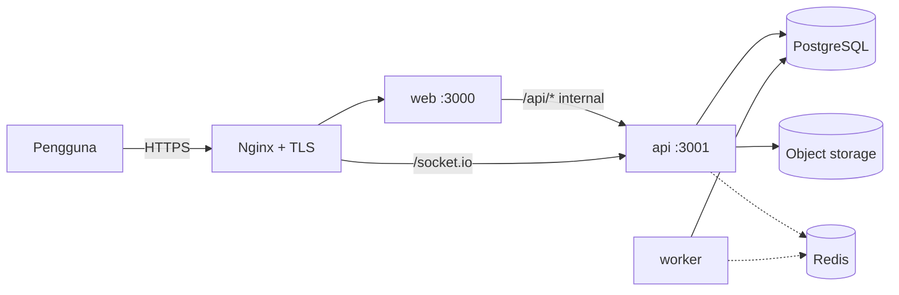
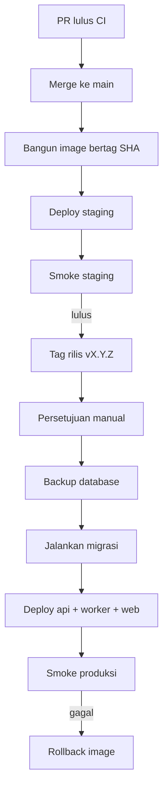

# Deploy — Cafe Companion Pro

**Status:** Kontrak lingkungan, build, rilis, dan operasi
**Tanggal:** 2 Oktober 2026

Kondisi saat ini: aplikasi hanya berjalan lokal. `infrastructure/docker` baru berisi compose untuk pengembangan lokal (2.5); `infrastructure/deployment` masih kosong, dan belum ada Dockerfile, compose produksi, maupun pipeline CI. Dokumen ini menetapkan cara menjalankan yang sudah ada dan rancangan yang harus dibangun.

Dokumen terkait: [`architecture.md`](./architecture.md), [`security.md`](./security.md), [`schema.md`](./schema.md).

---

## 1. Unit yang di-deploy

| Unit | Sumber | Port | Perintah jalan | Catatan |
|---|---|---|---|---|
| Web | `apps/web` | 3000 (prod), 4000 (dev) | `next start` | Meneruskan `/api/*` ke API |
| API | `apps/api` | 3001 | `node dist/main.js` | REST `/api/v1` + WebSocket |
| Worker | `apps/worker` | — | `node dist/index.js` | Dispatcher outbox dan job |
| PostgreSQL | — | 5432 | — | Satu database |
| Redis | — | 6379 | — | Ditunda sampai dibutuhkan |
| Object storage | S3-compatible | — | — | Gambar produk, lampiran |
| Storybook | `apps/storybook` | 6006 | Statis | Hanya internal |

Web, API, dan worker dibangun dari commit yang sama dan dirilis bersama.

---

## 2. Pengembangan lokal

### 2.1 Prasyarat

- Node.js 24 (`.nvmrc`)
- pnpm 11.13.0 (`packageManager` di `package.json`)
- PostgreSQL lokal (versi yang menyediakan `uuidv7()`; skema memakainya sebagai default ID)

### 2.2 Langkah

```bash
pnpm install --frozen-lockfile
cp .env.example .env            # isi DATABASE_URL
pnpm db:setup                   # generate klien + jalankan migrasi
pnpm dev                        # web :4000, api :3001, worker
```

| Alamat | Isi |
|---|---|
| `http://localhost:4000` | Web |
| `http://localhost:3001/api/v1/health` | Health API |
| `http://localhost:3001/api/docs` | Swagger (dev) |
| `pnpm --filter @merchant/storybook dev` → `:6006` | Storybook |

Platform user pertama:

```bash
PLATFORM_USER_EMAIL=… PLATFORM_USER_PASSWORD=… PLATFORM_USER_DISPLAY_NAME=… PLATFORM_USER_ROLE=OWNER \
  pnpm --filter @merchant/api platform:user:provision
```

Kredensial lokal dicatat di `CREDENTIALS.local.md` (tidak masuk repositori).

### 2.3 Perintah harian

| Perintah | Fungsi |
|---|---|
| `pnpm lint` | ESLint semua paket + penjaga warna |
| `pnpm typecheck` | TypeScript semua paket |
| `pnpm test` | Unit dan kontrak |
| `pnpm test:components` | Test komponen `packages/ui` |
| `pnpm build` | Build semua |
| `pnpm build:storybook` | Build Storybook |
| `pnpm test:e2e` | Smoke Playwright Storybook |
| `pnpm db:migrate` | Buat migrasi baru (dev) |
| `pnpm db:deploy` | Jalankan migrasi tertunda |
| `pnpm db:status` | Status migrasi |

### 2.4 Catatan Windows

- `next dev` dapat gagal bila kunci `.next/dev` masih dipegang proses lama. Hentikan proses `node` yang tertinggal, lalu hapus `apps/web/.next/dev`.
- Catatan lama menyebut `bun run dev`; pengelola paket resmi repo ini adalah pnpm. Gunakan `pnpm dev`.

### 2.5 Compose lokal

`infrastructure/docker/compose.dev.yml` menyediakan Redis, object storage, dan (opsional) PostgreSQL agar lingkungan pengembang seragam. Aplikasi tetap dijalankan dengan `pnpm dev` di host. Nilai diambil dari `.env` di akar repo.

| Perintah | Yang dijalankan |
|---|---|
| `pnpm infra:up` | Redis 8.2 (port 6379) dan object storage S3-compatible (port 9000); menunggu sampai keduanya sehat |
| `pnpm infra:up:all` | Sama, ditambah PostgreSQL 18.2 untuk mesin yang belum punya PostgreSQL; butuh `POSTGRES_USER` dan `POSTGRES_PASSWORD` di `.env` |
| `pnpm infra:status` | Status container |
| `pnpm infra:down` | Menghentikan semuanya; data tetap di volume Docker |

Catatan:

- PostgreSQL berada di profile `postgres` supaya tidak berebut port 5432 dengan PostgreSQL yang terpasang di host. Port tiap layanan bisa diganti lewat `POSTGRES_PORT`, `REDIS_PORT`, dan `OBJECT_STORAGE_PORT`.
- Redis memakai `appendonly yes` dan `maxmemory-policy noeviction`; antrean BullMQ tidak boleh kehilangan job.
- Object storage memakai Versity S3 Gateway dengan folder sebagai penyimpanan, bukan MinIO: image MinIO tidak lagi diterbitkan di Docker Hub. Aplikasi hanya memakai API S3, jadi penggantinya bebas selama S3-compatible. Bucket `OBJECT_STORAGE_BUCKET` dibuat saat container mulai.
- Semua port hanya dibuka di `127.0.0.1`.

---

## 3. Lingkungan

| Lingkungan | Tujuan | Data | Deploy |
|---|---|---|---|
| Local | Pengembangan | Data uji lokal | Manual |
| CI | Verifikasi otomatis | PostgreSQL sekali pakai | Setiap push dan PR |
| Staging | Uji rilis, smoke, uji pilot internal | Data sintetis | Otomatis dari `main` |
| Production | Pelanggan | Data nyata | Manual dengan persetujuan, dari tag |

Staging dan produksi memakai database, object storage, dan secret yang terpisah. Data produksi tidak disalin ke staging tanpa penyamaran.

### 3.1 Hosting (diputuskan: opsi A)

Produksi memakai VPS yang sudah tersedia, dengan Docker dan Nginx sebagai reverse proxy (keputusan D-10). Pekerjaan deploy dijadwalkan paling akhir, setelah modul Release 1 berjalan. Tabel berikut disimpan sebagai catatan pertimbangan.

| Opsi | Kelebihan | Kekurangan |
|---|---|---|
| **A. Satu VPS + Docker Compose + Nginx** (dipilih) | Biaya rendah; WebSocket dan worker berjalan tanpa penyesuaian; semua unit dalam satu jaringan | Skala dan failover manual; backup harus dikelola sendiri |
| B. Platform kontainer terkelola + PostgreSQL terkelola | Backup dan pemulihan titik-waktu bawaan; skala lebih mudah | Biaya lebih tinggi |
| C. Web di platform serverless, API/worker di kontainer | Web cepat dirilis | Dua platform; rewrite `/api` dan WebSocket perlu konfigurasi origin yang hati-hati |

PostgreSQL boleh berjalan sebagai kontainer di VPS yang sama untuk pilot, dengan syarat: volume data terpisah dari kontainer, backup harian dikirim **ke luar VPS**, dan uji restore dijalankan. Pindah ke PostgreSQL terkelola dipertimbangkan bila pilot membutuhkan pemulihan titik-waktu.

Catatan Nginx: teruskan header `Upgrade`/`Connection` untuk jalur WebSocket, kirim `X-Forwarded-For` dan `X-Forwarded-Proto`, dan set `trust proxy` di API untuk satu hop proxy (temuan `SEC-F4`).

Topologi opsi A:



API tidak dibuka langsung ke internet kecuali jalur WebSocket; semua permintaan REST masuk lewat web agar tetap satu origin.

---

## 4. Variabel environment

| Variabel | Dipakai oleh | Wajib | Keterangan |
|---|---|---|---|
| `NODE_ENV` | Semua | Ya | `production` mengaktifkan cookie `Secure` dan HSTS |
| `DATABASE_URL` | API, worker, migrasi | Ya | PostgreSQL |
| `API_URL` | Web | Ya | Alamat internal API untuk rewrite |
| `API_PORT` | API | Tidak | Bawaan 3001 |
| `WEB_URL` | API | Ya (prod) | Origin web |
| `AUTH_SESSION_TTL_HOURS` | API | Tidak | Bawaan 720 |
| `PLATFORM_SESSION_TTL_HOURS` | API | Tidak | Bawaan 12 |
| `API_DOCS_ENABLED` | API | Tidak | Di produksi hanya aktif bila `true` dan tetap butuh sesi platform |
| `REDIS_URL` | API, worker | Nanti | |
| `OBJECT_STORAGE_ENDPOINT`, `_REGION`, `_BUCKET`, `_ACCESS_KEY`, `_SECRET_KEY` | API | Nanti | |
| `PLATFORM_USER_EMAIL`, `_PASSWORD`, `_DISPLAY_NAME`, `_ROLE` | CLI provisioning | Sekali | Tidak disimpan di environment layanan |
| `DATABASE_RESTORE_DRILL_DB` | Drill backup | Operasi | Database tujuan uji restore |

Aturan: tidak ada secret di repositori, di image, atau di variabel yang diekspos ke browser (`NEXT_PUBLIC_*`). `.env.example` hanya berisi placeholder. Aplikasi harus gagal saat start bila variabel wajib tidak ada.

---

## 5. Build

### 5.1 Image (akan dibuat)

```text
infrastructure/docker/
  Dockerfile.web
  Dockerfile.api
  Dockerfile.worker
  compose.dev.yml
  compose.prod.yml
```

Pola setiap Dockerfile:

1. Tahap dependensi: `pnpm install --frozen-lockfile` dengan `pnpm fetch` agar lapisan dapat di-cache.
2. Tahap build: `pnpm turbo run build --filter=<app>...`; untuk API dan worker sertakan `pnpm db:generate`.
3. Tahap runtime: image Node 24 ramping, pengguna non-root, hanya berkas hasil build dan dependensi produksi (`pnpm deploy` atau `turbo prune`).
4. `HEALTHCHECK`: web dan API ke endpoint health; worker lewat mode `--smoke`.

Web memakai keluaran `standalone` Next.js agar image kecil.

### 5.2 Catatan build

- `packages/contracts`, `packages/database`, dan `packages/ui` dikonsumsi sebagai sumber TypeScript; build aplikasi harus mentranspilasinya.
- Klien Prisma di-generate saat build, tidak di-commit.
- Font Geist dibundel dari paket; tidak ada unduhan font saat runtime.
- Halaman referensi dev tidak ikut di build produksi.

---

## 6. CI

Pipeline (GitHub Actions atau setara) pada setiap push dan PR:

```text
1. pnpm install --frozen-lockfile
2. pnpm lint                 (ESLint + penjaga warna + batas modul)
3. pnpm typecheck
4. pnpm db:validate
5. pnpm test                 (unit, kontrak, isolasi)
6. integration test          (PostgreSQL sekali pakai sebagai service container)
7. pnpm build                (web, api, worker)
8. pnpm build:storybook
9. pnpm test:e2e             (smoke Storybook; nanti E2E alur kritis)
10. pemeriksaan kerentanan dependensi
11. pemeriksaan kesamaan kunci kamus id/en
```

Cache: store pnpm dan cache Turborepo. Pipeline gagal pada peringatan lint (`--max-warnings=0`).

Pada `main`: bangun image, beri tag commit SHA, dorong ke registry, deploy ke staging, jalankan smoke staging.

---

## 7. Rilis

### 7.1 Alur



### 7.2 Urutan deploy

1. Backup database (atau pastikan titik pemulihan tersedia).
2. `pnpm db:deploy` sebagai job tersendiri dengan pengguna migrasi.
3. Deploy API dan worker.
4. Deploy web.
5. Smoke: health API, login, satu halaman Backoffice, satu mutasi uji di workspace uji.

### 7.3 Migrasi tanpa mematikan layanan

Kode lama dan baru berjalan bersamaan sesaat, sehingga migrasi harus kompatibel mundur:

| Perubahan | Cara |
|---|---|
| Tambah kolom | Nullable atau dengan default; kode baru mulai mengisi |
| Wajibkan kolom | Rilis 1: tambah nullable + isi. Rilis 2: perketat |
| Ganti nama kolom | Rilis 1: tambah kolom baru + tulis ganda. Rilis 2: pindah baca. Rilis 3: hapus lama |
| Hapus kolom/tabel | Hanya setelah tidak ada kode yang membacanya selama satu rilis |
| Indeks pada tabel besar | `CREATE INDEX CONCURRENTLY` |

Migrasi tidak pernah dijalankan saat pelanggan membeli modul; aktivasi modul hanya membuat baris data.

### 7.4 Rollback

- **Aplikasi:** deploy ulang tag image sebelumnya. Karena migrasi kompatibel mundur, kode lama tetap berjalan pada skema baru.
- **Database:** tidak ada rollback migrasi otomatis. Perbaikan dilakukan dengan migrasi maju. Restore dari backup hanya untuk kehilangan atau kerusakan data.
- Setiap rilis mencatat tag image sebelumnya dan langkah rollback-nya.

---

## 8. Database

- Pengguna aplikasi tanpa hak DDL; pengguna migrasi terpisah.
- Connection pooling: batasi koneksi per instance; pakai pooler bila jumlah instance bertambah.
- Backup harian terenkripsi + pemulihan titik-waktu bila penyedia mendukung.
- Uji restore terjadwal memakai `pnpm --filter @merchant/database db:backup-drill` (membutuhkan `pg_dump` dan `pg_restore`).
- Target awal: RPO ≤24 jam, RTO ≤8 jam; diperketat setelah pilot.
- Projection (`report_*`, saldo stok, counter pemakaian) dapat dibangun ulang dan tidak perlu dipulihkan satu per satu.

---

## 9. Operasi

### 9.1 Health

| Unit | Pemeriksaan |
|---|---|
| API | `GET /api/v1/health` |
| Web | Halaman health ringan (akan dibuat) |
| Worker | Detak dispatcher: waktu event terakhir diproses |
| Database | Koneksi dan jeda replikasi bila ada |

### 9.2 Yang dipantau

| Sinyal | Ambang awal |
|---|---|
| Rasio error 5xx API | >1% selama 5 menit |
| Latensi API p95 | >1 detik |
| Umur event outbox tertua | >60 detik |
| Jumlah event `BLOCKED`/dead-letter | >0 baru |
| Login gagal | Lonjakan tidak wajar |
| Koneksi database | >80% batas |
| Ruang disk dan penyimpanan objek | >80% |
| Kedaluwarsa sertifikat TLS | <14 hari |

Log terstruktur (JSON) dikirim ke satu tempat dengan request ID, workspace, dan lokasi. Pelacakan error untuk web dan API. Log tidak memuat secret atau data pribadi.

### 9.3 Skala

- API tanpa state di memori selain rate limit; sebelum menambah instance, pindahkan rate limit ke Redis dan pasang adapter Redis untuk Socket.IO.
- Worker dapat diperbanyak karena klaim event memakai kunci baris (`SKIP LOCKED`).
- Web dapat diperbanyak bebas.

### 9.4 Runbook yang harus tersedia sebelum pilot

Provisioning workspace dan paket; binding error dan coba ulang event; antrean outbox menumpuk; pemulihan dari backup; pencabutan sesi dan kredensial; rollback rilis; rotasi secret.

---

## 10. PWA

- Service worker dirilis bersama web; setiap rilis mengganti versi cache agar klien mengambil aset baru.
- POS dan KDS menampilkan pemberitahuan "versi baru tersedia" dan memuat ulang pada saat aman (tidak di tengah transaksi).
- API menerima `clientVersion` pada `CommandContext` agar klien usang dapat dideteksi.

---

## 11. Checklist

**Sebelum staging pertama**

- [ ] Dockerfile web, API, worker.
- [ ] Compose dev dan prod.
- [ ] Pipeline CI.
- [ ] PostgreSQL staging dan migrasi otomatis.
- [ ] Secret staging di secret manager.
- [ ] Smoke staging.

**Sebelum produksi**

- [ ] TLS dan reverse proxy; `trust proxy` dikonfigurasi.
- [ ] Header keamanan dan CSP pada web.
- [ ] Backup dan uji restore berhasil.
- [ ] Pemantauan dan peringatan aktif.
- [ ] Rate limit di Redis bila lebih dari satu instance.
- [ ] Runbook tersedia.
- [ ] Platform user dibuat lewat CLI; tidak ada kredensial bawaan.
- [ ] `API_DOCS_ENABLED` ditinjau.
- [ ] Gerbang kepatuhan di `security.md` bagian 15 dicatat.
- [ ] Rencana rollback diuji di staging.

**Setiap rilis**

- [ ] CI hijau pada commit yang dirilis.
- [ ] Migrasi ditinjau kompatibel mundur.
- [ ] Backup tersedia.
- [ ] Smoke staging lulus.
- [ ] Tag image sebelumnya dicatat.
- [ ] Smoke produksi lulus.
