# Flowchart — Alur Interaksi Pengguna

**Status:** Kontrak alur UX
**Tanggal:** 2 Oktober 2026

Dokumen ini memetakan apa yang dilihat dan dilakukan pengguna, layar demi layar. Aturan tampilan ada di [`design-system.md`](./design-system.md); struktur rute ada di [`frontend.md`](./frontend.md).

Konvensi diagram: kotak = layar atau langkah; belah ketupat = keputusan; garis putus-putus = terjadi di sistem tanpa aksi pengguna. Semua aksi "simpan/kirim/bayar" menunggu konfirmasi server sebelum layar menampilkan hasil.

---

## 1. Peta aplikasi

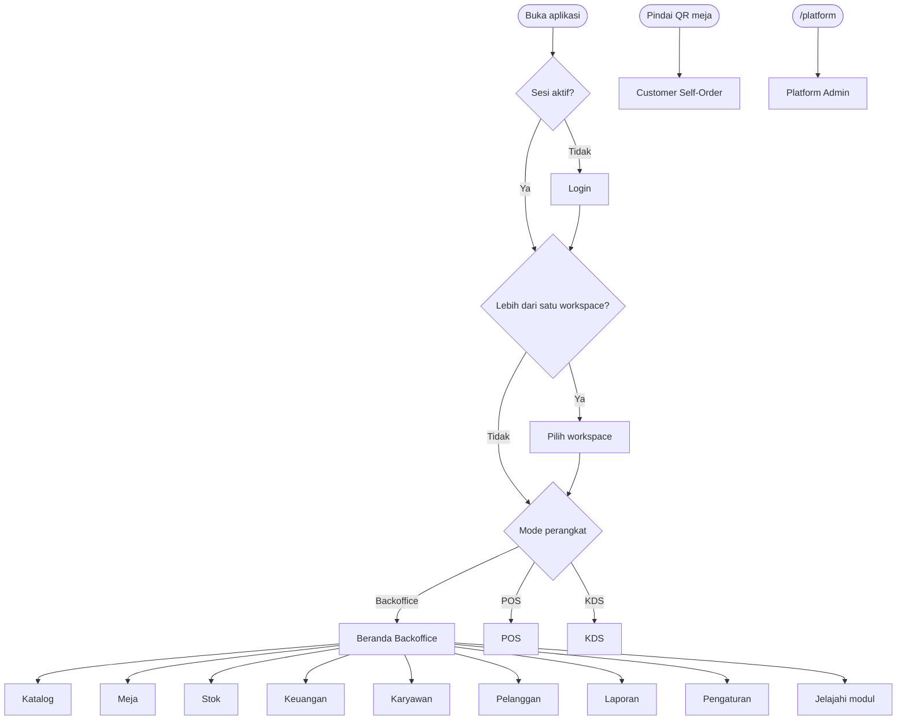
```mermaid
flowchart TD
    START([Buka aplikasi]) --> SES{Sesi aktif?}
    SES -- Tidak --> LOGIN[Login]
    SES -- Ya --> WS{Lebih dari satu workspace?}
    LOGIN --> WS
    WS -- Ya --> PICK[Pilih workspace]
    WS -- Tidak --> MODE
    PICK --> MODE{Mode perangkat}
    MODE -- Backoffice --> BO[Beranda Backoffice]
    MODE -- POS --> POS[POS]
    MODE -- KDS --> KDS[KDS]

    BO --> CAT[Katalog]
    BO --> FLR[Meja]
    BO --> INV[Stok]
    BO --> FIN[Keuangan]
    BO --> HC[Karyawan]
    BO --> CUS[Pelanggan]
    BO --> REP[Laporan]
    BO --> SET[Pengaturan]
    BO --> EXP[Jelajahi modul]

    QR([Pindai QR meja]) --> CUST[Customer Self-Order]
    PLAT([/platform]) --> PA[Platform Admin]
```

Navigasi Backoffice hanya menampilkan modul yang terpasang dan boleh diakses pengguna. Workspace HC-only, misalnya, hanya melihat Karyawan, Laporan, dan Pengaturan.

### 1.1 Peta rute

| Surface    | Rute                                                                                                                                    | Layar                                                                                                                                            |
| ---------- | --------------------------------------------------------------------------------------------------------------------------------------- | ------------------------------------------------------------------------------------------------------------------------------------------------ |
| Auth       | `/login`                                                                                                                                | Login                                                                                                                                            |
| Backoffice | `/`                                                                                                                                     | Beranda                                                                                                                                          |
|            | `/catalog`, `/catalog/categories`, `/catalog/modifiers`                                                                                 | Produk, kategori, modifier                                                                                                                       |
|            | `/floor`                                                                                                                                | Edit tata letak meja                                                                                                                             |
|            | `/inventory`, `/inventory/movements`, `/inventory/stocktakes`, `/inventory/receipts`, `/inventory/recipes`                              | Stok                                                                                                                                             |
|            | `/finance`, `/finance/cashbook`, `/finance/reconciliation`, `/finance/reports`                                                          | Keuangan                                                                                                                                         |
|            | `/hc/employees`, `/hc/schedule`, `/hc/attendance`, `/hc/leave`                                                                          | Karyawan                                                                                                                                         |
|            | `/customers`                                                                                                                            | Pelanggan                                                                                                                                        |
|            | `/reports`                                                                                                                              | Laporan                                                                                                                                          |
|            | `/activate`                                                                                                                             | Aktivasi perangkat dengan kode sekali pakai; tanpa sesi                                                                                          |
|            | `/invite`                                                                                                                               | Terima undangan dari tautan email; tanpa sesi. Akun baru mengisi nama dan kata sandi lalu langsung masuk; akun lama bergabung lalu masuk sendiri |
|            | `/settings/organization`, `/settings/users`, `/settings/roles`, `/settings/devices`, `/settings/subscription`, `/settings/integrations` | Pengaturan                                                                                                                                       |
|            | `/modules`                                                                                                                              | Jelajahi modul                                                                                                                                   |
| POS        | `/pos`, `/pos/tables`, `/pos/orders`, `/pos/shift`                                                                                      | Kasir                                                                                                                                            |
| KDS        | `/kds`, `/kds/history`                                                                                                                  | Dapur                                                                                                                                            |
| Customer   | `/t/[token]`, `/m/[slug]`                                                                                                               | Pesan dari meja, menu publik                                                                                                                     |
| Platform   | `/platform/login`, `/platform/workspaces`, `/platform/packages`, `/platform/audit`                                                      | Operator                                                                                                                                         |

---

## 2. Masuk dan konteks

### 2.1 Login

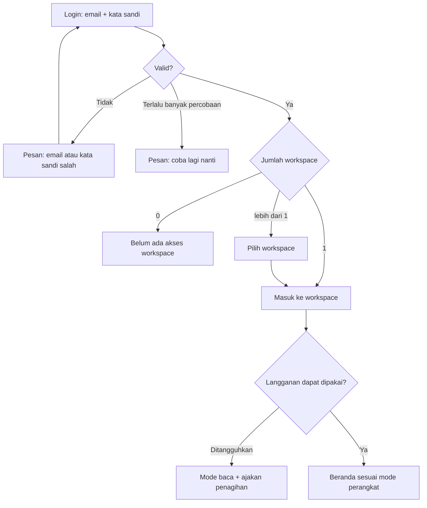
```mermaid
flowchart TD
    A[Login: email + kata sandi] --> B{Valid?}
    B -- Tidak --> C[Pesan: email atau kata sandi salah] --> A
    B -- Terlalu banyak percobaan --> D[Pesan: coba lagi nanti]
    B -- Ya --> E{Jumlah workspace}
    E -- 0 --> F[Belum ada akses workspace]
    E -- 1 --> H[Masuk ke workspace]
    E -- lebih dari 1 --> G[Pilih workspace] --> H
    H --> I{Langganan dapat dipakai?}
    I -- Ditangguhkan --> J[Mode baca + ajakan penagihan]
    I -- Ya --> K[Beranda sesuai mode perangkat]
```

Layar login hanya berisi: logo, email, kata sandi, tombol masuk, pemilih bahasa, dan tautan lupa kata sandi. Tanpa ilustrasi dan tanpa teks pemasaran.

### 2.2 Berganti workspace, lokasi, bahasa, tema

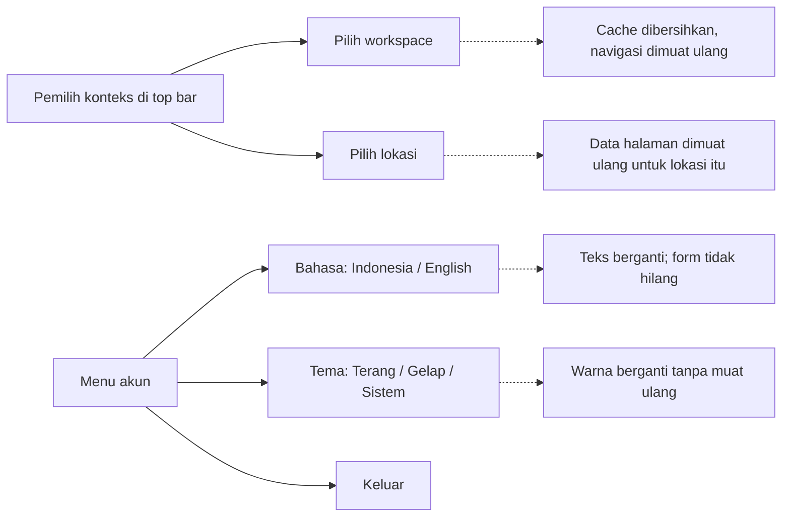
```mermaid
flowchart LR
    CS[Pemilih konteks di top bar] --> W[Pilih workspace] -.-> W2[Cache dibersihkan, navigasi dimuat ulang]
    CS --> L[Pilih lokasi] -.-> L2[Data halaman dimuat ulang untuk lokasi itu]
    UM[Menu akun] --> LG[Bahasa: Indonesia / English] -.-> LG2[Teks berganti; form tidak hilang]
    UM --> TH[Tema: Terang / Gelap / Sistem] -.-> TH2[Warna berganti tanpa muat ulang]
    UM --> OUT[Keluar]
```

Pada tampilan "Semua lokasi", aksi yang membutuhkan lokasi tertentu nonaktif sampai lokasi dipilih.

### 2.3 Membuka modul

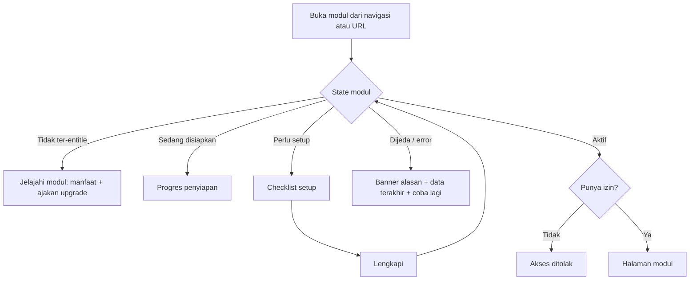
```mermaid
flowchart TD
    A[Buka modul dari navigasi atau URL] --> B{State modul}
    B -- Tidak ter-entitle --> C[Jelajahi modul: manfaat + ajakan upgrade]
    B -- Sedang disiapkan --> D[Progres penyiapan]
    B -- Perlu setup --> E[Checklist setup] --> F[Lengkapi] --> B
    B -- Dijeda / error --> G[Banner alasan + data terakhir + coba lagi]
    B -- Aktif --> H{Punya izin?}
    H -- Tidak --> I[Akses ditolak]
    H -- Ya --> J[Halaman modul]
```

---

## 3. Pola Backoffice

Semua halaman daftar di Backoffice memakai alur yang sama, sehingga pengguna hanya perlu mempelajarinya sekali.

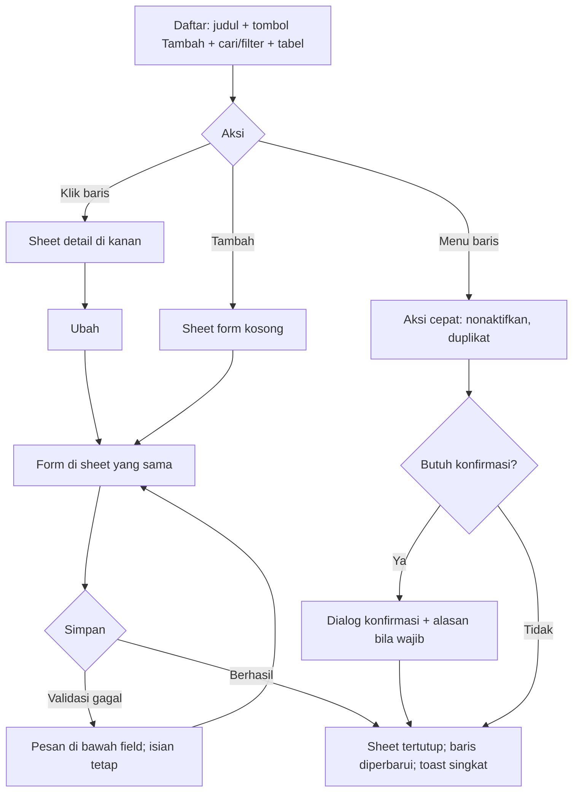
```mermaid
flowchart TD
    L[Daftar: judul + tombol Tambah + cari/filter + tabel] --> R{Aksi}
    R -- Klik baris --> S[Sheet detail di kanan]
    R -- Tambah --> N[Sheet form kosong]
    R -- Menu baris --> M[Aksi cepat: nonaktifkan, duplikat]
    S --> ED[Ubah] --> FM[Form di sheet yang sama]
    N --> FM
    FM --> SV{Simpan}
    SV -- Validasi gagal --> ER[Pesan di bawah field; isian tetap] --> FM
    SV -- Berhasil --> OK[Sheet tertutup; baris diperbarui; toast singkat]
    M --> CF{Butuh konfirmasi?}
    CF -- Ya --> AD[Dialog konfirmasi + alasan bila wajib] --> OK
    CF -- Tidak --> OK
```

State yang selalu tersedia: memuat (skeleton), kosong (satu kalimat + tombol tambah), hasil cari kosong (reset filter), error (coba lagi), tanpa izin.

Pada layar Small: tabel menjadi baris ringkas, filter pindah ke sheet, dan detail/form menjadi layar penuh.

---

## 4. Katalog

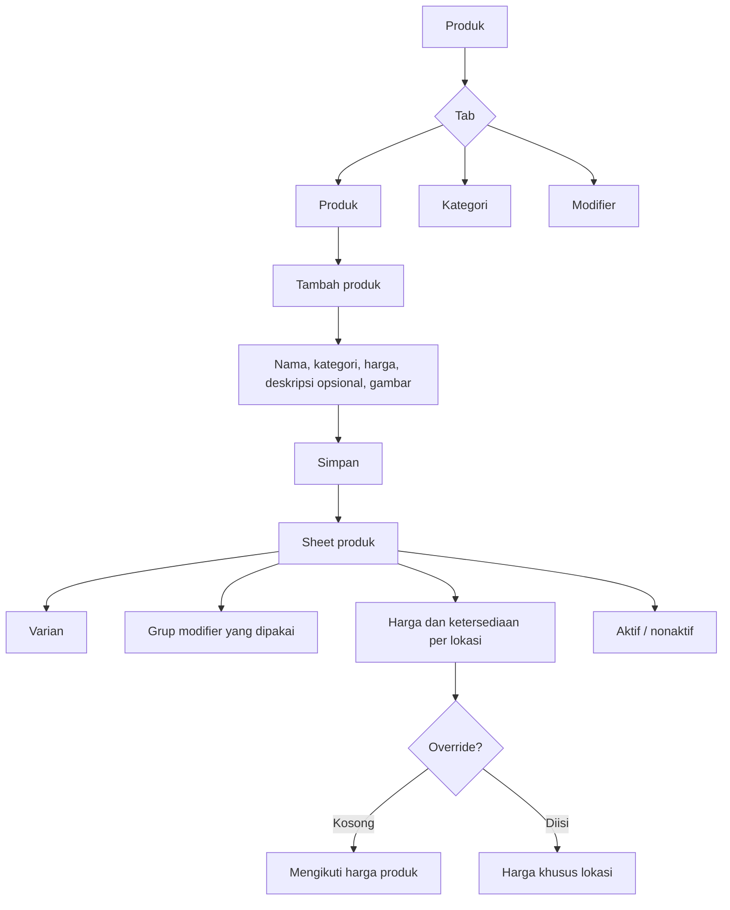
```mermaid
flowchart TD
    P[Produk] --> T{Tab}
    T --> PR[Produk]
    T --> KT[Kategori]
    T --> MD[Modifier]
    PR --> ADD[Tambah produk] --> F1[Nama, kategori, harga, deskripsi opsional, gambar]
    F1 --> SAVE[Simpan]
    SAVE --> DET[Sheet produk]
    DET --> V[Varian]
    DET --> MG[Grup modifier yang dipakai]
    DET --> LOC[Harga dan ketersediaan per lokasi]
    DET --> ST[Aktif / nonaktif]
    LOC --> OV{Override?}
    OV -- Kosong --> INH[Mengikuti harga produk]
    OV -- Diisi --> OVR[Harga khusus lokasi]
```

Aturan alur:

- Harga per lokasi yang kosong berarti mengikuti harga produk; layar menampilkan harga efektif satu kali, bukan harga dasar dan harga efektif berdampingan.
- "Habis" (ketersediaan) dan "Nonaktif" (lifecycle) adalah dua kontrol berbeda.
- Produk tidak dihapus; produk dinonaktifkan.
- Bagian resep hanya muncul bila Inventory terpasang.

---

## 5. POS

### 5.1 Memulai

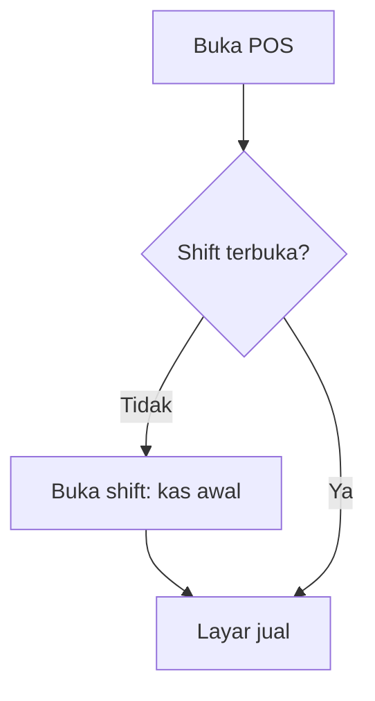
```mermaid
flowchart TD
    A[Buka POS] --> B{Shift terbuka?}
    B -- Tidak --> C[Buka shift: kas awal] --> D[Layar jual]
    B -- Ya --> D
```

### 5.2 Menjual

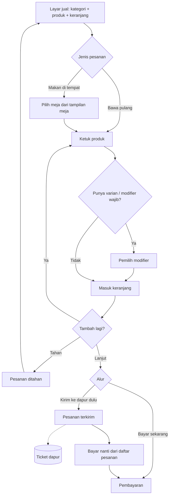
```mermaid
flowchart TD
    D[Layar jual: kategori + produk + keranjang] --> T{Jenis pesanan}
    T -- Bawa pulang --> P
    T -- Makan di tempat --> TB[Pilih meja dari tampilan meja] --> P
    P[Ketuk produk] --> M{Punya varian / modifier wajib?}
    M -- Ya --> MP[Pemilih modifier] --> K
    M -- Tidak --> K[Masuk keranjang]
    K --> MORE{Tambah lagi?}
    MORE -- Ya --> P
    MORE -- Tahan --> HOLD[Pesanan ditahan] --> D
    MORE -- Lanjut --> SUB{Alur}
    SUB -- Bayar sekarang --> PAY[Pembayaran]
    SUB -- Kirim ke dapur dulu --> SENT[Pesanan terkirim] -.-> KDS[(Ticket dapur)]
    SENT --> LATER[Bayar nanti dari daftar pesanan] --> PAY
```

### 5.3 Membayar

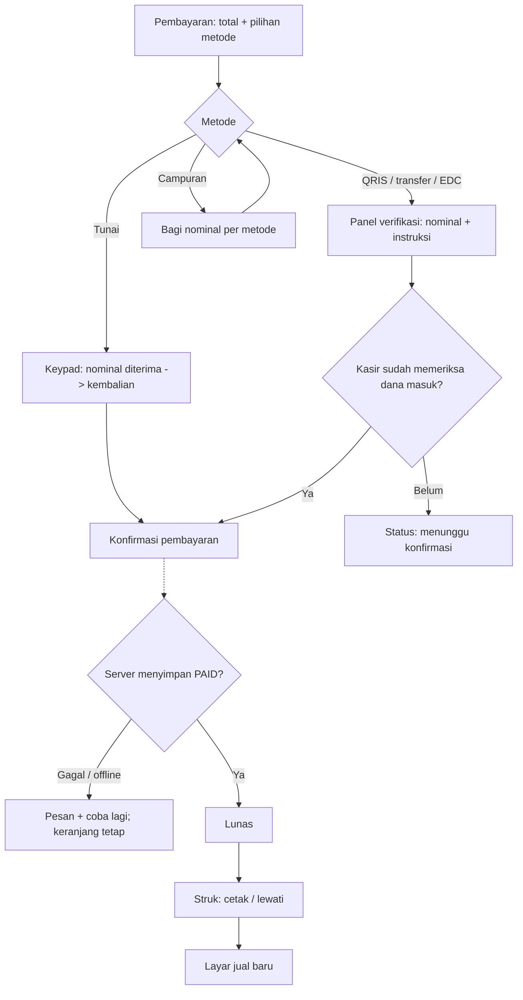
```mermaid
flowchart TD
    PAY[Pembayaran: total + pilihan metode] --> MT{Metode}
    MT -- Tunai --> CK[Keypad: nominal diterima -> kembalian]
    MT -- QRIS / transfer / EDC --> VF[Panel verifikasi: nominal + instruksi]
    MT -- Campuran --> SP[Bagi nominal per metode] --> MT
    CK --> CF[Konfirmasi pembayaran]
    VF --> CHK{Kasir sudah memeriksa dana masuk?}
    CHK -- Belum --> WAIT[Status: menunggu konfirmasi]
    CHK -- Ya --> CF
    CF -.-> SRV{Server menyimpan PAID?}
    SRV -- Gagal / offline --> RET[Pesan + coba lagi; keranjang tetap]
    SRV -- Ya --> DONE[Lunas] --> RC[Struk: cetak / lewati] --> D[Layar jual baru]
```

Layar pembayaran menggantikan katalog dan keranjang; total hanya tampil satu kali.

### 5.4 Membatalkan dan refund

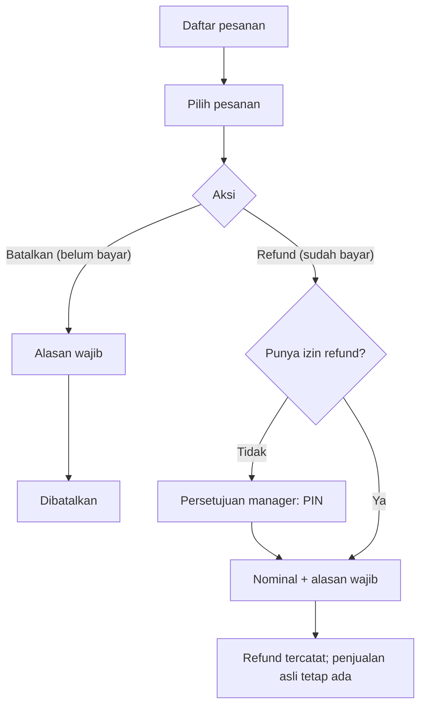
```mermaid
flowchart TD
    O[Daftar pesanan] --> S[Pilih pesanan]
    S --> X{Aksi}
    X -- Batalkan (belum bayar) --> R1[Alasan wajib] --> OK1[Dibatalkan]
    X -- Refund (sudah bayar) --> P{Punya izin refund?}
    P -- Tidak --> AP[Persetujuan manager: PIN] --> R2
    P -- Ya --> R2[Nominal + alasan wajib] --> OK2[Refund tercatat; penjualan asli tetap ada]
```

### 5.5 Menutup shift

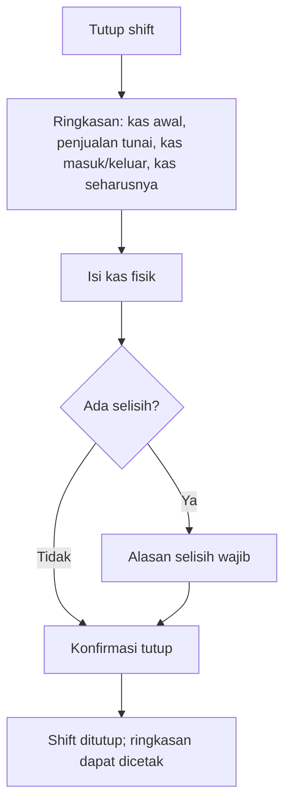
```mermaid
flowchart TD
    A[Tutup shift] --> B[Ringkasan: kas awal, penjualan tunai, kas masuk/keluar, kas seharusnya]
    B --> C[Isi kas fisik]
    C --> D{Ada selisih?}
    D -- Tidak --> F[Konfirmasi tutup]
    D -- Ya --> E[Alasan selisih wajib] --> F
    F --> G[Shift ditutup; ringkasan dapat dicetak]
```

Kas seharusnya dan selisih adalah nilai turunan yang hanya ditampilkan. Selisih hanya terlihat bagi yang berizin.

### 5.6 POS pada layar kecil

Produk menjadi tampilan utama. Keranjang dibuka dari bar ringkasan di bawah (jumlah item + total). Pembayaran menjadi langkah layar penuh.

---

## 6. Meja

### 6.1 Mengatur tata letak (Backoffice)

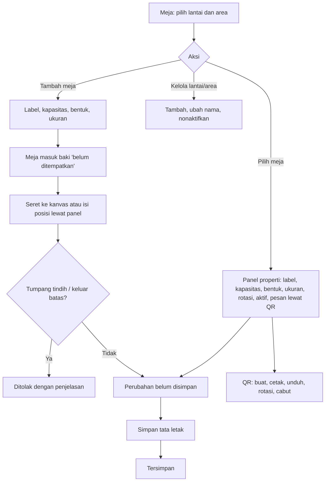
```mermaid
flowchart TD
    A[Meja: pilih lantai dan area] --> B{Aksi}
    B -- Tambah meja --> C[Label, kapasitas, bentuk, ukuran] --> D[Meja masuk baki 'belum ditempatkan']
    D --> E[Seret ke kanvas atau isi posisi lewat panel]
    B -- Pilih meja --> F[Panel properti: label, kapasitas, bentuk, ukuran, rotasi, aktif, pesan lewat QR]
    B -- Kelola lantai/area --> G[Tambah, ubah nama, nonaktifkan]
    E --> H{Tumpang tindih / keluar batas?}
    H -- Ya --> I[Ditolak dengan penjelasan]
    H -- Tidak --> J[Perubahan belum disimpan]
    F --> J
    J --> K[Simpan tata letak] --> L[Tersimpan]
    F --> Q[QR: buat, cetak, unduh, rotasi, cabut]
```

Lokasi baru sudah memiliki `Main Floor` dan `Main Area`, sehingga pengguna dapat langsung menambah meja. Pada layar kecil, posisi dan properti diatur lewat form; seret presisi tidak diwajibkan.

### 6.2 Operasi meja (POS)

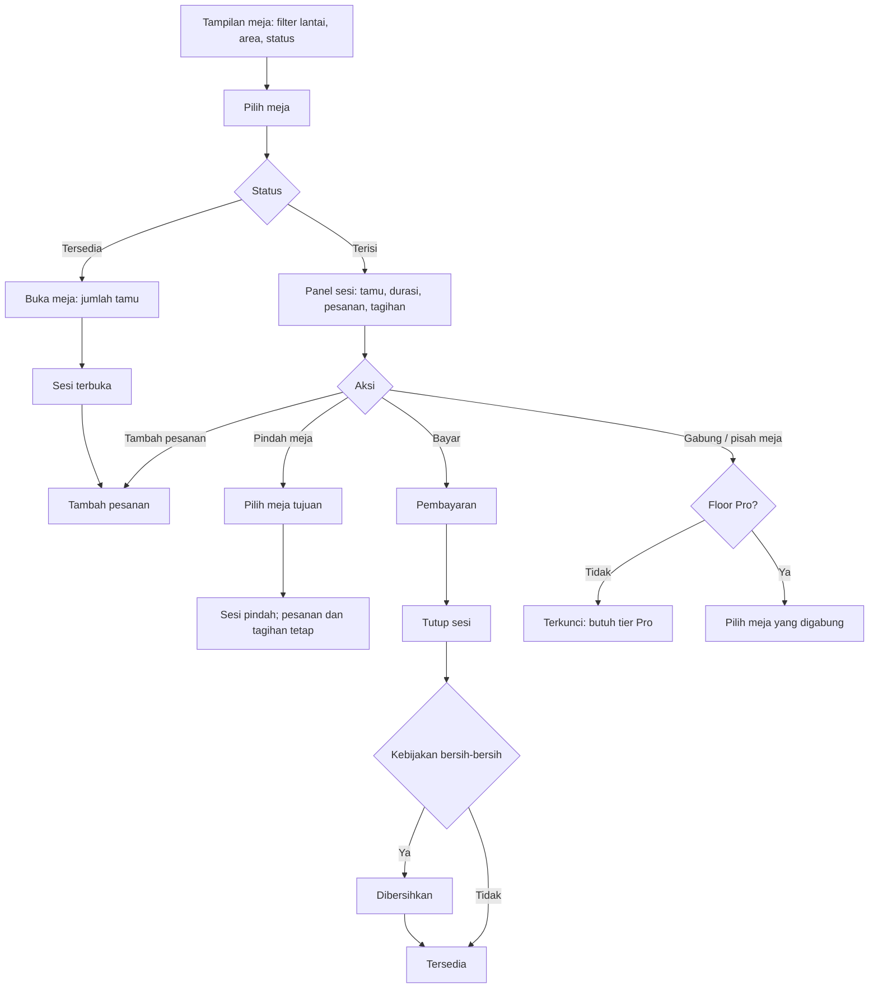
```mermaid
flowchart TD
    A[Tampilan meja: filter lantai, area, status] --> B[Pilih meja]
    B --> C{Status}
    C -- Tersedia --> D[Buka meja: jumlah tamu] --> E[Sesi terbuka] --> F[Tambah pesanan]
    C -- Terisi --> G[Panel sesi: tamu, durasi, pesanan, tagihan]
    G --> H{Aksi}
    H -- Tambah pesanan --> F
    H -- Pindah meja --> I[Pilih meja tujuan] --> J[Sesi pindah; pesanan dan tagihan tetap]
    H -- Bayar --> K[Pembayaran]
    K --> L[Tutup sesi] --> M{Kebijakan bersih-bersih}
    M -- Ya --> N[Dibersihkan] --> O[Tandai tersedia]
    M -- Tidak --> O[Tersedia]
    H -- Gabung / pisah meja --> P{Floor Pro?}
    P -- Tidak --> Q[Terkunci: butuh tier Pro]
    P -- Ya --> R[Pilih meja yang digabung]
```

Menggeser meja di editor tidak memindahkan tamu. Pindah meja adalah aksi tersendiri dengan pemilihan asal dan tujuan.

---

## 7. Customer Self-Order

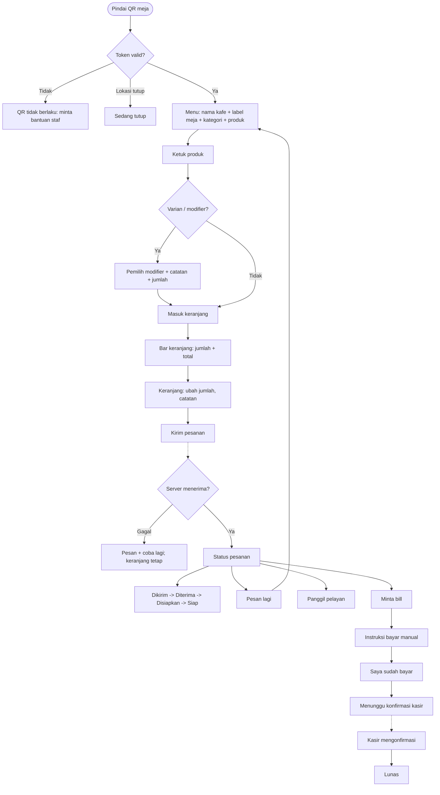
```mermaid
flowchart TD
    A([Pindai QR meja]) --> B{Token valid?}
    B -- Tidak --> X[QR tidak berlaku: minta bantuan staf]
    B -- Lokasi tutup --> Y[Sedang tutup]
    B -- Ya --> C[Menu: nama kafe + label meja + kategori + produk]
    C --> D[Ketuk produk] --> E{Varian / modifier?}
    E -- Ya --> F[Pemilih modifier + catatan + jumlah] --> G
    E -- Tidak --> G[Masuk keranjang]
    G --> H[Bar keranjang: jumlah + total]
    H --> I[Keranjang: ubah jumlah, catatan] --> J[Kirim pesanan]
    J -.-> K{Server menerima?}
    K -- Gagal --> L[Pesan + coba lagi; keranjang tetap]
    K -- Ya --> M[Status pesanan]
    M --> N[Dikirim -> Diterima -> Disiapkan -> Siap]
    M --> O[Pesan lagi] --> C
    M --> P[Panggil pelayan]
    M --> Q[Minta bill]
    Q --> R[Instruksi bayar manual]
    R --> S[Saya sudah bayar] --> T[Menunggu konfirmasi kasir]
    T -.-> U[Kasir mengonfirmasi] --> V[Lunas]
```

Tamu tidak perlu membuat akun. Pemilih bahasa ada di header. Layar tamu tidak pernah menampilkan meja lain, ID internal, atau status internal yang tidak relevan.

---

## 8. KDS

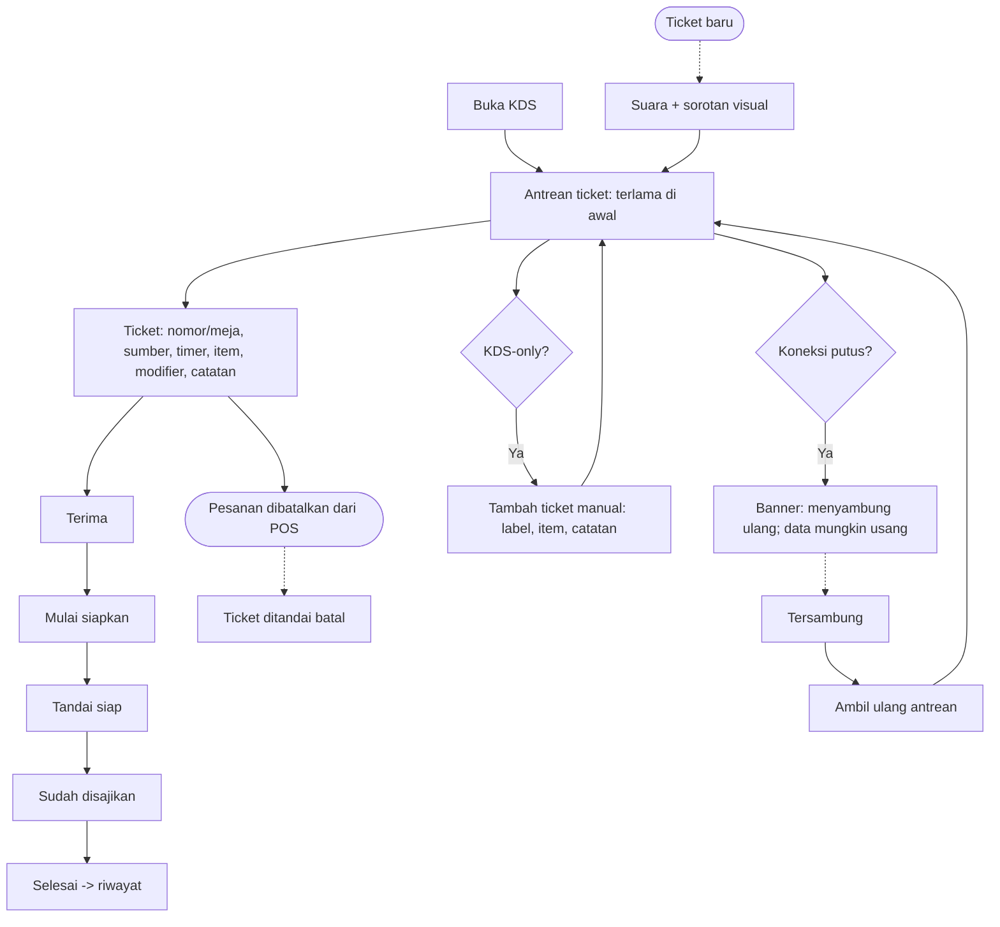
```mermaid
flowchart TD
    A[Buka KDS] --> B[Antrean ticket: terlama di awal]
    NEW([Ticket baru]) -.-> AL[Suara + sorotan visual] --> B
    B --> C[Ticket: nomor/meja, sumber, timer, item, modifier, catatan]
    C --> D[Terima] --> E[Mulai siapkan] --> F[Tandai siap] --> G[Sudah disajikan] --> H[Selesai -> riwayat]
    C --> CAN([Pesanan dibatalkan dari POS]) -.-> CX[Ticket ditandai batal]
    B --> MAN{KDS-only?}
    MAN -- Ya --> MT[Tambah ticket manual: label, item, catatan] --> B
    B --> OFF{Koneksi putus?}
    OFF -- Ya --> ST[Banner: menyambung ulang; data mungkin usang]
    ST -.-> RC[Tersambung] --> RF[Ambil ulang antrean] --> B
```

Setiap ticket hanya menampilkan satu tombol aksi: langkah berikutnya yang sah. Timer berubah warna saat mendekati dan melewati batas waktu, tanpa berkedip.

---

## 9. Stok

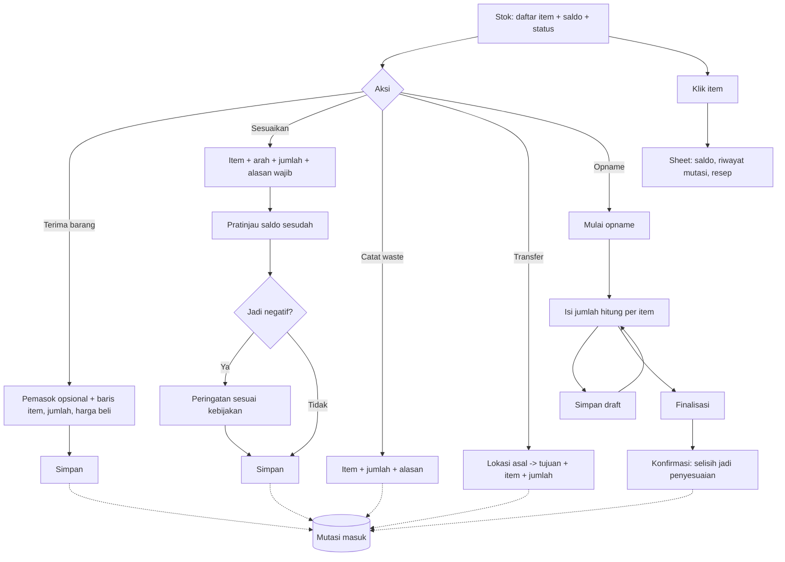
```mermaid
flowchart TD
    A[Stok: daftar item + saldo + status] --> B{Aksi}
    B -- Terima barang --> C[Pemasok opsional + baris item, jumlah, harga beli] --> C2[Simpan] -.-> M[(Mutasi masuk)]
    B -- Sesuaikan --> D[Item + arah + jumlah + alasan wajib] --> D1[Pratinjau saldo sesudah]
    D1 --> D2{Jadi negatif?}
    D2 -- Ya --> D3[Peringatan sesuai kebijakan]
    D2 -- Tidak --> D4[Simpan] -.-> M
    D3 --> D4
    B -- Catat waste --> E[Item + jumlah + alasan] -.-> M
    B -- Transfer --> F[Lokasi asal -> tujuan + item + jumlah] -.-> M
    B -- Opname --> G[Mulai opname] --> G1[Isi jumlah hitung per item]
    G1 --> G2[Simpan draft] --> G1
    G1 --> G3[Finalisasi] --> G4[Konfirmasi: selisih jadi penyesuaian] -.-> M
    A --> H[Klik item] --> I[Sheet: saldo, riwayat mutasi, resep]
```

Mutasi yang sudah tersimpan tidak dapat diubah atau dihapus; koreksi dilakukan dengan penyesuaian baru. Saldo adalah nilai turunan dan tidak dapat diedit langsung.

---

## 10. Keuangan

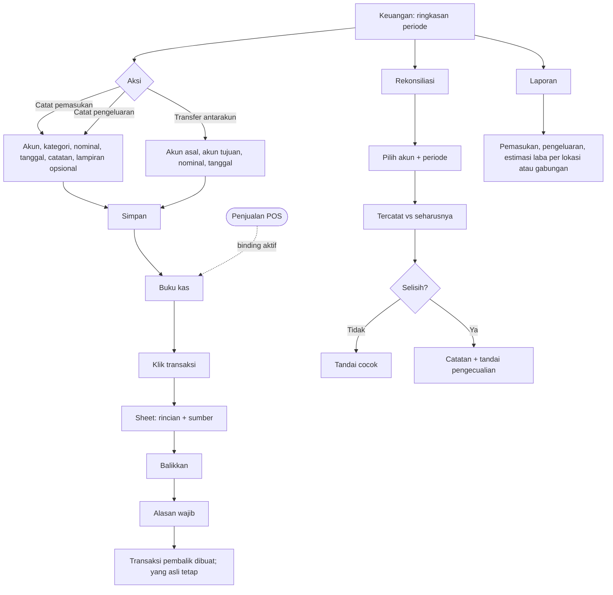
```mermaid
flowchart TD
    A[Keuangan: ringkasan periode] --> B{Aksi}
    B -- Catat pemasukan --> C[Akun, kategori, nominal, tanggal, catatan, lampiran opsional]
    B -- Catat pengeluaran --> C
    B -- Transfer antarakun --> D[Akun asal, akun tujuan, nominal, tanggal]
    C --> S[Simpan] --> K[Buku kas]
    D --> S
    POS([Penjualan POS]) -.->|binding aktif| K
    K --> T[Klik transaksi] --> U[Sheet: rincian + sumber]
    U --> V[Balikkan] --> W[Alasan wajib] --> X[Transaksi pembalik dibuat; yang asli tetap]
    A --> R[Rekonsiliasi] --> R1[Pilih akun + periode] --> R2[Tercatat vs seharusnya] --> R3{Selisih?}
    R3 -- Tidak --> R4[Tandai cocok]
    R3 -- Ya --> R5[Catatan + tandai pengecualian]
    A --> L[Laporan] --> L1[Pemasukan, pengeluaran, estimasi laba per lokasi atau gabungan]
```

Transaksi dari POS tampil dengan penanda sumber dan tidak dapat diedit dari Keuangan. HPP dan laba selalu berlabel "Estimasi operasional". Bila binding POS belum dipetakan, Keuangan tetap dapat dipakai dan menampilkan checklist setup pada Pengaturan → Integrasi, bukan memblokir halaman.

---

## 11. Karyawan

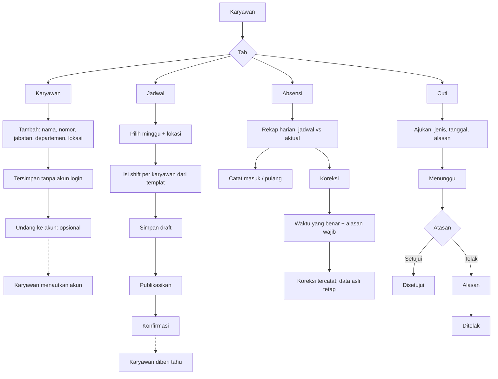
```mermaid
flowchart TD
    A[Karyawan] --> B{Tab}
    B --> E[Karyawan]
    B --> S[Jadwal]
    B --> T[Absensi]
    B --> L[Cuti]

    E --> E1[Tambah: nama, nomor, jabatan, departemen, lokasi] --> E2[Tersimpan tanpa akun login]
    E2 --> E3[Undang ke akun: opsional] -.-> E4[Karyawan menautkan akun]

    S --> S1[Pilih minggu + lokasi] --> S2[Isi shift per karyawan dari templat]
    S2 --> S3[Simpan draft]
    S3 --> S4[Publikasikan] --> S5[Konfirmasi] -.-> S6[Karyawan diberi tahu]

    T --> T1[Rekap harian: jadwal vs aktual]
    T1 --> T2[Catat masuk / pulang]
    T1 --> T3[Koreksi] --> T4[Waktu yang benar + alasan wajib] --> T5[Koreksi tercatat; data asli tetap]

    L --> L1[Ajukan: jenis, tanggal, alasan]
    L1 --> L2[Menunggu] --> L3{Atasan}
    L3 -- Setujui --> L4[Disetujui]
    L3 -- Tolak --> L5[Alasan] --> L6[Ditolak]
```

Status tautan akun ditampilkan terpisah dari status kepegawaian. Karyawan yang masuk dengan akunnya sendiri hanya melihat jadwal, absensi, dan cutinya sendiri.

---

## 12. Pengaturan

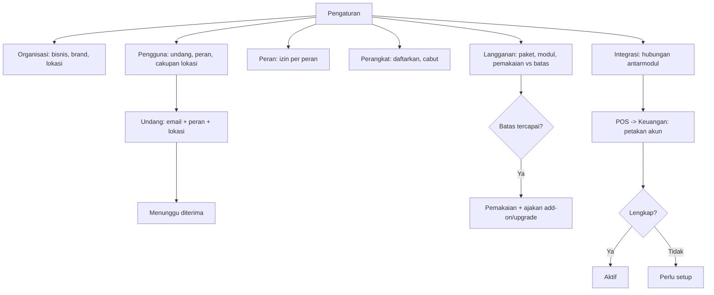
```mermaid
flowchart TD
    A[Pengaturan] --> B[Organisasi: bisnis, brand, lokasi]
    A --> C[Pengguna: undang, peran, cakupan lokasi]
    A --> D[Peran: izin per peran]
    A --> E[Perangkat: daftarkan, cabut]
    A --> F[Langganan: paket, modul, pemakaian vs batas]
    A --> G[Integrasi: hubungan antarmodul]

    C --> C1[Undang: email + peran + lokasi] --> C2[Menunggu diterima]
    F --> F1{Batas tercapai?}
    F1 -- Ya --> F2[Pemakaian + ajakan add-on/upgrade]
    G --> G1[POS -> Keuangan: petakan akun] --> G2{Lengkap?}
    G2 -- Ya --> G3[Aktif]
    G2 -- Tidak --> G4[Perlu setup]
```

Saat batas hard tercapai (misalnya jumlah pengguna), tombol tambah tetap terlihat tetapi membuka penjelasan batas dan ajakan upgrade — bukan error umum.

---

## 13. Platform Admin

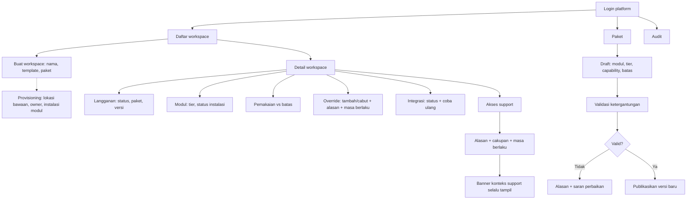
```mermaid
flowchart TD
    A[Login platform] --> B[Daftar workspace]
    B --> C[Buat workspace: nama, template, paket]
    C -.-> C1[Provisioning: lokasi bawaan, owner, instalasi modul]
    B --> D[Detail workspace]
    D --> D1[Langganan: status, paket, versi]
    D --> D2[Modul: tier, status instalasi]
    D --> D3[Pemakaian vs batas]
    D --> D4[Override: tambah/cabut + alasan + masa berlaku]
    D --> D5[Integrasi: status + coba ulang]
    D --> D6[Akses support] --> S1[Alasan + cakupan + masa berlaku] --> S2[Banner konteks support selalu tampil]
    A --> P[Paket] --> P1[Draft: modul, tier, capability, batas]
    P1 --> P2[Validasi ketergantungan] --> P3{Valid?}
    P3 -- Tidak --> P4[Alasan + saran perbaikan]
    P3 -- Ya --> P5[Publikasikan versi baru]
    A --> AU[Audit]
```

Versi paket yang sudah dipublikasikan tidak dapat diubah; mengedit berarti membuat versi baru. Pelanggan lama tetap pada versinya.

---

## 14. Alur lintas modul

### 14.1 Pesanan sampai laporan

```mermaid
sequenceDiagram
    actor K as Kasir / Tamu
    participant O as Pesanan
    participant D as Dapur (KDS)
    participant S as Stok
    participant F as Keuangan
    K->>O: Kirim pesanan
    O-->>K: Pesanan diterima
    O-)D: Ticket dapur dibuat
    D-)O: Status: disiapkan
    O-)S: Stok berkurang sesuai resep
    D-)O: Status: siap
    O-->>K: Pesanan siap
    K->>O: Bayar
    O-->>K: Lunas
    O-)F: Pendapatan dan pembayaran tercatat
```

Kasir langsung mendapat jawaban; dapur, stok, dan keuangan menyusul dalam hitungan detik. Bila salah satu modul tidak terpasang, langkahnya dilewati tanpa error. Bila salah satu gagal, pesanan tetap berhasil dan kegagalannya muncul di Pengaturan → Integrasi untuk dicoba ulang.

### 14.2 Menambah modul

```mermaid
flowchart TD
    A[Jelajahi modul] --> B[Pilih modul] --> C[Ajukan / upgrade]
    C -.-> D[Operator memberi entitlement]
    D -.-> E[Modul disiapkan]
    E --> F{Butuh setup?}
    F -- Ya --> G[Checklist setup di modul]
    F -- Tidak --> H[Modul muncul di navigasi]
    G --> H
    H --> I{Ada modul lain yang bisa dihubungkan?}
    I -- Ya --> J[Saran hubungan di Pengaturan -> Integrasi]
```

Data sebelum modul dipasang tidak diproses otomatis.

---

## 15. Alur error dan offline

```mermaid
flowchart TD
    A[Pengguna melakukan aksi] --> B{Hasil}
    B -- Berhasil --> C[Layar diperbarui]
    B -- Validasi --> D[Pesan di field terkait]
    B -- Tanpa izin --> E[Pesan: tidak punya akses]
    B -- Batas tercapai --> F[Pemakaian + ajakan upgrade]
    B -- Sesi habis --> G[Login ulang; kembali ke halaman semula]
    B -- Offline --> H[Banner offline; draft tetap; aksi server nonaktif]
    B -- Error server --> I[Pesan umum + kode permintaan + coba lagi]
    H -.-> J[Tersambung lagi] --> K[Data diambil ulang]
```

Aturan: draft (keranjang, isian form) tidak hilang karena error, offline, pergantian tema, pergantian bahasa, atau perubahan ukuran layar. Mengulang aksi yang sama tidak menghasilkan transaksi ganda.

---

## 16. Checklist alur per layar

- [ ] Tujuan layar dapat dinyatakan dalam satu kalimat.
- [ ] Hanya ada satu aksi utama.
- [ ] Langkah berikutnya jelas tanpa membaca penjelasan.
- [ ] State memuat, kosong, error, tanpa izin, dan state modul tersedia.
- [ ] Aksi destruktif meminta konfirmasi; aksi sensitif meminta alasan.
- [ ] Hasil baru ditampilkan setelah server mengonfirmasi.
- [ ] Draft tidak hilang saat error atau offline.
- [ ] Alur dapat diselesaikan pada Small, Medium, dan Large.
- [ ] Alur dapat diselesaikan dengan keyboard pada Backoffice.
