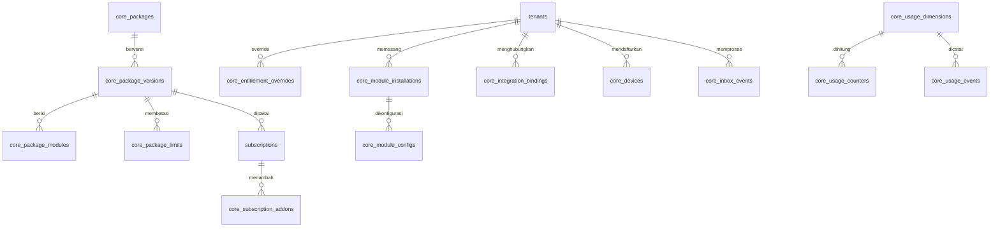
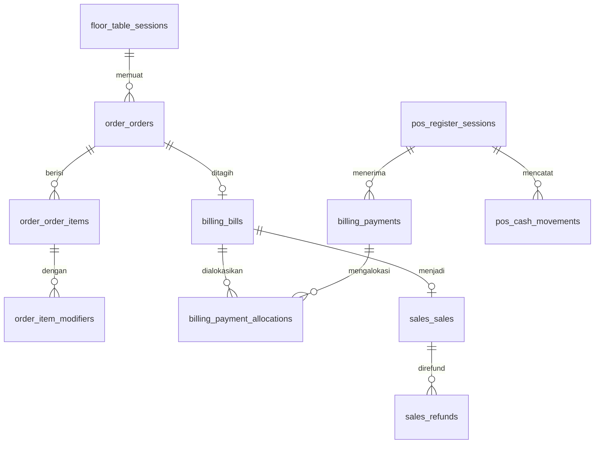
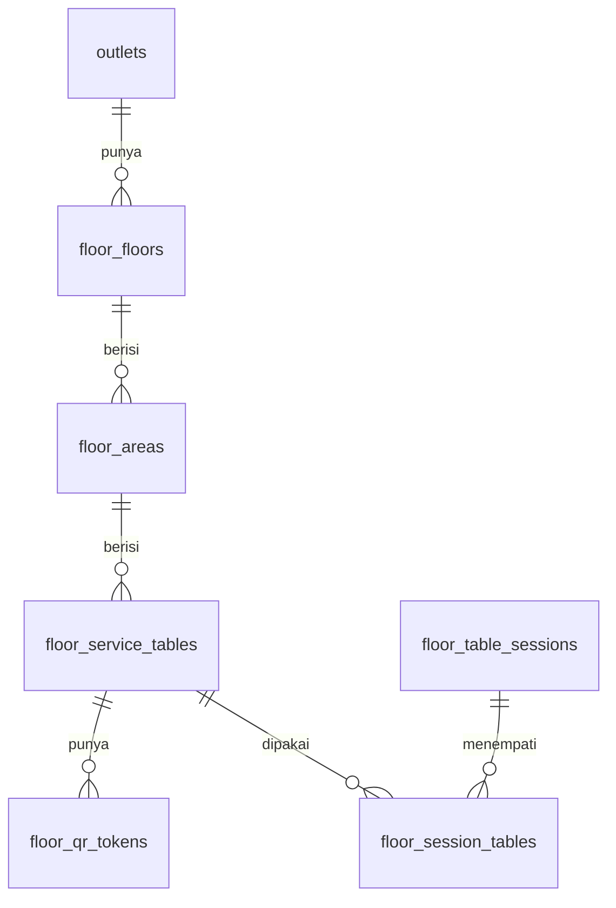

# Schema — Cafe Companion Pro

**Status:** Kontrak skema database
**Tanggal:** 2 Oktober 2026
**Database:** PostgreSQL, satu database untuk semua modul
**ORM:** Prisma 7 (`packages/database/prisma/schema.prisma`)

Dokumen ini memisahkan dua hal:

- **Bagian A — skema saat ini:** 30 tabel yang sudah ada di migrasi.
- **Bagian B — skema target:** tabel yang harus ditambahkan untuk Release 1.

Tabel target adalah rancangan. Nama kolom final ditetapkan pada checkpoint migrasi masing-masing dan dokumen ini diperbarui pada commit yang sama.

---

## 1. Konvensi

| Hal                     | Aturan                                                                                                                     |
| ----------------------- | -------------------------------------------------------------------------------------------------------------------------- |
| Primary key             | `uuid` dengan `uuidv7()` dari database; tidak bermakna bisnis                                                              |
| Nama tabel dan kolom    | `snake_case`; model Prisma `PascalCase` dengan `@map`                                                                      |
| Isolasi                 | Semua tabel domain memiliki `tenant_id` (dibaca sebagai `workspace_id`) non-null                                           |
| Integritas lintas tabel | Foreign key komposit `(tenant_id, x_id)` → `(tenant_id, id)`; setiap tabel anak punya `@@unique([tenantId, id])`           |
| Keunikan                | Selalu menyertakan `tenant_id` bila keunikan berlaku per workspace                                                         |
| Waktu                   | `timestamptz(6)` dalam UTC; `created_at`, `updated_at`                                                                     |
| Zona waktu              | Kolom IANA pada lokasi (`Asia/Jakarta`)                                                                                    |
| Uang                    | `bigint` satuan terkecil + `currency char(3)`; nama kolom berakhiran `_minor`                                              |
| Kuantitas               | `numeric(18,4)`                                                                                                            |
| Hapus                   | Tidak ada hard delete untuk master dan transaksi; pakai `status`                                                           |
| `ON DELETE`             | `RESTRICT` ke induk; `CASCADE` hanya untuk tabel penghubung                                                                |
| Enum                    | Enum PostgreSQL untuk status yang stabil                                                                                   |
| JSON                    | Hanya untuk konfigurasi tervalidasi dan metadata; bukan pengganti kolom relasional                                         |
| Prefix tabel baru       | `core_`, `order_`, `billing_`, `sales_`, `pos_`, `floor_`, `kds_`, `inventory_`, `finance_`, `hc_`, `customer_`, `report_` |

### 1.1 Istilah tenant → workspace

Tabel lama memakai `tenants`, `brands`, `outlets`. Secara konsep:

| Tabel sekarang | Konsep internal | Kolom di tabel lain |
| -------------- | --------------- | ------------------- |
| `tenants`      | Workspace       | `tenant_id`         |
| `brands`       | Business Unit   | `brand_id`          |
| `outlets`      | Location        | `outlet_id`         |

Aturan migrasi:

1. Tabel baru tetap memakai nama kolom `tenant_id` dan `outlet_id` agar foreign key komposit konsisten. Penggantian nama fisik dilakukan dalam satu migrasi tersendiri di kemudian hari, bukan dicicil.
2. Kontrak API dan kode aplikasi baru memakai istilah `workspace`, `businessUnit`, `location` (alias sudah tersedia di `packages/contracts`).
3. `tenants` mendapat kolom baru `type` dan `template` (bagian B.1).

---

# Bagian A — Skema saat ini

## 2. Diagram

```mermaid
erDiagram
    users ||--o{ login_sessions : memiliki
    users ||--o{ tenant_memberships : anggota
    platform_users ||--o{ platform_login_sessions : memiliki

    tenants ||--o{ brands : punya
    tenants ||--o{ outlets : punya
    brands ||--o{ outlets : punya
    tenants ||--o{ tenant_memberships : punya
    tenants ||--o{ roles : punya
    tenant_memberships ||--o{ user_roles : diberi
    roles ||--o{ user_roles : dipakai
    roles ||--o{ role_permissions : berisi
    permissions ||--o{ role_permissions : dirujuk
    tenant_memberships ||--o{ outlet_assignments : ditugaskan
    outlets ||--o{ outlet_assignments : menerima

    plans ||--o{ plan_modules : berisi
    modules ||--o{ plan_modules : dirujuk
    modules ||--o{ module_dependencies : bergantung
    tenants ||--o{ subscriptions : berlangganan
    plans ||--o{ subscriptions : dipakai
    tenants ||--o{ tenant_entitlements : override
    modules ||--o{ tenant_entitlements : dirujuk

    tenants ||--o{ categories : punya
    categories ||--o{ products : berisi
    products ||--o{ product_variants : punya
    products ||--o{ product_images : punya
    products ||--o{ product_modifier_groups : memakai
    modifier_groups ||--o{ product_modifier_groups : dipakai
    modifier_groups ||--o{ modifier_options : berisi
    products ||--o{ outlet_products : ditugaskan
    outlets ||--o{ outlet_products : menjual

    tenants ||--o{ audit_logs : mencatat
    tenants ||--o{ idempotency_keys : menyimpan
    tenants ||--o{ outbox_events : menerbitkan
```

## 3. Identitas dan sesi

| Tabel                     | Kolom penting                                                                                                         | Catatan                                           |
| ------------------------- | --------------------------------------------------------------------------------------------------------------------- | ------------------------------------------------- |
| `users`                   | `email` unik, `password_hash`, `display_name`, `status` (`ACTIVE`/`DISABLED`), `password_changed_at`, `last_login_at` | Identitas login merchant, global lintas workspace |
| `login_sessions`          | `user_id`, `token_hash char(64)` unik, `expires_at`, `revoked_at`, `last_seen_at`, `ip_address`, `user_agent`         | Hanya hash SHA-256 token yang disimpan            |
| `platform_users`          | `email` unik, `password_hash`, `role` (`OWNER`/`ADMIN`/`SUPPORT`), `status`                                           | Identitas operator, terpisah dari `users`         |
| `platform_login_sessions` | Sama dengan `login_sessions`                                                                                          | Sesi platform terpisah                            |

## 4. Organisasi

| Tabel     | Kolom penting                                                 | Keunikan            |
| --------- | ------------------------------------------------------------- | ------------------- |
| `tenants` | `name`, `slug`, `status`                                      | `slug`              |
| `brands`  | `tenant_id`, `name`, `slug`, `status`                         | `(tenant_id, slug)` |
| `outlets` | `tenant_id`, `brand_id`, `code`, `name`, `timezone`, `status` | `(tenant_id, code)` |

## 5. Akses

| Tabel                | Kolom penting                                      | Catatan                                                                 |
| -------------------- | -------------------------------------------------- | ----------------------------------------------------------------------- |
| `tenant_memberships` | `tenant_id`, `user_id`, `status`, `all_outlets`    | Unik `(tenant_id, user_id)`; `all_outlets` berarti cakupan semua lokasi |
| `permissions`        | `key` (PK), `description`                          | Katalog global; 26 kunci saat ini                                       |
| `roles`              | `tenant_id`, `code`, `name`, `is_system`, `status` | Unik `(tenant_id, code)`; role sistem tidak dapat diubah                |
| `role_permissions`   | `(tenant_id, role_id, permission_key)`             |                                                                         |
| `user_roles`         | `(tenant_id, membership_id, role_id)`              |                                                                         |
| `outlet_assignments` | `(tenant_id, membership_id, outlet_id)`            | Cakupan lokasi bila `all_outlets = false`                               |

Role sistem bawaan: `OWNER`, `MANAGER`, `CASHIER`, `KITCHEN`, dan role lain yang didefinisikan di `apps/api/src/core/memberships/access.service.ts`.

## 6. Langganan dan entitlement

| Tabel                 | Kolom penting                                                                              | Catatan                                                                     |
| --------------------- | ------------------------------------------------------------------------------------------ | --------------------------------------------------------------------------- |
| `modules`             | `key` (PK), `name`, `kind` (`CORE`/`COMMERCIAL`), `status`                                 | 15 modul di-seed migrasi                                                    |
| `module_dependencies` | `(module_key, dependency_key)`                                                             |                                                                             |
| `plans`               | `code` unik, `name`, `status`                                                              | `PROFILE`, `POS_BASIC`, `CAFE_DIGITAL`, `CAFE_OPERATIONS`, `CUSTOM_MODULAR` |
| `plan_modules`        | `(plan_id, module_key)`                                                                    |                                                                             |
| `subscriptions`       | `tenant_id`, `plan_id`, `status`, `starts_at`, `ends_at`, `grace_ends_at`, `superseded_at` | Status: `TRIAL`, `ACTIVE`, `GRACE`, `SUSPENDED`, `TERMINATED`               |
| `tenant_entitlements` | `tenant_id`, `module_key`, `enabled`, `reason`, `effective_at`, `actor_id`                 | Override boolean per modul                                                  |

**Kesenjangan terhadap target:** tidak ada versi paket, tier, capability, limit, add-on, instalasi, atau binding. `tenant_entitlements.enabled` adalah boolean yang harus digantikan (bagian B.2).

## 7. Catalog

| Tabel                     | Kolom penting                                                                                                               | Keunikan                                     |
| ------------------------- | --------------------------------------------------------------------------------------------------------------------------- | -------------------------------------------- |
| `categories`              | `name`, `slug`, `display_order`, `status`                                                                                   | `(tenant_id, slug)`                          |
| `products`                | `category_id`, `name`, `slug`, `description`, `base_price_minor`, `currency`, `availability`, `status`                      | `(tenant_id, slug)`                          |
| `product_variants`        | `product_id`, `name`, `price_delta_minor`, `availability`, `display_order`, `status`                                        | `(tenant_id, product_id, name)`              |
| `modifier_groups`         | `name`, `selection_type` (`SINGLE`/`MULTIPLE`), `min_selections`, `max_selections`, `display_order`, `status`               | `(tenant_id, name)`                          |
| `modifier_options`        | `group_id`, `name`, `price_delta_minor`, `availability`, `display_order`, `status`                                          | `(tenant_id, group_id, name)`                |
| `product_modifier_groups` | `product_id`, `modifier_group_id`, `display_order`, `status`                                                                | `(tenant_id, product_id, modifier_group_id)` |
| `product_images`          | `product_id`, `object_key`, `content_type`, `alt_text`, `width`, `height`, `is_primary`, `display_order`, `status`          | `(tenant_id, object_key)`                    |
| `outlet_products`         | `outlet_id`, `product_id`, `price_override_minor` (nullable), `availability_override` (nullable), `display_order`, `status` | `(tenant_id, outlet_id, product_id)`         |

`status` (`ACTIVE`/`INACTIVE`) adalah lifecycle master; `availability` (`AVAILABLE`/`SOLD_OUT`) adalah ketersediaan jual. Nilai `null` pada override berarti mewarisi produk induk.

## 8. Tabel lintas modul

| Tabel              | Kolom penting                                                                                                                                                                                                                                                                                                | Catatan |
| ------------------ | ------------------------------------------------------------------------------------------------------------------------------------------------------------------------------------------------------------------------------------------------------------------------------------------------------------ | ------- |
| `audit_logs`       | **Selesai 3 Oktober 2026 (migrasi `20261003230000_core_table_adjustments`):** `channel` (CHECK), `reason`, `correlation_id` (berindeks). Penulis audit belum mengisinya; menyusul bersama command context                                                                                                    |
| `idempotency_keys` | **Selesai 3 Oktober 2026 (migrasi `20261003230000_core_table_adjustments`):** `outlet_id` nullable untuk perintah tingkat workspace; keunikan baris tanpa outlet dijaga indeks unik parsial `(tenant_id, scope, key) WHERE outlet_id IS NULL`                                                                |
| `outbox_events`    | **Selesai 3 Oktober 2026 (migrasi `20261003230000_core_table_adjustments`):** `event_version int` (bawaan 1), `correlation_id`, `causation_id`, `actor_type` (CHECK), `actor_id`, `producer`, `recorded_at`. Penulis event belum mengisi kolom yang nullable; itu dikerjakan bersama dispatcher (`M2-BE-09`) |

**Kesenjangan:** `idempotency_keys.outlet_id` wajib, sehingga operasi tingkat workspace (HC, Finance tanpa lokasi) tidak dapat memakainya — kolom harus dibuat nullable. `outbox_events` belum menyimpan versi event, `correlation_id`, `causation_id`, dan aktor.

---

# Bagian B — Skema target

Urutan penambahan mengikuti tahap di `prd.md` bagian 11.2.

## B.1 Penyesuaian tabel lama

| Tabel              | Perubahan                                                                                                                                                                                                                                                                                                                                                                                                                                          |
| ------------------ | -------------------------------------------------------------------------------------------------------------------------------------------------------------------------------------------------------------------------------------------------------------------------------------------------------------------------------------------------------------------------------------------------------------------------------------------------- |
| `tenants`          | **Selesai 3 Oktober 2026 (migrasi `20261003230000_core_table_adjustments`):** `type` (`BUSINESS`/`PERSONAL`, bawaan `BUSINESS`), `template` (`CAFE`, `RESTAURANT`, `BAKERY_RETAIL`, `CLOUD_KITCHEN`, `HC_ONLY`, `BUSINESS_FINANCE_ONLY`, `PERSONAL`; sesuai PRD v2 6.4, bawaan `CAFE`), `currency char(3)` (bawaan `IDR`), `timezone` (bawaan `Asia/Jakarta`). CHECK: mata uang tiga huruf besar; tipe `PERSONAL` hanya dengan template `PERSONAL` |
| `users`            | **Selesai 3 Oktober 2026:** `locale` (`id`/`en`, nullable), `theme` (`light`/`dark`/`system`, nullable), dijaga CHECK                                                                                                                                                                                                                                                                                                                              |
| `outlets`          | **Selesai 3 Oktober 2026 (migrasi `20261003230000_core_table_adjustments`):** `address` (nullable, maks. 500)                                                                                                                                                                                                                                                                                                                                      |
| `idempotency_keys` | `outlet_id` menjadi nullable; keunikan menyesuaikan                                                                                                                                                                                                                                                                                                                                                                                                |
| `outbox_events`    | Tambah `event_version int`, `correlation_id`, `causation_id`, `actor_type`, `actor_id`, `producer`, `recorded_at`                                                                                                                                                                                                                                                                                                                                  |
| `audit_logs`       | Tambah `channel`, `reason`, `correlation_id`                                                                                                                                                                                                                                                                                                                                                                                                       |

## B.2 Core modular

| Tabel                         | Kolom                                                                                                                                                                    | Aturan                                                                                                                                                                                                                                                                   |
| ----------------------------- | ------------------------------------------------------------------------------------------------------------------------------------------------------------------------ | ------------------------------------------------------------------------------------------------------------------------------------------------------------------------------------------------------------------------------------------------------------------------ |
| `core_packages`               | `key` unik, `name`, `status`                                                                                                                                             | Menggantikan peran `plans` **Berjalan sejak 3 Oktober 2026** (migrasi `20261003233000_core_packages`). Baris `plans` disalin ke sini.                                                                                                                                    |
| `core_package_versions`       | `package_id`, `version int`, `status` (`DRAFT`/`PUBLISHED`/`RETIRED`), `template`, `published_at`                                                                        | Unik `(package_id, version)`; tidak berubah setelah `PUBLISHED` **Berjalan sejak 3 Oktober 2026** (migrasi `20261003233000_core_packages`). Dijaga trigger database: versi `PUBLISHED` hanya boleh menjadi `RETIRED`; `RETIRED` tidak berubah lagi.                      |
| `core_package_modules`        | `package_version_id`, `module_key`, `tier` (`BASIC`/`PRO`/`ADVANCED`)                                                                                                    | **Berjalan sejak 3 Oktober 2026** (migrasi `20261003233000_core_packages`). Tidak bisa ditambah, diubah, atau dihapus setelah versinya terbit.                                                                                                                           |
| `core_package_capabilities`   | `package_version_id`, `capability_key`, `included bool`                                                                                                                  | Penambahan atau pengurangan terhadap bawaan tier **Berjalan sejak 3 Oktober 2026** (migrasi `20261003233000_core_packages`).                                                                                                                                             |
| `core_package_limits`         | `package_version_id`, `dimension_key`, `value bigint?`, `unlimited bool`                                                                                                 | `unlimited` adalah flag, bukan angka besar **Berjalan sejak 3 Oktober 2026** (migrasi `20261003233000_core_packages`). `dimension_key` belum ber-FK; FK ditambahkan bersama `core_usage_dimensions` (M2-BE-11).                                                          |
| `subscriptions` (ubah)        | Tambah `package_version_id`, `cycle_starts_at`, `cycle_ends_at`; status tambah `DRAFT`, `CANCELED_AT_PERIOD_END`                                                         | **Berjalan sejak 3 Oktober 2026** (migrasi `20261003235000_subscription_package_versions`). `package_version_id` wajib dan tidak boleh menunjuk versi `DRAFT` (trigger); `cycle_starts_at` wajib; `plan_id` masih ada selama transisi (SCH-03).                          |
| `core_subscription_addons`    | `subscription_id`, `addon_key`, `quantity`, `starts_at`, `ends_at?`                                                                                                      | **Berjalan sejak 3 Oktober 2026** (migrasi `20261003235000_subscription_package_versions`). Ber-`tenant_id`; FK gabungan `(tenant_id, subscription_id)` memastikan add-on hanya menempel pada langganan tenant yang sama; `quantity > 0`. Katalog `addon_key` belum ada. |
| `core_entitlement_overrides`  | `tenant_id`, `target_type` (`CAPABILITY`/`LIMIT`), `target_key`, `operation` (`GRANT`/`REVOKE`/`ADD`/`REPLACE`), `value?`, `reason`, `starts_at`, `ends_at?`, `actor_id` | Menggantikan `tenant_entitlements`                                                                                                                                                                                                                                       |
| `core_effective_entitlements` | `tenant_id`, `module_key`, `tier`, `capabilities jsonb`, `limits jsonb`, `computed_at`                                                                                   | Projection; dapat dibangun ulang                                                                                                                                                                                                                                         |
| `core_module_installations`   | `tenant_id`, `module_key`, `tier`, `status`, `config_version`, `installed_at`, `actor_id`                                                                                | Unik `(tenant_id, module_key)`                                                                                                                                                                                                                                           |
| `core_module_configs`         | `installation_id`, `schema_version`, `config jsonb`                                                                                                                      | Divalidasi skema milik modul                                                                                                                                                                                                                                             |
| `core_integration_bindings`   | `tenant_id`, `source_module`, `event_type`, `event_version`, `target_module`, `handler`, `status`, `health`, `config_version`, `config jsonb`, `effective_from`          | Unik `(tenant_id, source_module, event_type, target_module, handler)`                                                                                                                                                                                                    |
| `core_usage_dimensions`       | `key` (PK), `unit`, `enforcement` (`HARD`/`SOFT`/`THROTTLED`)                                                                                                            | 25 dimensi dari dokumen Packages & Limits bagian 16                                                                                                                                                                                                                      |
| `core_usage_events`           | `tenant_id`, `dimension_key`, `quantity`, `source_reference`, `idempotency_key`, `occurred_at`, `received_at`                                                            | Unik `(tenant_id, dimension_key, idempotency_key)`                                                                                                                                                                                                                       |
| `core_usage_counters`         | `tenant_id`, `dimension_key`, `period_start`, `period_end`, `quantity`, `calculated_at`                                                                                  | Dapat dibangun ulang dari event                                                                                                                                                                                                                                          |
| `core_usage_adjustments`      | `tenant_id`, `dimension_key`, `delta`, `reason`, `actor_id`                                                                                                              | Koreksi yang diaudit                                                                                                                                                                                                                                                     |
| `core_limit_notifications`    | `tenant_id`, `dimension_key`, `period_start`, `threshold`                                                                                                                | Mencegah notifikasi berulang                                                                                                                                                                                                                                             |
| `core_devices`                | `tenant_id`, `outlet_id?`, `mode`, `label`, `status`, `credential_hash`, `last_seen_at`                                                                                  | Secret tidak pernah tampil lagi setelah provisioning                                                                                                                                                                                                                     |
| `core_feature_flags`          | `key` (PK), `rollout jsonb`, `status`                                                                                                                                    |                                                                                                                                                                                                                                                                          |
| `core_inbox_events`           | `tenant_id`, `consumer_name`, `event_id`, `event_type`, `status` (`PROCESSED`/`RETRYING`/`BLOCKED`/`FAILED`), `result_reference?`, `processed_at`                        | Unik `(tenant_id, consumer_name, event_id)`                                                                                                                                                                                                                              |
| `core_support_access_grants`  | `tenant_id`, `platform_user_id`, `scope`, `reason`, `status`, `expires_at`, `revoked_at?`                                                                                |                                                                                                                                                                                                                                                                          |

## B.3 Order, bill, payment, sales

| Tabel                         | Kolom                                                                                                                                                                                                                                                                                                    | Aturan                                                                                                                                                                                                                                                                         |
| ----------------------------- | -------------------------------------------------------------------------------------------------------------------------------------------------------------------------------------------------------------------------------------------------------------------------------------------------------- | ------------------------------------------------------------------------------------------------------------------------------------------------------------------------------------------------------------------------------------------------------------------------------ |
| `order_number_counters`       | PK `(tenant_id, outlet_id)`, `last_number`                                                                                                                                                                                                                                                               | Naik dalam transaksi pembuatan pesanan                                                                                                                                                                                                                                         |
| `order_orders`                | `tenant_id`, `outlet_id`, `order_number`, `source` (`POS`/`SELF_ORDER`/`MANUAL`/`EXTERNAL`), `order_type` (`DINE_IN`/`TAKEAWAY`), `status`, `table_session_id?`, `note?`, `submitted_at?`, `actor_id?`, `currency`, `idempotency_key`, `canceled_at?`, `canceled_by?`, `cancel_reason?`                  | Unik `(tenant_id, outlet_id, order_number)` dan `(tenant_id, outlet_id, idempotency_key)`; status `DRAFT`→`SUBMITTED`→`ACCEPTED`→`PREPARING`→`READY`→`SERVED`→`COMPLETED`, atau `CANCELED` (wajib waktu, pelaku, dan alasan; hanya bila belum dibayar)                         |
| `order_order_items`           | `order_id`, `position`, `product_id?`, `name_snapshot`, `variant_name_snapshot?`, `unit_price_minor`, `quantity`, `line_total_minor`, `note?`, `routing_hint?`                                                                                                                                           | Snapshot; tidak berubah bila katalog berubah. CHECK `line_total_minor = unit_price_minor * quantity`                                                                                                                                                                           |
| `order_item_modifiers`        | `order_item_id`, `position`, `group_name_snapshot`, `option_name_snapshot`, `price_delta_minor`                                                                                                                                                                                                          |                                                                                                                                                                                                                                                                                |
| `billing_bills`               | `outlet_id`, `order_id`, `currency`, `subtotal_minor`, `discount_minor`, `tax_minor`, `service_charge_minor`, `rounding_minor`, `total_minor`, `paid_minor`, `status`                                                                                                                                    | Status `UNPAID`/`PARTIALLY_PAID`/`PAID`/`VOID`, terpisah dari status pesanan. Unik `(tenant_id, order_id)`. CHECK `total = subtotal - discount + tax + service_charge + rounding` dan `paid <= total`. `table_session_id` ditambahkan bersama sesi meja                        |
| `billing_payments`            | `outlet_id`, `register_session_id?`, `method` (`CASH`/`MERCHANT_QRIS`/`TRANSFER`/`EDC`/`OTHER`), `amount_minor`, `tendered_minor?`, `status` (`UNPAID`/`VERIFYING`/`PAID`/`REFUND_PENDING`/`REFUNDED`/`FAILED`/`EXPIRED`), `reference?`, `confirmed_by?`, `confirmed_at?`, `actor_id`, `idempotency_key` | Unik `(tenant_id, outlet_id, idempotency_key)`. `tendered_minor` wajib dan `>= amount_minor` untuk tunai, kosong untuk metode lain; kembalian adalah nilai turunan. `PAID` wajib punya konfirmasi                                                                              |
| `billing_payment_allocations` | `payment_id`, `bill_id`, `amount_minor`                                                                                                                                                                                                                                                                  | Mendukung pembayaran campuran                                                                                                                                                                                                                                                  |
| `sales_sales`                 | `outlet_id`, `sale_number`, `bill_id`, `status` (`OPEN`/`COMPLETED`/`PARTIALLY_REFUNDED`/`REFUNDED`/`VOIDED`), `total_minor`, `completed_at?`                                                                                                                                                            | Unik `(tenant_id, outlet_id, sale_number)` dan `(tenant_id, bill_id)`; nomor dari `sales_number_counters`                                                                                                                                                                      |
| `sales_refunds`               | `outlet_id`, `sale_id`, `payment_id`, `register_session_id`, `method`, `amount_minor` (> 0), `reason` (≥ 3 huruf), `status` (`COMPLETED`), `actor_id`, `approved_by?`, `idempotency_key`                                                                                                                 | Unik `(tenant_id, outlet_id, idempotency_key)`. Jumlah semua refund ≤ total penjualan (dicek di bawah kunci penjualan); penjualan menjadi `PARTIALLY_REFUNDED`/`REFUNDED`, pembayaran asli tidak diubah. Refund tunai mengurangi kas seharusnya shift tempat refund dibayarkan |
| `pos_register_sessions`       | `outlet_id`, `status` (`OPEN`/`CLOSED`), `opened_by`, `opened_at`, `opening_cash_minor`, `closed_by?`, `closed_at?`, `expected_cash_minor?`, `counted_cash_minor?`, `variance_minor?`, `variance_reason?`                                                                                                | Satu shift terbuka per kasir per outlet (partial unique index). Fakta penutupan kosong selama `OPEN` dan lengkap saat `CLOSED`; `variance_minor = counted - expected`, selisih bukan nol wajib beralasan (CHECK). `device_id` ditambahkan bersama registrasi perangkat         |
| `pos_cash_movements`          | `outlet_id`, `register_session_id`, `direction` (`IN`/`OUT`), `amount_minor` (> 0), `reason`, `actor_id`, `idempotency_key`                                                                                                                                                                              | Unik `(tenant_id, register_session_id, idempotency_key)`; tidak diubah atau dihapus                                                                                                                                                                                            |
| `pos_held_carts`              | `outlet_id`, `label`, `lines jsonb` (produk, varian, pilihan, jumlah, catatan; divalidasi kontrak pesanan), `item_count` (> 0), `created_by`, `idempotency_key`                                                                                                                                          | Keranjang yang ditahan, bukan pesanan: tanpa nomor, tanpa harga, tanpa pengaruh kas. Melanjutkan atau membuang menghapus barisnya dalam transaksi sehingga hanya satu kasir yang mengambilnya                                                                                  |

## B.4 Floor dan Self-Order

| Tabel                    | Kolom                                                                                                                                                                                                           | Aturan                                                                                         |
| ------------------------ | --------------------------------------------------------------------------------------------------------------------------------------------------------------------------------------------------------------- | ---------------------------------------------------------------------------------------------- |
| `floor_floors`           | `outlet_id`, `name`, `display_order`, `grid_cols`, `grid_rows`, `status`                                                                                                                                        | Lokasi baru mendapat `Main Floor`                                                              |
| `floor_areas`            | `floor_id`, `name`, `display_order`, `status`                                                                                                                                                                   | Nama bebas; lantai baru mendapat `Main Area`                                                   |
| `floor_service_tables`   | `area_id`, `label`, `capacity int`, `shape` (`SQUARE`/`RECTANGLE`/`ROUND`), `visual_size` (`SMALL`/`MEDIUM`/`LARGE`), `grid_x?`, `grid_y?`, `grid_w`, `grid_h`, `rotation` (0/90), `qr_ordering bool`, `status` | Unik `(tenant_id, outlet_id, label)`; koordinat grid logis, bukan piksel; kursi tidak disimpan |
| `floor_table_sessions`   | `outlet_id`, `display_number`, `guest_count`, `status` (`OPEN`/`CLOSING`/`CLOSED`), `opened_at`, `closing_at?`, `closed_at?`, `opened_by`                                                                       | Riwayat sesi tidak ditimpa                                                                     |
| `floor_session_tables`   | `session_id`, `table_id`, `role` (`PRIMARY`/`MERGED`), `attached_at`, `detached_at?`                                                                                                                            | Indeks unik parsial: satu attachment aktif per meja                                            |
| `floor_qr_tokens`        | `table_id`, `token_hash char(64)`, `version int`, `status` (`ACTIVE`/`ROTATED`/`REVOKED`/`EXPIRED`), `rotated_at?`, `revoked_at?`                                                                               | Token mentah tidak disimpan; QR melekat pada meja, bukan sesi                                  |
| `floor_service_requests` | `session_id`, `type` (`WAITER`/`BILL`), `status`, `requested_at`, `handled_by?`                                                                                                                                 | Panggil pelayan dan minta bill                                                                 |

Status meja (`AVAILABLE`, `OCCUPIED`, `CLOSING`, `CLEANING`, `INACTIVE`) adalah **projection** dari sesi aktif dan konfigurasi, bukan kolom yang dapat diisi bebas.

## B.5 KDS

| Tabel                       | Kolom                                                                                                                                       | Aturan                                                                                                          |
| --------------------------- | ------------------------------------------------------------------------------------------------------------------------------------------- | --------------------------------------------------------------------------------------------------------------- |
| `kds_stations`              | `outlet_id`, `name`, `status`                                                                                                               | Satu station bawaan per lokasi                                                                                  |
| `kds_tickets`               | `outlet_id`, `station_id`, `source`, `source_reference`, `order_label`, `table_label?`, `status`, `received_at`, `started_at?`, `ready_at?` | Unik `(tenant_id, source, source_reference)`; **tanpa** foreign key ke `order_orders` agar KDS-only tetap valid |
| `kds_ticket_items`          | `ticket_id`, `name_snapshot`, `quantity`, `modifiers jsonb`, `note?`, `allergy_note?`                                                       | Tanpa harga                                                                                                     |
| `kds_ticket_status_history` | `ticket_id`, `from_status`, `to_status`, `actor_id?`, `occurred_at`                                                                         | Append-only                                                                                                     |

## B.6 Inventory

| Tabel                              | Kolom                                                                                                                                                                                                                                                           | Aturan                                                                                          |
| ---------------------------------- | --------------------------------------------------------------------------------------------------------------------------------------------------------------------------------------------------------------------------------------------------------------- | ----------------------------------------------------------------------------------------------- |
| `inventory_units`                  | `code`, `name`, `precision`                                                                                                                                                                                                                                     |                                                                                                 |
| `inventory_unit_conversions`       | `from_unit_id`, `to_unit_id`, `factor numeric`                                                                                                                                                                                                                  |                                                                                                 |
| `inventory_items`                  | `sku?`, `name`, `category?`, `base_unit_id`, `min_stock?`, `status`                                                                                                                                                                                             | Tidak wajib terhubung ke produk Catalog                                                         |
| `inventory_suppliers`              | `name`, `contact?`, `status`                                                                                                                                                                                                                                    |                                                                                                 |
| `inventory_stock_locations`        | `outlet_id?`, `name`, `status`                                                                                                                                                                                                                                  | Dimensi limit tersendiri, berbeda dari lokasi organisasi                                        |
| `inventory_movements`              | `stock_location_id`, `item_id`, `type` (`RECEIPT`/`CONSUMPTION`/`ADJUSTMENT`/`WASTE`/`TRANSFER_IN`/`TRANSFER_OUT`/`REVERSAL`), `quantity`, `unit_cost_minor?`, `source_type`, `source_reference`, `reverses_movement_id?`, `reason?`, `actor_id`, `occurred_at` | Append-only; unik `(tenant_id, source_type, source_reference, item_id)` untuk idempotency event |
| `inventory_balance_projection`     | `stock_location_id`, `item_id`, `quantity`, `updated_at`                                                                                                                                                                                                        | Dapat dibangun ulang dari movement                                                              |
| `inventory_stocktakes`             | `stock_location_id`, `status` (`DRAFT`/`FINALIZED`), `finalized_at?`, `actor_id`                                                                                                                                                                                |                                                                                                 |
| `inventory_stocktake_lines`        | `stocktake_id`, `item_id`, `system_quantity`, `counted_quantity`, `reason?`                                                                                                                                                                                     |                                                                                                 |
| `inventory_transfers`              | `from_location_id`, `to_location_id`, `status`                                                                                                                                                                                                                  | Movement keluar dan masuk dalam satu transaksi                                                  |
| `inventory_purchase_receipts`      | `supplier_id?`, `stock_location_id`, `received_at`, `status`                                                                                                                                                                                                    |                                                                                                 |
| `inventory_purchase_receipt_lines` | `receipt_id`, `item_id`, `quantity`, `unit_cost_minor`                                                                                                                                                                                                          |                                                                                                 |
| `inventory_recipes`                | `product_id?`, `variant_id?`, `status`                                                                                                                                                                                                                          | Jembatan opsional ke Catalog                                                                    |
| `inventory_recipe_items`           | `recipe_id`, `item_id`, `quantity`, `unit_id`                                                                                                                                                                                                                   |                                                                                                 |

## B.7 Finance

| Tabel                        | Kolom                                                                                                                                                                                                                                                          | Aturan                                                                                                               |
| ---------------------------- | -------------------------------------------------------------------------------------------------------------------------------------------------------------------------------------------------------------------------------------------------------------- | -------------------------------------------------------------------------------------------------------------------- |
| `finance_accounts`           | `name`, `type` (`CASH`/`BANK`/`CLEARING`/`OTHER`), `currency`, `status`                                                                                                                                                                                        |                                                                                                                      |
| `finance_categories`         | `name`, `kind` (`INCOME`/`EXPENSE`), `status`                                                                                                                                                                                                                  |                                                                                                                      |
| `finance_transactions`       | `outlet_id?`, `kind` (`INCOME`/`EXPENSE`/`TRANSFER`/`ADJUSTMENT`), `status` (`DRAFT`/`POSTED`/`REVERSED`), `source_type`, `source_reference?`, `purpose`, `category_id?`, `description?`, `occurred_at`, `received_at`, `reverses_transaction_id?`, `actor_id` | Unik `(tenant_id, source_type, source_reference, purpose)`; `POSTED` tidak berubah; tanpa referensi wajib ke pesanan |
| `finance_entries`            | `transaction_id`, `account_id`, `direction` (`IN`/`OUT`), `amount_minor`                                                                                                                                                                                       | Transfer harus seimbang                                                                                              |
| `finance_attachments`        | `transaction_id`, `object_key`, `content_type`                                                                                                                                                                                                                 | Hanya referensi                                                                                                      |
| `finance_reconciliations`    | `account_id`, `period_start`, `period_end`, `expected_minor`, `recorded_minor`, `status` (`PENDING`/`RECONCILED`/`EXCEPTION`), `note?`, `actor_id`                                                                                                             |                                                                                                                      |
| `finance_period_projections` | `outlet_id?`, `period`, `income_minor`, `expense_minor`, `updated_at`                                                                                                                                                                                          | Dapat dibangun ulang                                                                                                 |
| `business_finance_mappings`  | `binding_id`, `revenue_account_id`, `tax_account_id?`, `service_charge_account_id?`, `rounding_account_id?`, `payment_account_map jsonb`                                                                                                                       | Pemetaan POS → Finance                                                                                               |

Tabel `personal_finance_*` belum dibuat pada Release 1.

## B.8 Human Capital

| Tabel                     | Kolom                                                                                                                                                                                                                                                                                              | Aturan                                                  |
| ------------------------- | -------------------------------------------------------------------------------------------------------------------------------------------------------------------------------------------------------------------------------------------------------------------------------------------------- | ------------------------------------------------------- |
| `hc_employees`            | `employee_number`, `full_name`, `user_id?`, `status` (`DRAFT`/`ACTIVE`/`ON_LEAVE`/`INACTIVE`/`TERMINATED`), `joined_at?`                                                                                                                                                                           | Unik `(tenant_id, employee_number)`; `user_id` nullable |
| `hc_departments`          | `name`, `status`                                                                                                                                                                                                                                                                                   |                                                         |
| `hc_positions`            | `name`, `status`                                                                                                                                                                                                                                                                                   |                                                         |
| `hc_employee_assignments` | `employee_id`, `outlet_id?`, `department_id?`, `position_id?`, `effective_from`, `effective_to?`                                                                                                                                                                                                   |                                                         |
| `hc_shift_templates`      | `name`, `start_time`, `end_time`, `break_minutes`                                                                                                                                                                                                                                                  | Waktu lokal                                             |
| `hc_schedules`            | `outlet_id?`, `week_start`, `status` (`DRAFT`/`PUBLISHED`), `published_at?`, `version`                                                                                                                                                                                                             |                                                         |
| `hc_schedule_shifts`      | `schedule_id`, `employee_id`, `starts_at`, `ends_at`                                                                                                                                                                                                                                               | Disimpan UTC dengan zona waktu lokasi                   |
| `hc_attendance_events`    | `employee_id`, `event_type` (`CHECK_IN`/`CHECK_OUT`/`BREAK_START`/`BREAK_END`/`CORRECTION`), `source` (`WEB`/`MOBILE`/`DEVICE`/`IMPORT`), `occurred_at`, `received_at`, `timezone_context`, `device_id?`, `idempotency_key`, `validation_status`, `validation_reasons jsonb`, `corrects_event_id?` | Append-only; unik `(tenant_id, idempotency_key)`        |
| `hc_attendance_records`   | `employee_id`, `work_date`, `scheduled_start?`, `scheduled_end?`, `actual_check_in?`, `actual_check_out?`, `late_minutes`, `early_leave_minutes`, `overtime_minutes`, `status`, `last_recalculated_at`                                                                                             | Projection harian                                       |
| `hc_leave_types`          | `name`, `status`                                                                                                                                                                                                                                                                                   |                                                         |
| `hc_leave_requests`       | `employee_id`, `leave_type_id`, `starts_on`, `ends_on`, `reason?`, `status` (`DRAFT`/`SUBMITTED`/`APPROVED`/`REJECTED`/`CANCELLED`), `decided_by?`, `decided_at?`, `decision_reason?`                                                                                                              |                                                         |

Kolom lokasi GPS dan foto pada `hc_attendance_events` ditambahkan saat HC Pro, bukan sekarang.

## B.9 Customer dan laporan

| Tabel                                                                                                                 | Kolom                                            | Aturan                                       |
| --------------------------------------------------------------------------------------------------------------------- | ------------------------------------------------ | -------------------------------------------- |
| `customer_customers`                                                                                                  | `name?`, `phone?`, `note?`, `status`             | Terisolasi per workspace                     |
| `customer_order_links`                                                                                                | `customer_id`, `source_type`, `source_reference` | Jembatan ke riwayat                          |
| `report_daily_sales`                                                                                                  | `outlet_id`, `date`, agregat penjualan           | Projection                                   |
| `report_kds_daily`, `report_inventory_daily`, `report_finance_period`, `report_hc_daily`, `report_workspace_overview` | Agregat per modul                                | Projection; dapat dihapus dan dibangun ulang |

---

## 9. Indeks minimum

| Tabel             | Indeks                                                                       |
| ----------------- | ---------------------------------------------------------------------------- |
| Semua tabel besar | `(tenant_id, …)` + filter waktu atau status yang paling sering dipakai       |
| Pesanan, ticket   | `(tenant_id, outlet_id, status, created_at)`                                 |
| Outbox            | `(processed_at, available_at)`                                               |
| Inbox             | Unik `(tenant_id, consumer_name, event_id)`                                  |
| Audit             | `(tenant_id, created_at)`, `(tenant_id, entity_type, entity_id, created_at)` |
| Absensi           | `(tenant_id, employee_id, occurred_at)`                                      |
| Finance           | `(tenant_id, occurred_at)`; unik referensi sumber                            |
| Inventory         | `(tenant_id, stock_location_id, item_id, occurred_at)`                       |

## 10. Aturan migrasi

1. Semua migrasi dijalankan saat deploy (`pnpm db:deploy`), tidak pernah saat pelanggan membeli modul.
2. Satu migrasi untuk satu perubahan logis; nama `YYYYMMDDHHMMSS_deskripsi`.
3. Constraint yang tidak didukung Prisma (indeks unik parsial, `CHECK`) ditulis sebagai SQL di file migrasi dan dijaga test kontrak skema.
4. Migrasi harus maju-saja dan aman dijalankan pada data yang ada: tambah kolom nullable atau dengan default dulu, isi data, baru perketat.
5. Setiap tabel baru ditinjau: `tenant_id` non-null, foreign key komposit, keunikan menyertakan `tenant_id`, indeks, dan kebijakan hapus.
6. `apps/api/src/tenant-isolation-schema.spec.ts` diperluas untuk setiap tabel baru.
7. `db push` tidak dipakai di luar eksperimen lokal.
8. Dokumen ini diperbarui pada commit yang sama dengan migrasi.

## 11. Keputusan terbuka

| ID     | Pertanyaan                                                                                                                                                                                                                                                                          |
| ------ | ----------------------------------------------------------------------------------------------------------------------------------------------------------------------------------------------------------------------------------------------------------------------------------- |
| SCH-01 | Kapan mengganti nama fisik `tenants/brands/outlets` menjadi `core_workspaces/core_business_units/core_locations`?                                                                                                                                                                   |
| SCH-02 | Row-level security PostgreSQL diaktifkan untuk tabel kritis atau cukup pembatasan di aplikasi?                                                                                                                                                                                      |
| SCH-03 | **Diputuskan 3 Oktober 2026:** berdampingan selama transisi. Tabel baru dibuat dan diisi dari tabel lama; `plans`, `plan_modules`, dan `tenant_entitlements` tetap dibaca kode sampai evaluator akses efektif (M2-BE-05) memakai tabel baru, lalu dihapus dalam migrasi tersendiri. |
