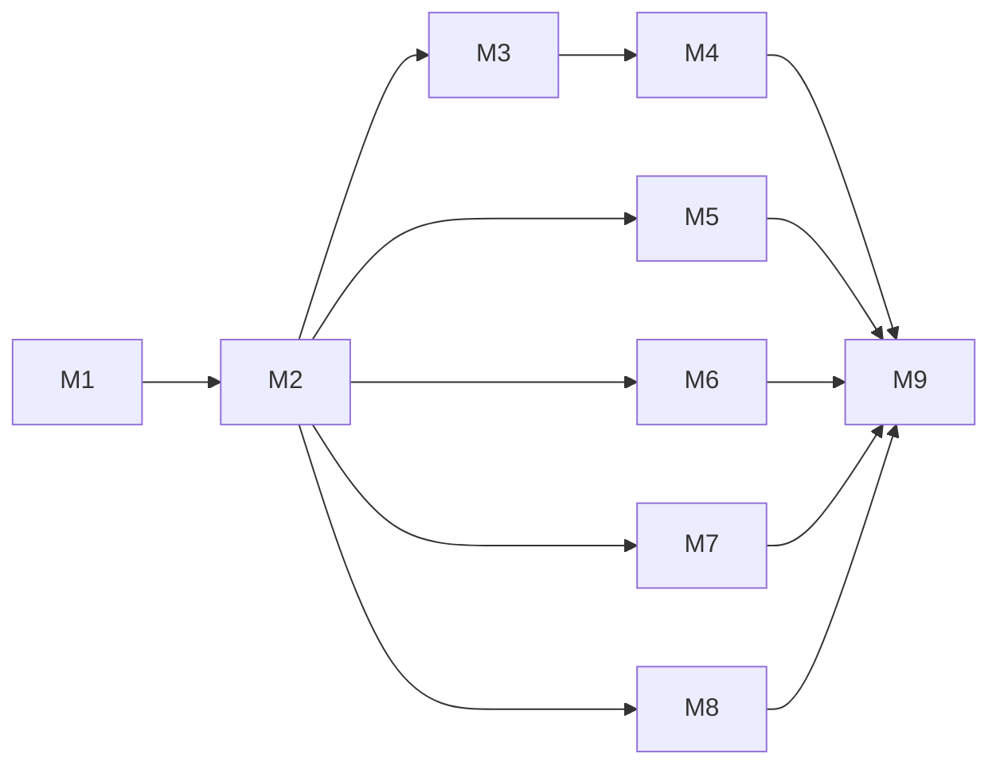

# Milestone Cafe Companion Pro

**Status:** Rencana kerja aktif
**Disusun:** 3 Oktober 2026

Folder ini memecah Release 1 menjadi milestone berurutan. Tiap milestone punya tujuan, kriteria selesai, dan task rinci per jalur kerja, supaya pekerjaan terarah dan tidak sekadar "lanjut ke hal berikutnya".

Milestone **tidak** menambah atau mengubah cakupan produk. Cakupan tetap diatur dokumen di [`../README.md`](../README.md) (PRD v2.3, `prd.md`, tier, paket, lalu dokumen foundation). Bila milestone bertentangan dengan dokumen itu, dokumen produk dan foundation yang berlaku, dan milestone diperbaiki.

---

## 1. Cara memakai

| Dokumen                        | Peran                                                                                      |
| ------------------------------ | ------------------------------------------------------------------------------------------ |
| `docs/milestones/*`            | Rencana: apa yang harus tercapai, dalam urutan apa, dan kapan dianggap selesai             |
| [`TODO.md`](../../TODO.md)     | Catatan checkpoint aktif: apa yang sedang dan sudah dikerjakan, beserta gate verifikasinya |
| [`AGENTS.md`](../../AGENTS.md) | Aturan kerja: satu checkpoint, verifikasi, commit, push                                    |

Alur kerja:

1. Ambil milestone yang berstatus **Berjalan**. Hanya satu milestone yang berjalan pada satu waktu, kecuali task yang ditandai boleh paralel.
2. Pilih task berikutnya yang ketergantungannya sudah selesai. Task besar dipecah menjadi beberapa checkpoint yang bisa di-push sendiri.
3. Catat checkpoint di `TODO.md`. Saat selesai, centang task di file milestone dan tulis hash commit-nya.
4. Milestone selesai bila semua kriteria selesai tercentang dan pengguna menyetujui hasil review.
5. Milestone berikutnya baru dimulai setelah itu, kecuali pengguna memutuskan lain.

---

## 2. Penamaan dan status

**ID task:** `M<nomor>-<jalur>-<urut>`, misalnya `M3-BE-02`.

**Jalur kerja:**

| Kode | Jalur                       | Isi                                                                            |
| ---- | --------------------------- | ------------------------------------------------------------------------------ |
| FT   | Fitur produk                | Capability yang dirasakan pengguna, sesuai tier Basic                          |
| BE   | Backend dan data            | Tabel, migrasi, use case, endpoint, event, worker                              |
| UX   | Alur dan interaksi          | Layar, navigasi, state kosong/error/izin, responsive, terang/gelap, dua bahasa |
| DS   | Design system dan komponen  | Token, komponen `packages/ui`, story, aksesibilitas komponen                   |
| AS   | Aset                        | Ikon aplikasi, logo, gambar, suara, template cetak, berkas unduhan             |
| SC   | Keamanan dan privasi        | Otorisasi, isolasi, idempotency, audit, data guard per surface                 |
| QA   | Kualitas kode dan test      | Struktur SOLID, batas modul, test unit/kontrak/integrasi/browser               |
| OP   | Operasional dan dokumentasi | Seed, runbook, CI, deploy, pembaruan dokumen foundation                        |

**Status task:** `[ ]` belum, `[~]` sedang dikerjakan, `[x]` selesai (dengan hash commit), `[-]` dibatalkan atau dipindah (dengan alasan).

**Status milestone:** Belum mulai · Berjalan · Menunggu review · Selesai.

---

## 3. Daftar milestone

| #   | Milestone                                                           | Tahap PRD | Tujuan                                                                                                           | Bergantung pada          | Status      |
| --- | ------------------------------------------------------------------- | --------- | ---------------------------------------------------------------------------------------------------------------- | ------------------------ | ----------- |
| M1  | [Fondasi UI dan POS inti](./M01-fondasi-ui-dan-pos-inti.md)         | A, C      | Backoffice Catalog dan POS-only menyelesaikan transaksi dari buka shift sampai tutup shift dengan UI baru        | —                        | Selesai     |
| M2  | [Core modular dan pengaturan](./M02-core-modular-dan-pengaturan.md) | B         | Paket berversi, instalasi modul, entitlement efektif, limit, event antarmodul, perangkat, dan halaman Pengaturan | M1                       | Berjalan    |
| M3  | [Kitchen Display System](./M03-kds.md)                              | D         | KDS-only dan POS + KDS memakai use case yang sama                                                                | M2                       | Belum mulai |
| M4  | [Meja, Self-Order, dan Customer](./M04-meja-self-order-customer.md) | E         | Tata letak meja, sesi meja, QR, pesan dari meja, makan di tempat di POS, data pelanggan                          | M3                       | Belum mulai |
| M5  | [Inventory](./M05-inventory.md)                                     | F         | Buku stok, opname, penerimaan, resep, konsumsi otomatis dari penjualan                                           | M2                       | Belum mulai |
| M6  | [Keuangan bisnis](./M06-keuangan-bisnis.md)                         | G         | Buku kas, pemasukan/pengeluaran, rekonsiliasi, penjualan tercatat otomatis tanpa pendapatan ganda                | M2                       | Belum mulai |
| M7  | [Human Capital](./M07-human-capital.md)                             | H         | Karyawan, jadwal, absensi web, cuti; HC-only tanpa istilah F&B                                                   | M2                       | Belum mulai |
| M8  | [Platform Admin dan laporan](./M08-platform-admin-dan-laporan.md)   | I         | Package Builder, kelola langganan dan override, akses support, laporan dasar per modul                           | M2 (laporan butuh M3–M7) | Belum mulai |
| M9  | [Hardening, deploy, dan pilot](./M09-hardening-deploy-pilot.md)     | J, D-10   | Uji isolasi dan beban, aksesibilitas, backup, VPS Docker + Nginx, pilot 2–3 merchant                             | M1–M8                    | Belum mulai |

M5, M6, dan M7 hanya bergantung pada M2, sehingga urutannya boleh ditukar bila prioritas bisnis berubah. Urutan di atas mengikuti `prd.md` bagian 11.2.

---

## 4. Definition of Done untuk setiap task

Task baru boleh dicentang bila semua yang relevan terpenuhi:

**Backend**

- Pemilik data dan modul jelas; tidak ada repository atau tabel modul lain yang ditulis langsung tanpa alasan tertulis.
- Use case satu kelas satu aksi; domain tanpa NestJS/Prisma; controller hanya parsing dan pemetaan.
- Kontrak Zod bersama untuk header, params, query, body, dan response.
- Setiap query membawa `tenant_id` (dan `outlet_id` bila berbatas lokasi); test substitusi ID lintas workspace.
- Mutasi kritis idempotent; audit dan outbox ditulis dalam transaksi yang sama.
- Error memakai kode stabil; teks untuk pengguna diterjemahkan di klien.
- Migrasi ditulis tangan dengan constraint, indeks, dan foreign key komposit tenant; test skema ditambah.

**UI**

- Inventaris field dibuat sebelum JSX (input pengguna, tampilan, turunan, disembunyikan).
- Judul tanpa deskripsi, satu aksi utama, satu fakta satu lokasi, tanpa kartu bersarang.
- Semua teks dari kamus `id` dan `en`; komponen `packages/ui` menerima label lewat props.
- State loading, kosong, error, izin, entitlement, setup, dan limit tersedia sesuai relevansi.
- Lolos di 320/390, 768, dan 1440 px; terang dan gelap; keyboard dan fokus.

**Verifikasi**

- `pnpm lint`, `pnpm typecheck`, `pnpm test`, `pnpm format:check`, dan pemeriksaan warna lulus.
- Endpoint baru diuji langsung terhadap API lokal; layar baru diuji di browser (Playwright) dengan database lokal.
- Dokumen foundation yang terdampak (`schema.md`, `backend.md`, `frontend.md`, `security.md`, `flowchart.md`, `design-system.md`) diperbarui dalam checkpoint yang sama.

---

## 5. Gerbang Release 1

Diambil dari `architecture.md` bagian 17. Masing-masing dipetakan ke milestone yang membuktikannya.

| Gerbang                                                                               | Dibuktikan di                   |
| ------------------------------------------------------------------------------------- | ------------------------------- |
| Dua workspace berjalan tanpa kebocoran data                                           | M1 (dasar), M9 (uji penuh)      |
| Provisioning paket dan modul tunggal idempotent                                       | M2, M8                          |
| Entitlement, izin, limit, dan instalasi menghasilkan alasan berbeda                   | M2                              |
| POS-only tidak error tanpa KDS, Finance, atau Inventory                               | M1, M2                          |
| POS + KDS + Inventory + Finance memproses event tanpa transaksi ganda                 | M3, M5, M6                      |
| HC-only onboard tanpa istilah F&B                                                     | M7                              |
| Finance-only mencatat transaksi tanpa referensi pesanan                               | M6                              |
| Floor: lantai/area bawaan, tiga bentuk meja, QR, sesi, pindah meja, tampilan langsung | M4                              |
| KDS menerima input manual tanpa POS                                                   | M3                              |
| Downgrade dan suspend tidak menghapus riwayat                                         | M2, M8                          |
| S/M/L, terang/gelap, `id`/`en`, aksesibilitas dasar pada surface R1                   | Setiap milestone, diaudit di M9 |
| Backup/restore, monitoring, migrasi, smoke test staging                               | M9                              |

---

## 6. Keputusan terbuka per milestone

| ID       | Pertanyaan                                                                                                                                                                              | Harus diputuskan sebelum       |
| -------- | --------------------------------------------------------------------------------------------------------------------------------------------------------------------------------------- | ------------------------------ |
| M1-OD-01 | **Diputuskan 3 Oktober 2026:** di M1 harga menu adalah harga akhir (sudah termasuk pajak), total = subtotal. Pola "ditambahkan di struk" dan tarif per outlet dikerjakan di `M2-FT-09`. | —                              |
| OD-04    | KDS-only bawaan memakai input manual atau API?                                                                                                                                          | M3                             |
| OD-05    | Titik potong stok bawaan per template                                                                                                                                                   | M5                             |
| OD-06    | Pengakuan pendapatan saat penjualan selesai atau saat pembayaran dikonfirmasi                                                                                                           | M6                             |
| OD-02    | HC Basic dijual di R1 atau beta sesudahnya                                                                                                                                              | M7                             |
| OD-08    | Masa simpan audit, bukti absensi, data pelanggan, lampiran                                                                                                                              | M9                             |
| OD-01    | Nama produk final                                                                                                                                                                       | M9 (sebelum peluncuran publik) |
| OD-12    | Harga paket dan add-on                                                                                                                                                                  | Setelah pilot M9               |
