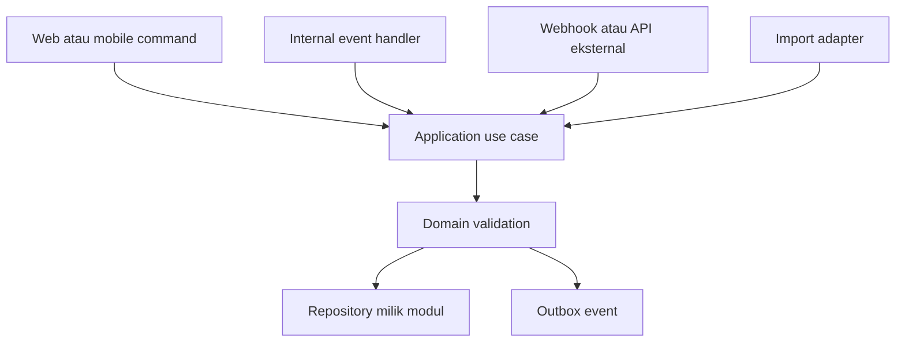
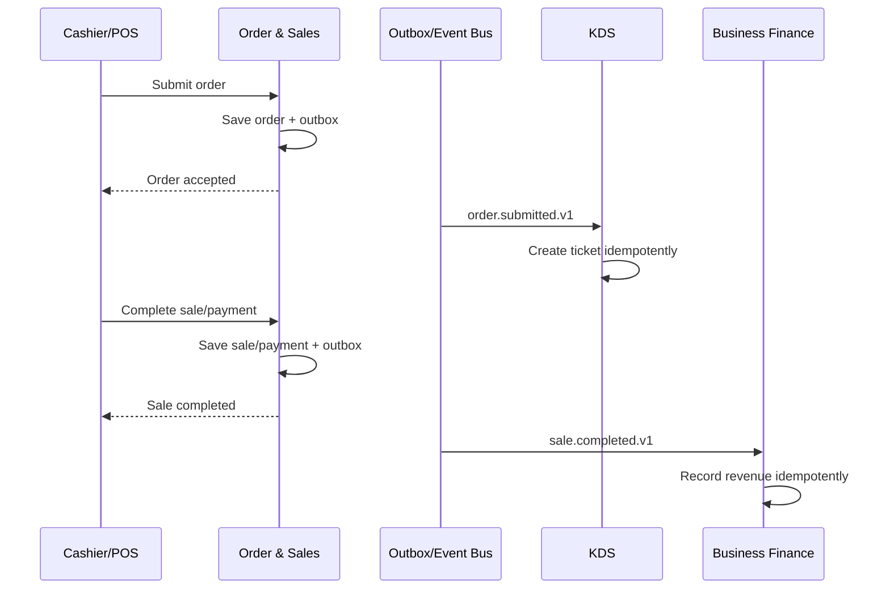

# Product Requirements Document (PRD)

# Cafe Companion Pro — Modular Business Platform

**Versi dokumen:** 2.3  
**Status:** Draft keputusan produk, baseline implementasi, dan packaging  
**Tanggal:** 5 Agustus 2026  
**Pemilik produk:** Cafe Companion Pro  
**Bahasa:** Indonesia  
**Cakupan:** Produk, paket, modul, integrasi, backend modular monolith, database, web, dan kesiapan mobile  
**Menggantikan untuk keputusan terbaru:** interpretasi modular pada PRD Release 1 dan Global Product Scope sebelumnya  
**Dokumen UI pendamping:** `../foundation/design-system.md`
**Matriks level modul:** `CAFE-COMPANION-MODULE-TIERS-V1.md`  
**Spesifikasi paket dan limit:** `CAFE-COMPANION-PACKAGES-LIMITS-V1.md`

---

## 0. Cara membaca dokumen

Dokumen ini membedakan empat tingkat komitmen:

| Label | Makna |
|---|---|
| **R1 — wajib** | Harus tersedia pada Release 1 agar platform modular dapat beroperasi dengan benar. |
| **R1 — simple** | Versi sederhana yang dapat dipakai dan diuji; belum mencakup fitur ERP lanjutan. |
| **Foundation now** | Fondasi backend/database dibuat sekarang, tetapi UI/fitur lengkap belum harus dirilis. |
| **Future** | Arah produk lanjutan; bukan komitmen Release 1. |

Kata **harus** menunjukkan requirement wajib. Kata **sebaiknya** menunjukkan rekomendasi yang dapat dinegosiasikan. Kata **future** tidak boleh dianggap sebagai scope MVP.

PRD induk ini menetapkan arah produk dan arsitektur. Detail capability per tier berada pada dokumen Module Tiers. Angka package, add-on, usage, dan enforcement berada pada dokumen Packages and Limits. Jika terjadi perbedaan, keputusan arsitektur mengikuti PRD induk; definisi capability mengikuti Module Tiers; angka komersial mengikuti package version snapshot yang dipublikasikan.

---

## 1. Ringkasan eksekutif

Cafe Companion Pro adalah platform modular untuk mengelola operasi bisnis. Fokus komersial dan pengalaman pengguna awal tetap pada kafe/UMKM F&B, tetapi fondasi produk tidak boleh terkunci hanya untuk alur kafe.

Platform harus memungkinkan customer:

1. membeli paket siap pakai;
2. membeli satu modul saja;
3. membeli beberapa modul yang terhubung;
4. menambah atau melepas modul tanpa mengganti aplikasi;
5. menggunakan modul dari web, perangkat operasional, API, dan pada tahap lanjut aplikasi mobile;
6. menjaga data setiap workspace tetap terisolasi;
7. mengaktifkan integrasi antarmodul melalui konfigurasi, bukan perubahan codebase per customer.

Contoh konfigurasi yang wajib didukung secara konsep:

- POS saja;
- POS + KDS;
- POS + Business Finance;
- POS + KDS + Inventory + Business Finance;
- KDS saja dengan input manual atau integrasi POS eksternal;
- HC saja untuk perusahaan non-F&B;
- Business Finance saja dengan input manual/impor;
- Personal Finance pada workspace pribadi di fase lanjutan.

Keputusan arsitektur utama:

> Satu modular monolith, satu backend utama, satu database PostgreSQL, beberapa frontend/client, modul dengan kepemilikan data sendiri, dan integrasi melalui public facade atau event internal.

Prinsip input:

> Banyak sumber data boleh masuk, tetapi setiap aksi bisnis hanya memiliki satu application use case sebagai pintu proses.

Contoh: kitchen ticket dapat berasal dari POS internal, input manual, webhook, atau impor. Semua sumber memanggil use case `CreateKitchenTicket`; tidak ada business logic KDS versi POS dan versi standalone.

---

## 2. Latar belakang dan masalah

### 2.1 Kondisi awal

Prototype dan dokumen sebelumnya berfokus pada platform operasional kafe dengan kemampuan:

- multi-tenant, multi-brand, dan multi-outlet;
- catalog/menu;
- POS dan kasir;
- order dan table management;
- QR self-order;
- KDS;
- Inventory Basic;
- Finance Basic;
- laporan;
- Platform Admin;
- light mode dan dark mode;
- lima shell terpisah untuk Platform Admin, Merchant Backoffice, POS, KDS, dan Customer.

Implementasi repo saat ini memiliki fondasi backend/API, isolation, security, reliability, dan kontrak operasional yang lebih maju daripada surface UI. Web masih didominasi device-mode shell dan development reference; Catalog Backoffice sudah memakai API, sedangkan POS, KDS, dan Inventory masih placeholder. Status implementasi aktual dan batas verifikasinya dicatat pada `../foundation/DESIGN_SYSTEM_APP_AUDIT.md`.

### 2.2 Masalah baru yang harus diselesaikan

Dokumen sebelumnya sudah menyebut modular dan entitlement, tetapi belum mendefinisikan dengan cukup rinci:

- cara satu modul dijual tanpa modul lain;
- cara beberapa modul otomatis saling terhubung;
- cara modul menerima input manual sekaligus input antarmodul;
- batas kepemilikan data tiap modul;
- konfigurasi paket, capability, limit, installation, dan integration binding;
- cara backend yang sama melayani web, POS, KDS, dan mobile;
- pemisahan Business Finance dan Personal Finance;
- pemisahan user login dan employee;
- pola database untuk idempotency, audit, offline mobile, dan event delivery;
- strategi agar modularitas tetap berada dalam monolith, bukan berubah prematur menjadi microservices.

### 2.3 Pernyataan masalah

Tanpa batas modul dan kontrak integrasi yang jelas, codebase berisiko memiliki:

- kondisi `if module enabled` tersebar di banyak file;
- business logic ganda untuk input manual dan input otomatis;
- modul menulis tabel modul lain secara langsung;
- dependency yang membuat modul tidak benar-benar dapat dijual sendiri;
- data lintas tenant atau workspace tercampur;
- aktivasi paket memerlukan deployment atau migration khusus customer;
- kesulitan menambahkan mobile atau integrasi pihak ketiga;
- Finance bisnis dan pribadi menjadi satu modul dengan terlalu banyak pengecualian.

PRD V2 menetapkan kontrak produk dan teknis untuk mencegah kondisi tersebut.

---

## 3. Visi, sasaran, dan non-sasaran

### 3.1 Visi produk

Menjadi platform operasional modular yang dapat dimulai dari kebutuhan sederhana—seperti kasir, dapur, inventaris, keuangan, atau HC—kemudian berkembang menjadi rangkaian ERP ringan tanpa memaksa customer membeli seluruh sistem.

### 3.2 Sasaran Release 1

1. Menyediakan Core Platform yang aman untuk semua jenis subscription.
2. Membuat catalog modul dan konfigurasi entitlement yang konsisten.
3. Menyediakan versi simple dari modul prioritas.
4. Membuktikan modul dapat berjalan standalone dan terintegrasi.
5. Menyediakan Platform Admin untuk paket, subscription, override, limit, dan integration status.
6. Menjaga pengalaman F&B tetap sederhana dan tidak terasa seperti ERP besar.
7. Menyiapkan database/API agar mobile HC dan Personal Finance dapat ditambahkan tanpa membongkar fondasi.
8. Mempertahankan karakter UI Cafe Companion Pro: bersih, tidak ramai, mudah dipahami, light/dark, cream/espresso/amber, DM Sans, dan penggunaan Fraunces yang terbatas.

### 3.3 Non-sasaran Release 1

- Microservices.
- Kafka, RabbitMQ, atau message broker eksternal.
- Database terpisah per modul atau per tenant.
- Native Android/iOS production app.
- Full offline synchronization.
- Offline payment atau offline stock mutation.
- Payroll lengkap.
- Accounting formal lengkap.
- Bank feed dan rekonsiliasi bank otomatis.
- Wallet atau penyimpanan saldo konsumen.
- Pinjaman, paylater, atau fungsi lembaga pembayaran.
- Integrated Payment produksi sebelum kerja sama PJP/payment gateway dan review legal.
- Advanced Inventory: batch, expiry, central kitchen, forecasting, atau supply-chain penuh.
- GPS tracking terus-menerus untuk karyawan.
- Biometrik production-grade.
- Mendukung semua industri seperti ERP generik sejak hari pertama.

### 3.4 Prinsip scope

Produk adalah **F&B-first, architecture-ready for adjacent use cases**. Artinya istilah, onboarding, paket awal, dan prioritas UI tetap mengutamakan kafe; model backend dibuat lebih generik hanya pada titik yang memang diperlukan.

---

## 4. Sumber keputusan dan perbandingan dengan PRD sebelumnya

### 4.1 Dokumen pembanding

PRD V2 disusun dari:

- `00-GLOBAL-PRODUCT-SCOPE.md`, tanggal 14 Juli 2026;
- `FEATURE_INVENTORY.md`, tanggal 3 Agustus 2026;
- README dokumentasi produk dan paket;
- PRD MVP Release 1 yang dirujuk oleh dokumen sebelumnya;
- `../foundation/design-system.md`;
- pembahasan terbaru tentang modular monolith, standalone module, integration binding, mobile HC, dan Personal Finance.

### 4.2 Ringkasan perubahan

| Area | PRD/dokumen sebelumnya | Keputusan PRD V2 | Status |
|---|---|---|---|
| Fokus produk | Sistem operasional kafe/UMKM F&B | Tetap F&B-first, tetapi platform dapat menjual HC dan Finance sebagai produk standalone | Diperluas |
| Hierarki | Platform → Tenant → Brand → Outlet | Internal: Platform → Workspace → Business Unit → Location; UI F&B tetap memakai Tenant/Brand/Outlet | Diklarifikasi |
| Workspace pribadi | Tidak ada | `PERSONAL` dipersiapkan untuk Personal Finance | Foundation now |
| Modularitas | Modul aktif berdasarkan paket/entitlement | Ditambah capability, limits, installation, integration binding, dan dependency resolver | Diperinci |
| KDS | Bergantung pada Order Core; antrean dari POS/QR | KDS Product dapat standalone melalui Order Intake Lite/manual/API; tetap menggunakan kernel order intake | Diubah tanpa menggandakan logic |
| Finance Basic | Bergantung pada Order, Bill, Payment Ledger | Business Finance dapat standalone; integrasi POS menjadi binding opsional | Diubah |
| Inventory Basic | Terikat Catalog/recipe dan optional order consumption | Inventory dapat standalone dengan item master sendiri; Catalog link dan consumption adalah bridge opsional | Diubah |
| HC | Belum menjadi bagian utama Global Product Scope; kemudian muncul pada fondasi UI | Menjadi product module standalone dengan employee, shift, attendance, dan leave simple | Scope baru R1 simple |
| Personal Finance | Tidak ada | Product module future di atas Finance Core | Scope baru future |
| Mobile | Native app secara eksplisit di luar V1 | Tetap di luar R1; API, device, idempotency, attendance event disiapkan sekarang | Dipertahankan + foundation |
| Paket | Profile, POS Basic, Cafe Digital, Cafe Operations, Custom Modular, Integrated Payment Add-on | Paket lama dipertahankan; Cafe Growth, Enterprise, module-only, tier, add-on, dan limit efektif diperinci pada spesifikasi pendamping | Diperluas |
| Core Catalog | Disebut Core selalu tersedia | Hanya Core Platform selalu aktif; domain kernel seperti Catalog/Order diinstal otomatis bila diperlukan | Dikoreksi |
| Integrasi | Dependency dan pusat order disebutkan | Public facade, internal event bus, outbox/inbox, idempotency, event versioning, dan integration binding ditentukan | Diperinci |
| Aktivasi modul | Entitlement gate | Aktivasi tidak mengubah schema; membuat installation, config, permission defaults, seed, dan binding | Diperinci |
| Finance bisnis/pribadi | Finance hanya untuk operasional bisnis | Finance Core internal dipakai oleh Business Finance dan Personal Finance dengan UX/domain extension terpisah | Scope baru |
| Payment | Manual dahulu; Integrated Payment future; tanpa wallet | Tetap sama | Dipertahankan |
| Inventory/Finance advanced | Roadmap | Tetap roadmap | Dipertahankan |
| Lima shell | Platform Admin, Backoffice, POS, KDS, Customer | Tetap; mobile HC dan Personal Finance menjadi client future, bukan shell R1 | Dipertahankan |
| UI visual | Cream/espresso/amber, light/dark, sederhana | Tetap menjadi baseline | Dipertahankan |

### 4.3 Keputusan lama yang tetap mengikat

- Data tenant/workspace harus terisolasi.
- Satu account dapat memiliki beberapa brand/business unit dan outlet/location.
- Order status dan payment status harus terpisah.
- Transaksi final tidak dihapus; gunakan void, refund, reversal, atau correction.
- Manual payment adalah jalur MVP.
- QRIS merchant manual harus diverifikasi kasir.
- Platform tidak menyimpan saldo konsumen.
- Full offline sync tidak termasuk Release 1.
- Finance Basic harus diberi label laporan operasional/estimasi, bukan laporan akuntansi formal.
- HPP Basic adalah estimasi berdasarkan data recipe dan biaya bahan yang tersedia.
- Security gate harus diterapkan backend; menyembunyikan menu bukan security control.
- Customer/KDS/POS tidak boleh menerima data yang tidak relevan seperti HPP, margin, token, raw payload, atau internal identifier.

### 4.4 Scope expansion yang perlu disadari

Menambahkan HC Basic ke Release 1 dan membuat semua modul benar-benar standalone memperbesar scope dibanding PRD sebelumnya. Karena itu PRD V2 memisahkan:

- **R1 platform foundation** yang wajib selesai lebih dulu;
- **R1 simple module** yang dapat dirilis bertahap;
- **future clients/capabilities** yang hanya disiapkan kontraknya.

---

## 5. Terminologi produk

| Istilah | Definisi | Contoh |
|---|---|---|
| Core Platform | Fondasi wajib, tidak dijual sebagai checkbox modul | Login, workspace, membership, subscription, audit |
| Product Module | Produk utama yang dapat dibeli customer | POS, KDS, Inventory, Business Finance, HC |
| Internal Kernel | Kemampuan teknis internal yang mendukung product module | Order Kernel, Finance Core, Catalog Kernel |
| Capability | Fitur berizin di dalam modul | `pos.refund`, `hc.leave.approve` |
| Tier | Tingkat fitur suatu modul | Basic, Pro, Advanced |
| Package | Preset modul, capability, dan limit | Cafe Operations, HC Only |
| Add-on | Capability/modul tambahan yang dapat dibeli | Multi-outlet, Integrated Payment future |
| Entitlement | Hak workspace karena pembelian/kontrak | Workspace membeli `kds.basic` |
| Permission | Hak seorang user dalam workspace | Cashier boleh membuat sale, tidak boleh melihat profit |
| Feature Flag | Kontrol rollout teknis/beta | Forecast hanya aktif untuk pilot tenant |
| Module Installation | Status operasional modul di sebuah workspace | Finance terpasang tetapi setup belum lengkap |
| Integration Binding | Konfigurasi hubungan source–event–target | POS `sale.completed` → Finance `record-revenue` |
| Limit | Batas pemakaian komersial | 3 outlet, 20 user, 2 register |
| Usage | Pemakaian aktual terhadap limit | 2 dari 3 outlet digunakan |
| Business Template | Preset istilah, setting, dan modul menurut use case | Cafe, Restaurant, HC Only, Personal |
| Workspace | Batas data dan subscription utama | Perusahaan Kopi A atau Keuangan Pribadi Andi |
| Business Unit | Unit organisasi di dalam workspace | Brand atau legal entity |
| Location | Lokasi operasional | Outlet atau branch |
| Adapter | Jalur masuk/keluar tanpa business logic utama | HTTP, event handler, webhook, CSV import |
| Use Case | Satu pintu proses bisnis | Create Kitchen Ticket, Record Expense |

### 5.1 Entitlement, permission, dan feature flag

Ketiganya harus selalu dibedakan:

```text
Entitlement: apakah workspace membeli fitur?
Permission: apakah user boleh melakukan aksi?
Feature flag: apakah fitur sudah dirilis untuk workspace/channel ini?
```

Syarat akses efektif:

```text
workspace usable
AND module installation active
AND entitlement capability active
AND user permission granted
AND feature flag allows rollout
```

---

## 6. Model organisasi dan workspace

### 6.1 Hierarki internal

```text
Platform
└── Workspace
    ├── Business Unit
    │   └── Location
    ├── Membership
    ├── Subscription
    ├── Module Installation
    └── Integration Binding
```

### 6.2 Jenis workspace

| Type | Penggunaan | Terminologi default | Status |
|---|---|---|---|
| `BUSINESS` | Kafe, restoran, retail, atau perusahaan | Tenant/Company, Brand/Business Unit, Outlet/Branch | R1 wajib |
| `PERSONAL` | Keuangan pribadi | Personal Workspace, tanpa brand/outlet wajib | Foundation now; UI future |

### 6.3 Aturan workspace

- Satu user dapat menjadi anggota beberapa workspace.
- Satu workspace memiliki subscription dan data boundary sendiri.
- Membership harus menyimpan role dan scope location.
- Satu user dapat menjadi owner di workspace pribadi dan employee di workspace bisnis.
- Akses satu workspace tidak memberikan akses ke workspace lain.
- Workspace personal tidak boleh dibagikan secara otomatis kepada staff workspace bisnis.
- `tenant_id` lama dapat dipertahankan pada tahap migrasi, tetapi secara konseptual diperlakukan sebagai `workspace_id`.

### 6.4 Business template

| Template | Label UI | Default module suggestion |
|---|---|---|
| Cafe | Brand, Outlet, Menu, Meja | Catalog, POS, Floor, Self-Order, KDS |
| Restaurant | Brand, Outlet, Floor, Station | Catalog, POS, Floor, KDS |
| Bakery/Retail | Business, Store, Product, Barcode | Catalog, POS, Inventory |
| Cloud Kitchen | Brand, Kitchen, Channel, Station | Order Intake, KDS, Inventory |
| HC Only | Company, Branch, Department, Employee | HC |
| Business Finance Only | Company, Branch, Account, Transaction | Business Finance |
| Personal | Workspace, Account, Category, Budget | Personal Finance future |

Business template adalah preset, bukan fork codebase. Template boleh mengubah label, default navigation, seed, dan onboarding; template tidak boleh mengubah aturan keamanan atau membuat schema khusus tenant.

---

## 7. Pengguna dan peran

### 7.1 Peran platform

| Peran | Tujuan utama |
|---|---|
| Platform Owner | Mengelola seluruh platform, paket, billing policy, dan akses admin |
| Platform Admin | Mengelola workspace, subscription, modules, limits, dan support |
| Platform Support | Membantu customer dengan akses beralasan, terbatas waktu, dan diaudit |
| Platform Finance | Mengelola invoice subscription manual dan rekonsiliasi pembayaran subscription |

### 7.2 Peran workspace bisnis

| Peran | Scope umum |
|---|---|
| Owner | Semua modul yang dibeli dan konfigurasi workspace |
| Manager | Operasi lokasi yang ditugaskan dan approval tertentu |
| Cashier | POS, order, payment manual, shift kas |
| Kitchen | KDS dan status produksi |
| Waiter | Meja, order, request customer |
| Inventory Staff | Stock, receiving, adjustment sesuai permission |
| Finance Staff | Income, expense, reconciliation, report keuangan |
| HR Admin | Employee, schedule, attendance, leave |
| Employee | Self-service HC sesuai hubungan employee-user |
| Custom Role | Kombinasi permission dengan scope location |

### 7.3 User tidak sama dengan employee

`User` adalah identitas login global. `Employee` adalah data kepegawaian di dalam workspace.

- Employee dapat dibuat tanpa akun login.
- `employee.user_id` boleh kosong.
- Undangan mobile/web dapat menghubungkan user ke employee.
- Menonaktifkan employee tidak selalu menghapus user global.
- Satu user dapat memiliki hubungan employee di lebih dari satu workspace jika diizinkan.

---

## 8. Model komersial dan konfigurasi

### 8.1 Paket adalah preset

Paket tidak membuat versi aplikasi baru. Saat dipilih, paket menghasilkan sekumpulan entitlement, installation, config, permission default, limits, dan integration recommendation.

Contoh:

```yaml
package: cafe_operations
template: cafe
modules:
  catalog: basic
  pos: basic
  floor_self_order: basic
  kds: basic
  inventory: basic
  business_finance: basic
limits:
  locations: 3
  users: 20
  registers: 3
```

### 8.2 Paket standar

| Paket | Isi minimum | Status |
|---|---|---|
| Profile | Cafe Profile + Catalog publik terbatas | R1 |
| POS Basic | Catalog Basic + POS Basic + embedded sales report | R1 |
| Cafe Digital | POS Basic + Floor/Table/Self-Order Basic + KDS Basic | R1 simple |
| Cafe Operations | Cafe Digital + Inventory Basic + Business Finance Basic + Customer Basic | R1 bertahap |
| Cafe Growth | Tier Pro pada modul operasional utama + Analytics Pro | R1+/Future menurut kesiapan capability |
| Enterprise | Komposisi dan limit custom yang tetap memakai package snapshot | Custom |
| HC Only | HC Basic, Pro, atau Advanced + Core Platform | Basic R1; tier lebih tinggi Future |
| KDS Only | KDS tier terpilih + Order Intake Lite/manual/API sesuai entitlement | Basic R1 |
| Finance Only | Business Finance tier terpilih + Finance Core | Basic R1 |
| Inventory Only | Inventory tier terpilih + Core Platform | Basic R1 |
| Custom Modular | Kombinasi product module valid | Sesuai module availability |
| Integrated Payment Add-on | Dynamic payment dan settlement | Future; tetap tunduk PJP/legal |
| Personal Finance | Personal Finance pada workspace PERSONAL | Future |

Definisi capability lengkap setiap Basic, Pro, dan Advanced berada pada `CAFE-COMPANION-MODULE-TIERS-V1.md`. Angka users, locations, devices, transactions, employees, storage, dan add-on berada pada `CAFE-COMPANION-PACKAGES-LIMITS-V1.md`.

### 8.3 Override tenant/workspace

Platform Admin harus dapat:

- menambah atau mencabut capability;
- mengubah tier;
- mengubah limit;
- memberikan trial dengan tanggal mulai/akhir;
- memberi grace period;
- menonaktifkan module installation tanpa menghapus data;
- mengaktifkan kembali modul;
- menambah config khusus;
- membuat custom package snapshot;
- melihat siapa yang mengubah konfigurasi dan alasannya.

Override tidak boleh mengubah definisi paket global untuk customer lain.

### 8.4 Lifecycle subscription

```text
DRAFT → TRIAL → ACTIVE → GRACE → SUSPENDED → TERMINATED
                    ↘ CANCELED_AT_PERIOD_END
```

Aturan:

- `TRIAL` dan `ACTIVE` usable.
- `GRACE` usable dengan banner dan pembatasan yang ditentukan policy.
- `SUSPENDED` menolak mutation bisnis; akses read-only/export mengikuti policy.
- `TERMINATED` tidak menghapus data secara otomatis.
- Perubahan status harus diaudit.

### 8.5 Lifecycle installation

```text
NOT_INSTALLED → PROVISIONING → SETUP_REQUIRED → ACTIVE
                                  ↓             ↓
                                ERROR ← SUSPENDED
```

- Entitlement tidak otomatis berarti installation siap.
- Installation dapat berada di `SETUP_REQUIRED` ketika mapping akun, lokasi, atau sumber input belum lengkap.
- Handler integrasi hanya memproses event jika target installation `ACTIVE`.

### 8.6 Limits dan usage

Limit minimum yang perlu didukung:

- workspace users;
- business units/brands;
- locations/outlets;
- registers/POS devices;
- KDS devices/stations;
- employees;
- monthly transactions;
- storage/attachments;
- API requests atau webhook endpoints pada fase lanjut.

Limit harus diklasifikasikan:

- **Hard count:** memblokir resource baru, tidak menonaktifkan resource lama.
- **Soft metered:** mencatat overage tetapi tetap memproses event operasional.
- **Throttled:** dapat menunda/menolak job non-kritis seperti export atau external API.
- **Capability gate:** meminta tier/add-on yang sesuai.

Sale, kitchen ticket, stock movement, finance event, attendance event, refund, reversal, correction, dan check-out tidak boleh hilang hanya karena quota tercapai. Pelanggaran limit harus menghasilkan error/state domain yang jelas dan CTA upgrade; tidak boleh gagal sebagai error server generik.

Effective limit dihitung dari package version snapshot, add-on aktif, dan workspace override. Package version yang telah dipublikasikan tidak boleh mengubah entitlement customer lama secara diam-diam.

---

## 9. Katalog modul dan dependency

### 9.1 Core Platform — selalu aktif

- Authentication dan session.
- Workspace dan membership.
- RBAC dan scoped permission.
- Subscription, entitlement, installation, limits, dan usage.
- Business template dan terminology.
- Device registry.
- Audit log.
- Idempotency registry.
- Internal event bus.
- Outbox/inbox.
- Integration binding.
- Notification foundation.
- Feature flags.
- Shared file/attachment metadata.

### 9.2 Internal kernel — otomatis, tidak dijual

| Kernel | Dipakai oleh |
|---|---|
| Catalog Kernel | Catalog/Menu, POS, Self-Order, optional Inventory bridge |
| Order Intake Kernel | POS, Self-Order, KDS standalone, external order integrations |
| Bill & Payment Ledger | POS, Self-Order payment, Business Finance bridge |
| Finance Core | Business Finance dan Personal Finance |
| Reporting Projection | Dashboard/report per modul |

Internal kernel hanya diaktifkan ketika diperlukan. HC-only tidak harus melihat atau menggunakan Catalog/Order.

### 9.3 Product module

| Modul | Bisa dijual sendiri | Minimum dependency internal | Jalur standalone | Bridge opsional |
|---|---:|---|---|---|
| Catalog & Profile | Ya | Core + Catalog Kernel | CRUD produk/menu dan profile publik | POS, Self-Order, Inventory |
| POS & Sales | Ya | Catalog + Order + Bill/Payment Ledger | Input kasir | KDS, Inventory, Finance, Customer |
| Floor & Customer Ordering | Ya sebagai paket digital | Catalog + Order + Bill | QR/mobile web | POS, KDS, Payment |
| KDS | Ya | Order Intake Kernel | Manual/API/import inbox | POS/Self-Order events |
| Inventory | Ya | Core | Item, movement, stocktake manual | Catalog recipe, POS/order consumption, Finance HPP |
| Business Finance | Ya | Finance Core | Income/expense/manual/import | POS revenue/payment, Inventory HPP, HC payroll future |
| Human Capital | Ya | Core organization | Employee/shift/attendance/leave | Finance payroll future |
| Customer Basic | Ya | Core | Customer record manual | POS/order history |
| Reports & Analytics | Report basic melekat pada modul | Reporting Projection | Report dari modul aktif | Cross-module analytics future |
| Personal Finance | Ya, future | Finance Core + PERSONAL workspace | Manual/import/mobile | Bank integration future |

### 9.4 Dependency resolver

Package Builder dan backend harus:

1. memeriksa hard dependency;
2. menambahkan internal kernel otomatis;
3. menawarkan companion adapter bila product module standalone memerlukan sumber input;
4. menolak kombinasi invalid;
5. menampilkan alasan dan langkah penyelesaian;
6. tidak mengandalkan frontend untuk validasi akhir.

Contoh:

- KDS tanpa POS valid jika `order_intake.manual` atau `order_intake.api` aktif.
- Self-Order tanpa Catalog tidak valid.
- Personal Finance pada workspace `BUSINESS` tidak valid untuk R1/future awal.
- POS + Finance valid, tetapi integration binding dapat tetap `SETUP_REQUIRED` sampai mapping akun selesai.

---

## 10. Functional requirements — Core Platform

### 10.1 Authentication dan session

| ID | Requirement | Prioritas |
|---|---|---|
| CORE-AUTH-001 | Sistem harus menyediakan login yang tidak terikat pada satu workspace. | R1 wajib |
| CORE-AUTH-002 | Setelah login, user harus memilih workspace jika memiliki lebih dari satu membership aktif. | R1 wajib |
| CORE-AUTH-003 | Session harus membawa user identity; workspace aktif harus divalidasi server pada setiap request. | R1 wajib |
| CORE-AUTH-004 | Sistem harus mendukung pencabutan session dan logout perangkat. | R1 wajib |
| CORE-AUTH-005 | MFA dan SSO enterprise disiapkan sebagai extension point, bukan scope R1. | Future |

### 10.2 Workspace, membership, dan scope

| ID | Requirement | Prioritas |
|---|---|---|
| CORE-ORG-001 | Platform Admin dapat membuat workspace BUSINESS. | R1 wajib |
| CORE-ORG-002 | Sistem dapat membuat satu business unit dan satu location default saat onboarding merchant sederhana. | R1 wajib |
| CORE-ORG-003 | Owner dapat mengundang user dan menentukan role serta location scope. | R1 wajib |
| CORE-ORG-004 | Semua query domain harus dibatasi oleh `workspace_id`; query location-scoped juga dibatasi `location_id`. | R1 wajib |
| CORE-ORG-005 | User dapat beralih workspace tanpa mencampur cache, navigation, permission, atau data. | R1 wajib |
| CORE-ORG-006 | Workspace PERSONAL dapat dibuat oleh service/API pada fondasi, tetapi onboarding publiknya belum dirilis. | Foundation now |

### 10.3 Entitlement dan permission

| ID | Requirement | Prioritas |
|---|---|---|
| CORE-ENT-001 | Entitlement harus disimpan sebagai capability, tier, validity period, dan optional limits. | R1 wajib |
| CORE-ENT-002 | Frontend membangun navigation dari module manifest dan effective entitlement. | R1 wajib |
| CORE-ENT-003 | Backend harus menolak endpoint yang tidak memiliki entitlement aktif. | R1 wajib |
| CORE-ENT-004 | Permission harus dievaluasi setelah entitlement dan berdasarkan role serta scope. | R1 wajib |
| CORE-ENT-005 | Perubahan package tidak boleh menghapus data domain. | R1 wajib |
| CORE-ENT-006 | Effective entitlement harus dapat dijelaskan: package source, override source, start, expiry, dan limit. | R1 wajib |

### 10.4 Installation dan configuration

| ID | Requirement | Prioritas |
|---|---|---|
| CORE-INS-001 | Modul yang dibeli harus memiliki satu `module_installation` per workspace dan module key. | R1 wajib |
| CORE-INS-002 | Installation menyimpan status, tier, config version, setup status, installed time, dan actor. | R1 wajib |
| CORE-INS-003 | Provisioning harus idempotent; retry tidak membuat seed atau binding ganda. | R1 wajib |
| CORE-INS-004 | Config harus divalidasi dengan schema milik modul. | R1 wajib |
| CORE-INS-005 | Module uninstall bersifat disable/archive, bukan drop table atau delete data. | R1 wajib |

### 10.5 Integration binding

| ID | Requirement | Prioritas |
|---|---|---|
| CORE-INT-001 | Hubungan antarmodul harus direpresentasikan sebagai configuration entity, bukan hard-coded per tenant. | R1 wajib |
| CORE-INT-002 | Binding harus menyimpan source module, event/version, target module, handler, status, dan mapping config. | R1 wajib |
| CORE-INT-003 | Sistem harus mendukung status `DRAFT`, `SETUP_REQUIRED`, `ACTIVE`, `PAUSED`, dan `ERROR`. | R1 wajib |
| CORE-INT-004 | Handler harus memeriksa installation, entitlement, binding status, dan idempotency sebelum memproses. | R1 wajib |
| CORE-INT-005 | Test binding harus tersedia untuk memvalidasi config tanpa membuat transaksi finansial produksi. | R1 sebaiknya |
| CORE-INT-006 | Kesalahan binding tidak boleh membatalkan transaksi source yang sudah berhasil commit. | R1 wajib |

### 10.6 Audit dan idempotency

| ID | Requirement | Prioritas |
|---|---|---|
| CORE-AUD-001 | Aksi sensitif harus memiliki actor, source/channel, timestamp server, reason, correlation ID, dan before/after summary aman. | R1 wajib |
| CORE-AUD-002 | Raw password, token, secret, payment payload, foto pribadi, dan attachment content tidak boleh disalin ke audit log. | R1 wajib |
| CORE-IDEM-001 | Mutation kritis harus menerima `Idempotency-Key`. | R1 wajib |
| CORE-IDEM-002 | Key unik minimal berdasarkan workspace, operation, dan client key. | R1 wajib |
| CORE-IDEM-003 | Request duplikat dengan payload sama mengembalikan hasil pertama; payload berbeda dengan key sama ditolak. | R1 wajib |

### 10.7 Device registry

- Device memiliki ID, workspace, location opsional, mode, public label, status, last seen, dan credential reference.
- Mode minimum: `BACKOFFICE`, `POS`, `KDS`, `INVENTORY`, `MOBILE_HC`, `MOBILE_PERSONAL_FINANCE`, `API_CLIENT`.
- Secret tidak boleh tampil kembali setelah provisioning.
- Device dapat dicabut tanpa menonaktifkan user.
- Request dari device harus tetap memiliki actor atau service identity yang dapat diaudit.

---

## 11. Functional requirements — Catalog, Profile, dan Menu

### 11.1 Cakupan simple

- Category.
- Product/menu item.
- Foto dan deskripsi.
- Base price.
- Variant.
- Modifier group dan option.
- Availability dan sold-out manual.
- Assignment business unit/location.
- Outlet price override.
- Public profile dan menu.
- Recipe link opsional jika Inventory terpasang.

### 11.2 Requirement

| ID | Requirement |
|---|---|
| CAT-001 | Produk harus dimiliki Catalog module, bukan POS atau KDS. |
| CAT-002 | Harga transaksi harus disalin sebagai snapshot ke order item saat order dibuat. |
| CAT-003 | Perubahan nama, harga, modifier, atau recipe tidak boleh mengubah transaksi historis. |
| CAT-004 | Customer-safe DTO tidak boleh memuat cost, HPP, margin, internal ID, atau recipe. |
| CAT-005 | Produk dapat dinonaktifkan tanpa menghapus histori. |
| CAT-006 | Jika Inventory tidak aktif, field recipe tidak tampil dan bukan requirement. |
| CAT-007 | Jika POS tidak aktif, Catalog tetap dapat dipakai untuk profile/menu publik. |

### 11.3 Status utama

- Product: `DRAFT`, `ACTIVE`, `INACTIVE`, `ARCHIVED`.
- Availability: `AVAILABLE`, `SOLD_OUT`, `SCHEDULED_OFF`.
- Public profile: `DRAFT`, `PUBLISHED`, `UNPUBLISHED`.

### 11.4 Out of scope simple

- Dynamic pricing rule engine.
- BOGO dan promotion engine.
- Marketplace/channel pricing lanjutan.
- Complex bundle.
- AI menu recommendation.

---

## 12. Functional requirements — POS & Sales

### 12.1 Tujuan

Memberikan alur kasir yang cepat untuk membuat order, mencatat pembayaran manual, mengelola shift kas, dan menerbitkan event yang dapat diproses KDS, Inventory, Finance, atau Customer module bila terpasang.

### 12.2 Cakupan simple

- Dine-in dan takeaway.
- Product search/category filter.
- Cart.
- Variant, modifier, quantity, item note, dan order note.
- Tax dan service charge.
- Diskon sederhana.
- Hold/resume order.
- Submit/cancel dengan alasan.
- Payment manual: cash, merchant QRIS, transfer, EDC, other.
- Mixed payment sederhana.
- Receipt dan reprint marker.
- Open/close shift, opening cash, cash in/out, counted cash, variance.
- Refund record simple dan manager approval sesuai permission.

### 12.3 Requirement

| ID | Requirement |
|---|---|
| POS-001 | POS harus dapat berjalan tanpa KDS, Inventory, atau Finance. |
| POS-002 | Submit order harus menyimpan order dan outbox event dalam satu database transaction. |
| POS-003 | Complete sale harus menyimpan sale/payment ledger dan event terkait secara atomik. |
| POS-004 | POS tidak boleh menulis tabel KDS, Inventory, atau Finance secara langsung. |
| POS-005 | Order item harus menyimpan snapshot nama, harga, tax, modifier, note, dan routing hint yang relevan. |
| POS-006 | Payment status harus terpisah dari order/production status. |
| POS-007 | Cancel, void, refund, dan cash adjustment membutuhkan reason dan audit. |
| POS-008 | Record final tidak boleh dihapus melalui CRUD generik. |
| POS-009 | POS UI tidak boleh menampilkan HPP, profit, payment provider secret, atau customer data yang tidak diperlukan. |
| POS-010 | Ketika target module nonaktif, transaksi POS tetap berhasil dan event tetap tercatat tanpa membuat data target. |

### 12.4 State model

Order:

```text
DRAFT → SUBMITTED → ACCEPTED → PREPARING → READY → SERVED → COMPLETED
   └──────────────→ CANCELED
```

Payment:

```text
UNPAID → VERIFYING → PAID → REFUND_PENDING → REFUNDED
               └──→ FAILED / EXPIRED
```

Sale:

```text
OPEN → COMPLETED → PARTIALLY_REFUNDED → REFUNDED
             └──→ VOIDED (sesuai policy dan sebelum settlement tertentu)
```

### 12.5 Event output minimum

- `order.submitted.v1`
- `order.cancelled.v1`
- `sale.completed.v1`
- `payment.recorded.v1`
- `sale.refunded.v1`
- `shift.opened.v1`
- `shift.closed.v1`

---

## 13. Functional requirements — Floor, Table, dan Customer Ordering

### 13.1 Cakupan simple

Konfigurasi layout oleh owner/manager:

- Hierarki operasional adalah `Location -> Floor -> Area -> Service Table`.
- Setiap location baru mendapatkan default `Main Floor` dan `Main Area`; cafe satu lantai tidak dipaksa mengisi konfigurasi lantai sebelum dapat membuat meja.
- Nama floor dan area bebas: contoh `Lantai 1`, `Lantai 2`, `Rooftop`, `Indoor`, `Outdoor`, `Smoking`, `VIP`, `Garden`, `Bar`, atau `Terrace`.
- Basic menyediakan tiga bentuk meja: `SQUARE`, `RECTANGLE`, dan `ROUND`.
- Setiap meja mempunyai public label, kapasitas orang, visual size (`SMALL`, `MEDIUM`, `LARGE`), posisi grid, rotasi 0/90 derajat, status active/inactive, serta QR-ordering flag.
- Kursi pada editor adalah representasi visual yang dihitung otomatis dari kapasitas dan bentuk meja; kursi bukan inventory/resource terpisah.
- Editor Basic memakai drag-and-drop dengan snap-to-grid. User tidak perlu memasukkan ukuran meja dalam sentimeter.
- QR token per meja dapat dibuat, print/download, rotate, dan revoke.

Live Table View untuk staff operasional:

- Floor dan area menjadi tab/filter; layout yang sudah dikonfigurasi ditampilkan read-only untuk operasi harian.
- Status minimum: `AVAILABLE`, `OCCUPIED`, `CLOSING`, `CLEANING`, dan `INACTIVE`. `RESERVED` hanya muncul jika capability reservation aktif.
- Klik meja menampilkan kapasitas, jumlah guest, durasi session, order/bill aktif, dan aksi yang diizinkan role.
- Membuka table session dengan jumlah guest.
- Beberapa order batch dapat masuk ke satu session tanpa mencampurkan transaksi session sebelumnya.
- Pindah meja mempertahankan session, order, bill, dan audit trail.
- Close session membuat meja kembali tersedia sesuai cleaning policy.
- Data model sejak R1 mendukung satu session terhubung ke beberapa meja; UI merge/split baru diaktifkan mulai Pro.

Customer:

- Resolve QR ke konteks publik yang aman.
- Lihat menu.
- Pilih variant/modifier.
- Cart dan note.
- Submit order.
- Pesan lagi.
- Lihat status.
- Panggil pelayan dan minta bill.
- Klaim sudah membayar manual dengan status `VERIFYING`; kasir tetap mengonfirmasi.

### 13.2 Requirement

| ID | Requirement |
|---|---|
| FLOOR-001 | QR publik menggunakan opaque rotating token, bukan internal table ID. |
| FLOOR-002 | Customer response tidak memuat koordinat layout, internal ID, token mentah, session ID, atau payment detail internal. |
| FLOOR-003 | Customer order masuk melalui Order use case yang sama dengan source metadata `SELF_ORDER`. |
| FLOOR-004 | Modul dapat berjalan tanpa KDS; status produksi mengikuti Order Core atau staff update. |
| FLOOR-005 | Satu bill per table session adalah batas UI simple; split bill penuh future. |
| FLOOR-006 | Editor Basic memakai snap-to-grid, tiga bentuk meja, visual size, dan rotasi 0/90 derajat; bukan editor denah bangunan. |
| FLOOR-007 | Floor dan Area adalah entity yang dapat dinamai user; system membuat default floor/area agar setup cafe kecil tetap satu langkah. |
| FLOOR-008 | Kapasitas adalah integer bisnis; jumlah/posisi kursi pada canvas diturunkan untuk visual dan tidak menjadi source of truth terpisah. |
| FLOOR-009 | `Edit Layout` dan `Live Table View` adalah mode terpisah dan memiliki permission terpisah; kasir tidak mendapat affordance edit layout tanpa izin. |
| FLOOR-010 | Table session mempunyai identity sendiri, dapat memuat beberapa order batch, dan history session yang closed tidak ditimpa oleh penggunaan meja berikutnya. |
| FLOOR-011 | Move table memindahkan session aktif tanpa membatalkan atau membuat ulang order/bill; source dan destination masuk audit. |
| FLOOR-012 | Relasi session-to-table dimodelkan many-to-many sejak R1; capability merge/split beberapa meja adalah Pro dan tidak membuka otomatis pada Basic. |
| FLOOR-013 | QR melekat pada table, bukan pada session; resolver server menentukan session yang valid tanpa mengekspos `tableSessionId` ke public DTO. |
| FLOOR-014 | Status meja operasional adalah projection dari active session/configuration, bukan field bebas yang boleh diubah untuk melewati lifecycle. |
| FLOOR-015 | Status `RESERVED` dan reservation action hanya tersedia bila capability reservation/waitlist di-entitle. |
| FLOOR-016 | Archive/nonaktif meja tidak menghapus QR history, table session, order, bill, atau audit record yang sudah ada. |
| FLOOR-017 | Perubahan floor/area/table tunduk pada limit subscription, tetapi session/order yang sedang aktif tidak boleh dihentikan karena quota berubah. |

### 13.3 Model table session dan grouping

Lifecycle minimum:

```text
AVAILABLE table
  -> OPEN table session
  -> one or more order batches
  -> optional BILL_REQUESTED / CLOSING
  -> CLOSED session
  -> CLEANING or AVAILABLE table
```

Aturan:

- `tableId` mengidentifikasi furniture/service point; `tableSessionId` mengidentifikasi satu kunjungan customer.
- Satu meja dapat mempunyai banyak session historis, tetapi maksimal satu active session pada waktu yang sama kecuali explicit recovery/admin policy.
- Basic memakai satu active primary table per session. Move table menutup attachment lama dan membuat attachment baru pada session yang sama.
- Pro dapat menghubungkan beberapa table attachment aktif ke satu session untuk skenario rombongan/merge; split harus menjaga ownership order dan bill secara eksplisit.
- Table session tidak dianggap sale. Revenue tetap mengikuti `sale.completed`, bukan pembukaan/penutupan meja.
- QR resolve tidak otomatis membuka session sampai policy customer-order membutuhkan session; operasi ini harus idempotent agar scan/request berulang tidak membuat session ganda.

### 13.4 Out of scope Basic

- Dinding, pintu, jendela, dekorasi, atau background denah.
- Rotasi bebas, arbitrary polygon, atau ukuran fisik centimeter.
- Merge/split beberapa meja pada satu session (Pro).
- Service-zone assignment lanjutan (Pro).
- Reservation/waitlist engine (Advanced/future).
- Loyalty/customer account wajib.
- Dynamic Integrated Payment.

---

## 14. Functional requirements — KDS

### 14.1 Tujuan

KDS menerima pekerjaan produksi dari satu atau lebih source, mengubahnya menjadi kitchen ticket, dan mengelola status persiapan tanpa mengambil alih kepemilikan order atau pembayaran.

### 14.2 Jalur input

| Source | Adapter | Product configuration |
|---|---|---|
| POS internal | `OnOrderSubmitted` event handler | POS + KDS binding aktif |
| QR Self-Order | Event handler yang sama melalui Order Core | Self-Order + KDS binding aktif |
| Input manual | HTTP command | `kds.manual_intake` capability |
| POS eksternal | Webhook/API adapter | `kds.api_intake` capability |
| CSV/import | Import adapter | Future/basic optional |

Semua adapter harus memanggil `CreateKitchenTicket` yang sama.

### 14.3 Cakupan simple

- New ticket queue.
- Accept, start/preparing, ready, served, complete.
- Item name, quantity, modifier, note, allergy/special note bila tersedia.
- Source label dan table/order label publik.
- Elapsed time.
- Audio/visual new-ticket alert.
- Reconnect/refetch state.
- Riwayat hari berjalan.
- Satu station default per location.
- Manual ticket entry untuk KDS-only.

### 14.4 Requirement

| ID | Requirement |
|---|---|
| KDS-001 | KDS harus dapat diaktifkan tanpa POS internal. |
| KDS-002 | Ticket harus unik berdasarkan workspace, source, dan source reference. |
| KDS-003 | Ticket menyimpan item snapshot; tidak selalu membaca Catalog/POS pada render. |
| KDS-004 | Event delivery duplikat tidak boleh membuat ticket ganda. |
| KDS-005 | Status KDS tidak boleh mengubah tabel POS secara langsung. |
| KDS-006 | KDS menerbitkan event status agar Order/POS/customer read model dapat bereaksi. |
| KDS-007 | KDS UI tidak boleh menerima price, HPP, payment, customer phone, atau internal audit payload. |
| KDS-008 | Jika binding error, error masuk retry/dead-letter operasional tanpa menghapus source order. |

### 14.5 Status dan event

```text
NEW → ACCEPTED → PREPARING → READY → SERVED → COMPLETED
  └────────────→ CANCELED
```

Event:

- `kitchen_ticket.created.v1`
- `kitchen_ticket.accepted.v1`
- `kitchen_ticket.started.v1`
- `kitchen_ticket.ready.v1`
- `kitchen_ticket.served.v1`
- `kitchen_ticket.cancelled.v1`

### 14.6 Future

- Multi-station routing.
- Course/firing coordination.
- SLA configuration per station/item.
- Kitchen analytics advanced.
- Print fallback dan device health advanced.

---

## 15. Functional requirements — Inventory

### 15.1 Tujuan

Inventory dapat digunakan sendiri untuk pencatatan stok sederhana dan dapat menerima konsumsi otomatis dari Order/POS ketika bridge aktif.

### 15.2 Cakupan simple

- Inventory item/ingredient master.
- Category dan unit.
- Conversion dasar.
- Supplier.
- Minimum stock.
- Opening stock.
- Stock in/out.
- Adjustment.
- Stock opname.
- Waste.
- Transfer antar-location.
- Purchasing dan goods receipt sederhana.
- Stock ledger.
- Low-stock alert.
- Recipe/BOM link opsional.
- Estimasi HPP opsional.

### 15.3 Requirement

| ID | Requirement |
|---|---|
| INV-001 | Inventory item dapat dibuat tanpa Catalog product. |
| INV-002 | Link Catalog–Inventory bersifat bridge many-to-many melalui recipe/BOM. |
| INV-003 | Stock balance dihitung dari immutable movement ledger atau projection yang dapat direkonsiliasi. |
| INV-004 | Movement final tidak boleh dihapus; koreksi menggunakan reversal/adjustment. |
| INV-005 | Auto-consumption hanya berjalan jika binding aktif dan recipe valid. |
| INV-006 | Event duplikat tidak boleh mengurangi stok dua kali. |
| INV-007 | Transfer harus membuat movement keluar dan masuk dalam satu transaction domain. |
| INV-008 | Negative stock policy dapat dikonfigurasi per workspace/location. |
| INV-009 | HPP harus diberi label estimasi bila source cost belum lengkap. |

### 15.4 Titik konsumsi stok

Binding harus memiliki konfigurasi `deduction_point`:

- `ORDER_ACCEPTED` — default untuk F&B dengan proses produksi;
- `PRODUCTION_STARTED` — bila KDS terintegrasi dan recipe dipakai saat mulai;
- `SALE_COMPLETED` — untuk retail atau flow tanpa produksi.

Source module tidak langsung memutuskan movement. Ia menerbitkan event; Inventory handler menerapkan config dan membuat movement.

### 15.5 Future

- Batch dan expiry.
- Multi-warehouse lanjutan.
- Purchase request/approval/PO formal/return.
- Forecasting.
- Central kitchen dan production order.
- Supplier portal.

---

## 16. Functional requirements — Finance Core

### 16.1 Kedudukan

Finance Core adalah internal kernel. Ia tidak muncul sebagai menu dan tidak dijual terpisah. Business Finance dan Personal Finance menggunakan primitive yang sama, tetapi tetap memiliki use case, navigation, terminology, permission, dan experience yang berbeda.

### 16.2 Primitive minimum

- Financial account.
- Currency.
- Financial transaction.
- Transaction entry.
- Category/tag.
- Counterparty reference opsional.
- Attachment reference.
- Source metadata.
- Reversal link.
- Reconciliation state.

### 16.3 Aturan data keuangan

- Nominal menggunakan decimal fixed precision, direkomendasikan `DECIMAL(19,4)`.
- Currency menggunakan kode ISO 4217.
- Uang tidak boleh menggunakan floating point.
- Transaction final bersifat immutable.
- Correction dilakukan dengan reversal atau adjustment transaction.
- Transfer antarakun harus seimbang dan tidak dihitung sebagai income/expense.
- Setiap transaction menyimpan `workspace_id`, occurred time, received time, source, actor, dan correlation.
- UI simple tidak harus mengekspos istilah debit/kredit atau chart of accounts formal.
- Finance Core harus dapat menghasilkan projection untuk balance, cashflow, category summary, dan period summary.

### 16.4 Pemisahan Business dan Personal

| Area | Business Finance | Personal Finance |
|---|---|---|
| Workspace | `BUSINESS` | `PERSONAL` |
| Pengguna | Owner, Finance Staff, Manager terbatas | Pemilik workspace dan collaborator future |
| Sumber otomatis | POS, payment, inventory, payroll future | Bank import, recurring rule, scan receipt future |
| Fokus UI | Income usaha, expense, cash closing, margin | Account, spending, budget, saving goal |
| Reporting | Per location dan consolidated business | Personal cashflow/net worth/budget |
| Extension | Accounting formal | Household/shared finance future |

Tidak boleh ada satu halaman yang penuh kondisi `if personal/business`. Kedua product module memanggil Finance Core melalui application service yang sesuai.

---

## 17. Functional requirements — Business Finance

### 17.1 Tujuan

Menyediakan pencatatan keuangan operasional sederhana untuk bisnis, baik sebagai modul mandiri maupun sebagai penerima data otomatis dari POS, Inventory, dan kelak HC.

### 17.2 Jalur input

| Source | Contoh | Adapter |
|---|---|---|
| Manual | Income/expense/cash adjustment | HTTP command |
| POS internal | Sale revenue dan payment | Internal event handler |
| Inventory | Estimated HPP/waste/purchase | Internal event handler/projection |
| Import | CSV bank/cashbook | Import adapter, optional |
| External | Accounting/bank API | Future integration adapter |

Semua jalur harus berakhir pada use case Finance seperti `RecordBusinessIncome`, `RecordExpense`, `RecordSalesRevenue`, atau `ReverseFinancialTransaction`.

### 17.3 Cakupan simple

- Sales revenue otomatis jika binding aktif.
- Other income manual.
- Operational expense manual.
- Category.
- Cash/bank/other account sederhana.
- Attachment opsional.
- Cashbook.
- Shift reconciliation.
- Rekap payment method.
- Manual reconciliation cash/QRIS/transfer/EDC.
- Estimated HPP jika Inventory bridge aktif.
- Gross profit dan operating profit estimate.
- Report per location.
- Consolidated workspace report.

### 17.4 Requirement

| ID | Requirement |
|---|---|
| BFIN-001 | Business Finance harus dapat dipakai tanpa POS atau Inventory. |
| BFIN-002 | Ketika POS binding aktif, `sale.completed` membuat revenue transaction secara idempotent. |
| BFIN-003 | `payment.recorded` memperbarui payment/cash account projection tanpa menghitung revenue dua kali. |
| BFIN-004 | `sale.refunded` membuat reversal/contra transaction, bukan menghapus revenue lama. |
| BFIN-005 | Mapping revenue account, payment account, tax, service charge, dan rounding harus dapat dikonfigurasi. |
| BFIN-006 | Binding tetap `SETUP_REQUIRED` jika mapping wajib belum lengkap. |
| BFIN-007 | Manual income tidak boleh menggunakan source reference yang sama dengan event POS. |
| BFIN-008 | Report Basic harus menampilkan label estimasi dan data freshness. |
| BFIN-009 | Finance data hanya tampil untuk permission dan location scope yang sesuai. |
| BFIN-010 | Attachment disimpan sebagai reference aman dan mengikuti retention policy. |

### 17.5 Finance advanced — future

- Chart of accounts yang dikelola user.
- Double-entry journal UI.
- General ledger.
- AP/AR.
- Balance sheet dan formal profit/loss.
- Period closing dan lock.
- Asset/depreciation.
- Tax workflow.
- Budgeting business.
- Accounting integration.

---

## 18. Functional requirements — Personal Finance

### 18.1 Status

**Product UI:** Future.  
**Backend/database foundation:** Foundation now.

### 18.2 Tujuan

Memungkinkan user mengelola keuangan pribadi pada workspace `PERSONAL` tanpa membawa terminology tenant, brand, outlet, kasir, atau laporan operasional kafe.

### 18.3 Cakupan product future awal

- Personal account/wallet representation tanpa menyimpan dana aktual.
- Income dan expense.
- Category dan tag.
- Transfer antaraccount.
- Recurring transaction.
- Budget.
- Saving goal.
- Attachment/receipt.
- Monthly cashflow dan spending summary.
- Mobile-first entry.

### 18.4 Requirement foundation

| ID | Requirement |
|---|---|
| PFIN-FND-001 | Core schema harus mengizinkan workspace `PERSONAL` tanpa business unit/location wajib. |
| PFIN-FND-002 | Finance Core entity tidak boleh wajib memiliki POS/order reference. |
| PFIN-FND-003 | Permission personal default hanya memberikan akses ke workspace owner. |
| PFIN-FND-004 | Business staff tidak boleh memperoleh akses personal melalui hubungan user yang sama. |
| PFIN-FND-005 | Account di sini adalah representasi catatan; bukan stored-value wallet milik platform. |
| PFIN-FND-006 | API harus menerima channel `MOBILE` dan idempotency untuk future offline queue. |

### 18.5 Out of scope R1

- UI Personal Finance production.
- Bank credential/connection.
- OCR receipt.
- Shared household.
- Investment tracking.
- Advice finansial otomatis.
- Real money wallet.

---

## 19. Functional requirements — Human Capital

### 19.1 Tujuan

Menyediakan modul HC sederhana yang dapat dibeli perusahaan tanpa modul F&B lain, serta fondasi event-based attendance untuk aplikasi mobile di tahap lanjut.

### 19.2 Cakupan simple

- Employee master.
- Department/job role sederhana.
- Employment status.
- Assignment ke business unit/location.
- Shift template.
- Weekly schedule.
- Publish schedule.
- Attendance manual/web.
- Leave type, request, approve/reject.
- Attendance summary.
- Basic report.

### 19.3 Employee lifecycle

```text
DRAFT → ACTIVE → ON_LEAVE → INACTIVE → TERMINATED
```

Record employee tidak dihapus jika telah memiliki schedule, attendance, atau leave history.

### 19.4 Requirement

| ID | Requirement |
|---|---|
| HC-001 | HC harus dapat diinstal tanpa Catalog, POS, KDS, Inventory, atau Finance. |
| HC-002 | Employee dan user harus menjadi entity terpisah; `employee.user_id` nullable. |
| HC-003 | HR dapat mengundang employee untuk membuat/menghubungkan account. |
| HC-004 | Schedule harus memiliki timezone location dan menyimpan UTC boundaries. |
| HC-005 | Publish schedule harus membuat audit dan notification event. |
| HC-006 | Attendance event bersifat append-only. |
| HC-007 | Attendance correction menggunakan correction event/approval, bukan overwrite tanpa jejak. |
| HC-008 | Mobile atau device hanya mengirim observation/evidence; backend menentukan validitas. |
| HC-009 | Leave approval harus memeriksa permission dan conflict dasar. |
| HC-010 | Data pribadi employee hanya tampil untuk role yang membutuhkan. |

### 19.5 Attendance event model

Field minimum:

```text
id
workspace_id
employee_id
event_type: CHECK_IN | CHECK_OUT | BREAK_START | BREAK_END | CORRECTION
source: MOBILE | WEB | DEVICE | IMPORT
occurred_at
received_at
timezone_context
device_id nullable
latitude nullable
longitude nullable
accuracy nullable
photo_reference nullable
idempotency_key
validation_status: PENDING | VALID | REJECTED | NEEDS_REVIEW
validation_reasons
correlation_id
```

Daily projection `attendance_record` minimum:

```text
employee_id
work_date
schedule_id nullable
scheduled_start/end
actual_check_in/out
late_minutes
early_leave_minutes
overtime_minutes
status
source_summary
last_recalculated_at
```

### 19.6 Mobile HC — foundation now, client future

- Register device.
- Check-in/out command dengan idempotency.
- Store-and-forward queue dapat ditambahkan kemudian.
- Server menyimpan `occurred_at` dan `received_at` terpisah.
- GPS bersifat evidence sesuai policy; bukan sumber keputusan tunggal.
- Geofence, selfie, dan device trust adalah capability future.
- Continuous location tracking tidak termasuk scope.

### 19.7 HC advanced — future

- Payroll.
- Recruitment.
- Performance/appraisal.
- Training.
- Document management.
- Benefit.
- Advanced roster optimization.
- Biometric/device integration.

---

## 20. Functional requirements — Customer Basic

### 20.1 Cakupan simple

- Customer name opsional.
- Phone opsional.
- Note.
- Transaction history jika Order/POS bridge aktif.
- Total visits dan purchase projection.
- Customer order-status context untuk self-order.

### 20.2 Requirement

- Customer Basic dapat dipakai sebagai contact list sederhana tanpa POS.
- Customer identity harus terisolasi per workspace.
- KDS tidak menerima phone atau customer profile.
- Self-order tidak mewajibkan account customer.
- Duplicate customer merge adalah future; R1 menyediakan warning/manual resolution sederhana bila diperlukan.
- Consent dan retention harus dapat ditambahkan sebelum campaign/marketing dirilis.

### 20.3 Future CRM

- Loyalty.
- Membership tier.
- Voucher personal.
- Segmentation.
- Campaign.
- Feedback.
- Promotion engine.

---

## 21. Functional requirements — Reports & Analytics

### 21.1 Prinsip

Laporan simple melekat pada setiap module. Customer tidak perlu membeli module Analytics terpisah hanya untuk melihat data dasarnya sendiri. Analytics lintas modul dan custom BI adalah product future.

### 21.2 Report per modul

| Modul | Report simple |
|---|---|
| POS | Sales by date/location/product/category/cashier/channel/payment; discount/refund/void; shift variance |
| KDS | Ticket count, average wait, overdue, source, status |
| Inventory | Balance, movement, low stock, waste, receiving, estimated HPP |
| Business Finance | Income, expense, cashbook, payment summary, gross/operating estimate |
| HC | Headcount, schedule coverage, attendance, lateness, leave |
| Customer | Visits dan spend summary sesuai permission |

### 21.3 Requirement

- Report harus menghormati workspace dan location scope.
- Metric harus memiliki definisi tunggal dan data source terdokumentasi.
- Projection harus dapat dibangun ulang dari source transaction/event.
- UI harus menampilkan filter dan timezone yang digunakan.
- Nilai estimated harus diberi label.
- Data freshness harus tampil bila projection asynchronous.
- Export dapat ditambahkan setelah report on-screen stabil.

---

## 22. Functional requirements — Platform Admin

### 22.1 Module Catalog

Platform Admin dapat:

- melihat daftar product module dan internal kernel;
- mengatur key, public name, description, status, tier, dependency, dan manifest version;
- melihat capability yang dimiliki modul;
- menonaktifkan penjualan baru tanpa memutus installation lama secara otomatis;
- melihat breaking-change warning untuk manifest/config version.

### 22.2 Capability Management

- Capability key immutable setelah digunakan.
- Capability memiliki module owner, tier availability, dependency, dan deprecation status.
- Capability dapat memiliki limit dimension.
- Penghapusan capability harus melalui deprecation, bukan hard delete.

### 22.3 Package Builder

Alur minimum:

1. Tentukan nama, target, template, dan status paket.
2. Pilih product module dan tier.
3. Pilih capability tambahan/pengurangan.
4. Tentukan limits.
5. Jalankan dependency validation.
6. Preview navigation dan setup requirement.
7. Simpan draft.
8. Publish version baru.

Package yang sudah digunakan harus versioned. Perubahan package baru tidak mengubah subscription lama tanpa migration/upgrade action.

### 22.4 Workspace Subscription Detail

Harus menampilkan:

- workspace identity aman;
- current package/version;
- status dan billing period;
- entitlements efektif;
- installations dan setup status;
- limits vs usage;
- overrides;
- integration binding health;
- invoice manual;
- support notes;
- audit timeline.

### 22.5 Tenant/workspace module configuration

Admin dapat:

- provision module;
- pause/resume installation;
- configure tier dan module settings;
- menjalankan validation;
- menambah binding yang direkomendasikan;
- memperbaiki binding error;
- melihat last processed event dan lag summary tanpa raw sensitive payload;
- membuka support access dengan reason dan expiry.

### 22.6 Explore Modules untuk merchant

Modul nonaktif:

- tidak muncul di navigation utama;
- tidak dapat diakses lewat direct URL;
- dapat muncul di halaman Explore Modules;
- menampilkan manfaat, kebutuhan setup, dependency, dan CTA upgrade/contact;
- tidak menampilkan data contoh seolah-olah modul sudah aktif.

---

## 23. Perilaku kombinasi modul

| Modul aktif | Input utama | Otomasi | Perilaku yang diharapkan |
|---|---|---|---|
| POS | Kasir | Tidak ada target | Order, sale, payment, dan shift tetap lengkap di POS |
| POS + KDS | Kasir/QR | `order.submitted` → ticket | Kitchen ticket otomatis; status KDS diproyeksikan kembali ke order/customer |
| POS + Finance | Kasir | `sale.completed` dan `payment.recorded` | Revenue/payment tercatat otomatis sesuai mapping |
| POS + Inventory | Kasir | Order/production/sale event → consumption | Stok berkurang sesuai recipe dan deduction point |
| POS + KDS + Finance | Kasir/QR | Dua binding aktif | KDS menangani produksi; Finance menangani revenue/payment |
| POS + KDS + Inventory + Finance | Kasir/QR | Tiga target | Tiap target memproses event sendiri dan menulis tabelnya sendiri |
| KDS only | Manual/API eksternal | Intake adapter → ticket | Tidak memerlukan POS UI/internal sale |
| Inventory only | Manual/import | Tidak wajib ada event | Stock ledger, stocktake, receiving tetap dapat digunakan |
| Business Finance only | Manual/import | Tidak wajib ada event | Income, expense, cashbook, report tetap dapat digunakan |
| HC only | HR/admin/employee | Notification event optional | Tidak menampilkan istilah menu, table, POS, atau outlet bila template Company |
| Personal Finance future | User mobile/web | Recurring/import future | Berjalan pada PERSONAL workspace dan terisolasi dari bisnis |

### 23.1 Aturan ketika modul ditambah

Contoh workspace POS-only menambahkan Finance:

1. Platform memberikan entitlement Finance.
2. Provisioner membuat Finance installation.
3. Finance default config dan account seed dibuat idempotently.
4. Sistem mendeteksi POS aktif.
5. Sistem merekomendasikan binding POS → Finance.
6. Owner/Admin mengisi atau menyetujui mapping.
7. Binding menjadi `ACTIVE`.
8. Hanya event baru setelah effective time yang diproses otomatis.
9. Backfill historis harus menjadi action terpisah dengan preview, range, dan idempotency; tidak otomatis.

### 23.2 Aturan ketika modul dilepas

- Entitlement berakhir sesuai subscription.
- Installation menjadi `SUSPENDED` atau `ARCHIVED`.
- Binding target/source menjadi `PAUSED`.
- Data tidak dihapus.
- Event baru tidak diproses oleh modul tersebut.
- Export/read-only mengikuti retention dan commercial policy.
- Reaktivasi menggunakan data lama dan menjalankan schema/config migration bila diperlukan.

---

## 24. Pola input: banyak adapter, satu use case



### 24.1 Aturan wajib

- Adapter hanya melakukan authentication, authorization context, parsing, mapping, dan transport concern.
- Validasi bisnis harus berada di use case/domain.
- Repository tidak boleh dipanggil langsung oleh controller modul lain.
- Use case menerima input yang tidak bergantung pada transport.
- Semua source membawa `CommandContext` standar.
- Hasil dan error domain dipetakan kembali oleh adapter.

### 24.2 Command context

```ts
interface CommandContext {
  workspaceId: string;
  actorId?: string;
  actorType: "USER" | "DEVICE" | "SYSTEM" | "INTEGRATION";
  channel: "WEB" | "MOBILE" | "POS" | "KDS" | "API" | "IMPORT";
  deviceId?: string;
  idempotencyKey: string;
  correlationId: string;
  causationId?: string;
  occurredAt: string;
  receivedAt: string;
  clientVersion?: string;
}
```

`workspaceId`, permission, entitlement, dan source identity tidak boleh dipercaya hanya dari request body. Server harus mengambil/mengecek konteks dari session, token, device, atau integration credential.

### 24.3 Contoh use case KDS

```ts
type TicketSource = "MANUAL" | "POS" | "SELF_ORDER" | "EXTERNAL";

interface CreateKitchenTicketInput {
  source: TicketSource;
  sourceReference: string;
  orderNumber: string;
  locationId: string;
  items: Array<{
    sourceItemReference?: string;
    name: string;
    quantity: string;
    modifiers: string[];
    notes?: string;
    stationHint?: string;
  }>;
}

class CreateKitchenTicket {
  async execute(input: CreateKitchenTicketInput, ctx: CommandContext) {
    // authorize capability + permission
    // detect existing source reference / idempotency
    // validate ticket domain
    // save ticket and outbox atomically
  }
}
```

Manual controller dan `OnOrderSubmitted` handler memanggil class yang sama.

---

## 25. Komunikasi antarmodul

### 25.1 Kapan synchronous facade digunakan

Gunakan public module facade jika source membutuhkan jawaban sebelum melanjutkan.

Contoh:

- POS mengecek product availability dari Catalog.
- POS mengecek stock policy dari Inventory jika workspace mewajibkan blocking checkout.
- HC membaca location timezone dari Core Organization.
- Package Builder menjalankan dependency validator.

Aturan:

- Facade mengekspos contract kecil, bukan repository.
- Target module boleh menjawab `UNAVAILABLE` jika tidak installed/entitled.
- Call synchronous tidak boleh membuat circular dependency.
- Query lintas modul tidak memberikan entity ORM internal.

### 25.2 Kapan event digunakan

Gunakan event bila target hanya perlu bereaksi setelah source berhasil commit.

Contoh:

- Order submitted membuat kitchen ticket.
- Sale completed membuat financial transaction.
- Production/consumption event membuat stock movement.
- Attendance approved memberi input payroll future.

### 25.3 Dilarang

- POS menulis `kds_tickets`.
- KDS mengubah `pos_orders` langsung.
- Finance mengubah `pos_sales`.
- Inventory mengubah `catalog_products`.
- Modul mengimpor persistence adapter modul lain.
- Join ORM lintas modul untuk mutation bisnis.
- Shared table generik yang menampung semua entity domain tanpa ownership.

### 25.4 Dashboard gabungan

Dashboard lintas modul menggunakan read model/projection, bukan akses repository target dari UI composer.

Contoh projection:

```text
workspace_daily_overview
- workspace_id
- date
- sales_total
- open_kds_tickets
- low_stock_count
- attendance_present_count
- finance_expense_total
- source_versions
- updated_at
```

Projection boleh eventual consistent dan harus menampilkan freshness bila relevan.

---

## 26. Event contract dan event catalog

### 26.1 Event envelope

```ts
interface DomainEvent<T> {
  eventId: string;
  eventType: string;          // contoh sale.completed.v1
  eventVersion: number;
  occurredAt: string;
  recordedAt: string;
  workspaceId: string;
  businessUnitId?: string;
  locationId?: string;
  producer: string;
  correlationId: string;
  causationId?: string;
  actor?: {
    type: "USER" | "DEVICE" | "SYSTEM" | "INTEGRATION";
    id?: string;
  };
  payload: T;
}
```

### 26.2 Prinsip payload

- Payload adalah contract, bukan serialization entity database.
- Event membawa data minimum yang dibutuhkan consumer umum.
- Snapshot penting dibawa agar consumer tidak wajib query source.
- Secret, token, password, raw provider payload, dan PII tidak relevan dilarang.
- Breaking change membuat version event baru.
- Producer mempertahankan event version lama selama migration window yang ditetapkan.

### 26.3 Event catalog R1

| Event | Producer | Consumer potensial | Tujuan |
|---|---|---|---|
| `order.submitted.v1` | Order/POS/Self-Order | KDS, reporting | Membuat ticket/read model |
| `order.accepted.v1` | Order | Inventory | Consumption bila configured |
| `order.cancelled.v1` | Order | KDS, Inventory, reporting | Cancel/reversal sesuai state |
| `kitchen_ticket.started.v1` | KDS | Order, Inventory | Status display/consumption configured |
| `kitchen_ticket.ready.v1` | KDS | Order, Customer, POS | Pesanan siap |
| `kitchen_ticket.served.v1` | KDS | Order | Update service status |
| `sale.completed.v1` | POS/Sales | Finance, Inventory, Customer, report | Revenue, retail consumption, history |
| `payment.recorded.v1` | Payment Ledger | Finance, report | Cash/bank/payment projection |
| `sale.refunded.v1` | POS/Sales | Finance, Inventory, Customer, report | Reversal/return policy |
| `shift.closed.v1` | POS | Finance, report | Cash reconciliation summary |
| `table_session.opened.v1` | Floor | Order, reporting | Membuka konteks kunjungan meja |
| `table_session.moved.v1` | Floor | Order, POS, reporting | Memproyeksikan perpindahan session tanpa membuat order baru |
| `table_session.closed.v1` | Floor | POS, Customer, reporting | Menutup konteks meja setelah pelayanan selesai |
| `stock.movement_recorded.v1` | Inventory | Finance/report | HPP/waste/purchase projection |
| `attendance.approved.v1` | HC | Payroll future/report | Approved work time |
| `schedule.published.v1` | HC | Notification | Notify employee |
| `module.installed.v1` | Core | Provisioner/admin projection | Setup lifecycle |
| `subscription.changed.v1` | Core | Entitlement evaluator | Refresh effective access |

### 26.4 Contoh `sale.completed.v1`

```json
{
  "eventId": "evt_01...",
  "eventType": "sale.completed.v1",
  "eventVersion": 1,
  "occurredAt": "2026-08-04T05:20:00Z",
  "recordedAt": "2026-08-04T05:20:01Z",
  "workspaceId": "ws_01...",
  "locationId": "loc_01...",
  "producer": "pos",
  "correlationId": "cor_01...",
  "payload": {
    "saleId": "sale_01...",
    "saleNumber": "S-20260804-0019",
    "currency": "IDR",
    "subtotal": "100000.00",
    "discount": "5000.00",
    "tax": "9500.00",
    "serviceCharge": "0.00",
    "grandTotal": "104500.00",
    "channel": "POS",
    "completedAt": "2026-08-04T05:20:00Z"
  }
}
```

Finance tidak menghitung ulang grand total dari product catalog. Ia menggunakan snapshot resmi event dan mapping binding.

---

## 27. Outbox, inbox, retry, dan consistency

### 27.1 Transactional outbox

Source transaction dan outbox event harus disimpan dalam database transaction yang sama.

```ts
await db.transaction(async (tx) => {
  await sales.save(sale, tx);
  await outbox.append(saleCompletedEvent, tx);
});
```

Dispatcher berjalan di proses monolith yang sama dan mengirim event kepada registered handler setelah commit.

### 27.2 Inbox/processed event

Setiap consumer menyimpan minimal:

```text
workspace_id
consumer_name
event_id
event_type
processed_at
result_reference nullable
```

Unique constraint: `(workspace_id, consumer_name, event_id)`.

### 27.3 Retry policy

- Retry hanya untuk error transient.
- Validation/config error masuk `BLOCKED` atau dead-letter operasional.
- Backoff bertahap dengan jumlah maksimum configurable.
- Admin dapat retry setelah config diperbaiki.
- Retry tidak boleh menggandakan transaction karena inbox/idempotency.
- Payload error yang tampil di UI harus disanitasi.

### 27.4 Consistency expectation

- Source command: strongly consistent dalam boundary modul.
- Cross-module reaction: eventual consistent.
- R1 target normal: consumer memproses event maksimal 5 detik pada persentil ke-99 di kondisi sehat.
- UI harus menampilkan `Processing`/`Sync issue` jika target belum ter-update.
- Kegagalan consumer tidak mengubah source transaction menjadi gagal setelah source commit.

---

## 28. Module manifest

Setiap product module harus mendaftarkan metadata melalui satu manifest versioned.

```ts
interface ModuleManifest {
  key: string;
  version: string;
  displayName: string;
  supportedWorkspaceTypes: Array<"BUSINESS" | "PERSONAL">;
  internalDependencies: string[];
  capabilities: string[];
  permissions: string[];
  routes: RouteRegistration[];
  navigation: NavigationRegistration[];
  settings: SettingRegistration[];
  eventsProduced: string[];
  eventHandlers: EventHandlerRegistration[];
  installSteps: InstallStep[];
  configSchemaVersion: number;
}
```

Manifest digunakan untuk:

- dependency validation;
- provisioning;
- navigation;
- route guard;
- permission catalog;
- settings registry;
- package builder;
- event handler registration;
- health/status page.

Manifest tidak boleh memuat customer-specific configuration.

---

## 29. Struktur codebase modular monolith

Struktur referensi:

```text
apps/
├── platform-admin-web/
├── merchant-backoffice-web/
├── pos-web/
├── kds-web/
├── customer-web/
├── hc-mobile/                  # future
└── personal-finance-mobile/    # future

backend/
└── src/
    ├── core/
    │   ├── auth/
    │   ├── workspaces/
    │   ├── memberships/
    │   ├── permissions/
    │   ├── subscriptions/
    │   ├── entitlements/
    │   ├── installations/
    │   ├── integrations/
    │   ├── devices/
    │   ├── audit/
    │   ├── idempotency/
    │   ├── event-bus/
    │   ├── outbox/
    │   └── notifications/
    ├── kernels/
    │   ├── catalog/
    │   ├── order-intake/
    │   ├── billing-payment-ledger/
    │   ├── finance-core/
    │   └── reporting-projection/
    ├── modules/
    │   ├── catalog-profile/
    │   ├── pos-sales/
    │   ├── floor-self-order/
    │   ├── kds/
    │   ├── inventory/
    │   ├── business-finance/
    │   ├── human-capital/
    │   ├── customer-basic/
    │   └── personal-finance/
    └── shared/
        ├── contracts/
        ├── money/
        ├── time/
        └── errors/
```

### 29.1 Struktur internal setiap modul

```text
modules/kds/
├── domain/
│   ├── entities/
│   ├── value-objects/
│   ├── policies/
│   └── events/
├── application/
│   ├── commands/
│   ├── queries/
│   ├── ports/
│   └── dto/
├── adapters/
│   ├── http/
│   ├── events/
│   ├── integrations/
│   └── persistence/
├── manifest.ts
└── public.ts
```

### 29.2 Import rules

- Modul boleh mengimpor `core`, `shared`, dan `public.ts` modul yang diizinkan.
- Modul tidak boleh mengimpor folder `domain`, `application`, atau `persistence` modul lain.
- Build/lint harus mendeteksi pelanggaran boundary.
- Circular module dependency harus ditolak.
- Shared tidak boleh menjadi tempat memindahkan logic domain agar bebas boundary.

### 29.3 Deployment

R1 tetap:

- satu repository/monorepo;
- satu backend deployment unit;
- satu PostgreSQL cluster/database;
- background dispatcher/worker dapat menjadi process type kedua dari codebase yang sama bila diperlukan;
- tidak ada network call antar module internal.

Pemisahan service di masa depan hanya dipertimbangkan jika ada bukti kebutuhan scaling, isolation, atau team ownership; event/public contract dalam PRD ini menjadi seam pemisahannya.

---

## 30. Blueprint database

### 30.1 Database strategy

- PostgreSQL digunakan untuk R1.
- Satu database dapat digunakan oleh semua modul.
- Kepemilikan tabel ditandai melalui schema PostgreSQL atau prefix konsisten.
- Migration semua modul dijalankan saat deploy, bukan saat workspace membeli modul.
- Aktivasi module hanya membuat row installation/config/seed; tidak membuat atau menghapus tabel.
- Row-level security dapat dipertimbangkan sebagai defense-in-depth, tetapi application scoping tetap wajib.

### 30.2 Konvensi umum

- Primary key opaque dan tidak bermakna bisnis.
- Semua domain table workspace-bound memiliki `workspace_id` non-null kecuali tabel platform/global.
- Entity location-bound memiliki `location_id` yang divalidasi milik workspace sama.
- Waktu disimpan UTC dengan timezone-aware type.
- Workspace/location menyimpan IANA timezone, contoh `Asia/Makassar`.
- Business number seperti sale/order/employee number unik dalam scope yang jelas, bukan global.
- Soft archive memakai status/archived timestamp; jangan memakai hard delete untuk transaction.
- Unique constraint selalu memasukkan `workspace_id` jika uniqueness bersifat tenant-scoped.
- Money menggunakan decimal + currency.
- Quantity menggunakan decimal sesuai unit precision.
- JSON config diizinkan untuk configuration yang divalidasi schema; core relational data tidak dipindahkan ke JSON generik.

### 30.3 Core tables

| Table | Field/constraint penting | Owner |
|---|---|---|
| `core_users` | global login identity, status | Core Auth |
| `core_workspaces` | type, name, timezone, currency, status | Core Workspace |
| `core_workspace_memberships` | workspace, user, role/status; unique workspace+user | Core Membership |
| `core_business_units` | workspace, type, name, status | Core Organization |
| `core_locations` | workspace, business unit, timezone, address, status | Core Organization |
| `core_roles` | workspace nullable for system role, name | Core Permission |
| `core_permissions` | immutable permission key | Core Permission |
| `core_role_permissions` | role+permission+scope policy | Core Permission |
| `core_member_location_scopes` | membership+location | Core Permission |
| `core_packages` | package key, version, status | Core Subscription |
| `core_package_entitlements` | package version, capability, tier, limit | Core Subscription |
| `core_subscriptions` | workspace, package snapshot/version, status, dates | Core Subscription |
| `core_entitlement_overrides` | grant/deny, validity, reason, actor | Core Entitlement |
| `core_module_installations` | workspace+module unique, tier/status/config version | Core Installation |
| `core_module_configs` | installation, schema version, validated config | Core Installation |
| `core_integration_bindings` | source/event/target/handler/status/config | Core Integration |
| `core_usage_records` | workspace, dimension, period, quantity | Core Metering |
| `core_devices` | workspace, location, mode, status, last seen | Core Device |
| `core_audit_logs` | safe action metadata, immutable | Core Audit |
| `core_idempotency_records` | workspace+operation+key unique, request hash/result ref | Core Idempotency |
| `core_outbox_events` | event envelope, status, attempt, available_at | Core Event |
| `core_inbox_events` | consumer+event unique, result/status | Consumer/Core Event |
| `core_feature_flags` | flag definition/rollout | Core Feature Flag |

### 30.4 Catalog and order tables

| Table | Catatan |
|---|---|
| `catalog_categories` | workspace/business unit, display order, status |
| `catalog_products` | workspace, business unit, base attributes/status |
| `catalog_product_variants` | product-owned variants |
| `catalog_modifier_groups` | selection rule/min/max |
| `catalog_modifier_options` | price delta snapshot source |
| `catalog_outlet_products` | location availability/override |
| `order_orders` | source, order number, statuses, location, table session ref optional |
| `order_order_items` | immutable-enough transaction snapshot |
| `billing_bills` | bill totals/status separate from order |
| `billing_payments` | method, amount, verification status |
| `billing_payment_allocations` | payment-to-bill allocation |
| `sales_sales` | completed sale snapshot/status |
| `sales_refunds` | sale reference, amount, reason, status |
| `pos_register_sessions` | opening/closing cash and variance |

### 30.5 Floor and KDS tables

| Table | Catatan |
|---|---|
| `floor_floors` | location, name, display order, active; default `Main Floor` per location |
| `floor_areas` | floor, user-defined name/type-neutral label, display order, active; contoh Indoor/Outdoor/VIP |
| `floor_service_tables` | area, public label, capacity, shape, visual size, grid x/y/w/h, rotation, active/status policy |
| `floor_table_sessions` | location, display number, guest count, lifecycle status, opened/closing/closed timestamps |
| `floor_session_tables` | session-table attachment, role `PRIMARY/MERGED`, attached/detached time; mendukung move dan Pro merge tanpa mengubah identity session |
| `floor_qr_tokens` | hash/reference, version, status, rotated/revoked time |
| `kds_tickets` | source/source ref unique per workspace, status, timing |
| `kds_ticket_items` | name/modifier/note snapshots |
| `kds_ticket_status_history` | append-only transition history |
| `kds_stations` | one default R1, multi-station foundation optional |

Cross-module reference seperti `kds_tickets.source_reference` tidak wajib menjadi foreign key ke `order_orders`. Integritas dipertahankan melalui contract, idempotency, dan audit agar KDS eksternal tetap valid.

### 30.6 Inventory tables

| Table | Catatan |
|---|---|
| `inventory_items` | item master independent from Catalog |
| `inventory_units` | unit/precision |
| `inventory_unit_conversions` | conversion factor versioned/validated |
| `inventory_suppliers` | workspace-scoped |
| `inventory_recipes` | catalog reference optional + effective status |
| `inventory_recipe_items` | inventory item and quantity |
| `inventory_movements` | append-only movement/reversal reference/source ref |
| `inventory_balance_projection` | rebuildable balance per location/item |
| `inventory_stocktakes` | workflow header/status |
| `inventory_stocktake_lines` | counted vs expected |
| `inventory_transfers` | source/destination and state |
| `inventory_purchase_receipts` | simple purchasing/receiving |

### 30.7 Finance tables

| Table | Catatan |
|---|---|
| `finance_accounts` | workspace, type, currency, status |
| `finance_categories` | module extension/type |
| `finance_transactions` | source, source reference, occurred date, status, reversal link |
| `finance_entries` | account, direction/type, decimal amount; balanced rule |
| `finance_attachments` | attachment reference only |
| `finance_reconciliations` | account/payment/period reconciliation |
| `finance_period_projections` | rebuildable summary |
| `business_finance_mappings` | POS/payment/tax/service/HPP mapping |
| `personal_finance_budgets` | future, PERSONAL only |
| `personal_finance_goals` | future, PERSONAL only |
| `personal_finance_recurring_rules` | future |

`finance_transactions.source_reference` unik dalam `(workspace_id, source_type, source_reference, transaction_purpose)` untuk mencegah duplikasi event.

### 30.8 HC tables

| Table | Catatan |
|---|---|
| `hc_employees` | workspace, nullable user link, employee number/status |
| `hc_departments` | business unit/location scope optional |
| `hc_positions` | job title/role business |
| `hc_employee_assignments` | location/department/effective dates |
| `hc_shift_templates` | local time + timezone context |
| `hc_schedules` | period/status/version |
| `hc_schedule_shifts` | employee/date/start/end/location |
| `hc_attendance_events` | append-only observation/evidence |
| `hc_attendance_records` | rebuildable daily projection |
| `hc_leave_types` | policy simple |
| `hc_leave_requests` | dates/status/approval trail |

### 30.9 Customer and projection tables

- `customer_customers`
- `customer_contact_methods`
- `customer_order_links`
- `report_daily_sales`
- `report_kds_daily`
- `report_inventory_daily`
- `report_finance_period`
- `report_hc_daily`
- `report_workspace_overview`

Projection table dapat dihapus dan dibangun ulang tanpa kehilangan source transaction.

### 30.10 Index minimum

- Semua tabel besar: index `workspace_id` + filter waktu/status yang paling sering dipakai.
- Order/ticket: workspace + location + status + created time.
- Outbox: status + available time.
- Inbox: unique consumer + event.
- Audit: workspace + occurred time + action.
- Attendance: workspace + employee + occurred time.
- Finance: workspace + account + occurred date; source reference unique.
- Inventory: workspace + location + item + occurred time.

---

## 31. API requirements

### 31.1 Prinsip API

- Versioned URL atau contract, contoh `/v1/...`.
- Client-agnostic; endpoint bukan khusus komponen React.
- Workspace context eksplisit pada path atau trusted header/session claim dan selalu divalidasi.
- Command endpoint menggunakan kata kerja domain untuk transaction final.
- List endpoint memiliki pagination, filter, sort, dan safe field projection.
- Error memiliki stable code, user-safe message, correlation ID, dan field errors.
- Mutation kritis menerima idempotency key.
- API tidak mengembalikan ORM entity mentah.

### 31.2 Contoh endpoint core

```text
GET    /v1/workspaces
POST   /v1/workspaces/:workspaceId/members
GET    /v1/workspaces/:workspaceId/effective-entitlements
GET    /v1/workspaces/:workspaceId/module-installations
POST   /v1/platform/workspaces/:workspaceId/modules/:moduleKey/install
POST   /v1/platform/workspaces/:workspaceId/integration-bindings
POST   /v1/platform/integration-bindings/:bindingId/test
```

### 31.3 Contoh endpoint domain

```text
POST   /v1/workspaces/:workspaceId/pos/orders
POST   /v1/workspaces/:workspaceId/pos/orders/:orderId/submit
POST   /v1/workspaces/:workspaceId/pos/sales/:saleId/complete
POST   /v1/workspaces/:workspaceId/pos/sales/:saleId/refund

POST   /v1/workspaces/:workspaceId/floor/floors
POST   /v1/workspaces/:workspaceId/floor/areas
POST   /v1/workspaces/:workspaceId/floor/tables
PATCH  /v1/workspaces/:workspaceId/floor/tables/:tableId/layout
POST   /v1/workspaces/:workspaceId/floor/tables/:tableId/qr/rotate
POST   /v1/workspaces/:workspaceId/floor/table-sessions
POST   /v1/workspaces/:workspaceId/floor/table-sessions/:sessionId/move
POST   /v1/workspaces/:workspaceId/floor/table-sessions/:sessionId/merge
POST   /v1/workspaces/:workspaceId/floor/table-sessions/:sessionId/close

POST   /v1/workspaces/:workspaceId/kds/tickets
POST   /v1/workspaces/:workspaceId/kds/tickets/:ticketId/start
POST   /v1/workspaces/:workspaceId/kds/tickets/:ticketId/ready

POST   /v1/workspaces/:workspaceId/inventory/movements
POST   /v1/workspaces/:workspaceId/inventory/stocktakes/:id/finalize

POST   /v1/workspaces/:workspaceId/business-finance/income
POST   /v1/workspaces/:workspaceId/business-finance/expenses
POST   /v1/workspaces/:workspaceId/business-finance/transactions/:id/reverse

POST   /v1/workspaces/:workspaceId/hc/attendance/check-in
POST   /v1/workspaces/:workspaceId/hc/attendance/check-out
POST   /v1/workspaces/:workspaceId/hc/leave-requests
POST   /v1/workspaces/:workspaceId/hc/leave-requests/:id/approve
```

### 31.4 CRUD boundary

CRUD cocok untuk:

- category;
- draft product;
- supplier;
- department;
- shift template;
- package draft;
- module config draft.

Command wajib untuk:

- submit/cancel order;
- complete/refund sale;
- record/void payment;
- finalize stocktake;
- reverse stock/finance transaction;
- publish schedule;
- check-in/out;
- approve/reject leave;
- activate/suspend installation.

Tidak disediakan endpoint `DELETE` generik untuk transaction final.

### 31.5 Webhook/integration API future-ready

- Integration credential scoped ke workspace dan capability.
- Webhook signature verification.
- Replay protection.
- Idempotency.
- Rate limit.
- Provider mapping/version.
- Raw payload dapat disimpan terenkripsi/terbatas bila benar-benar diperlukan, tidak tampil di UI umum.

---

## 32. Navigation dan route gating

Navigation efektif disusun dari:

```text
active workspace type
+ business template
+ active module installations
+ effective entitlements
+ user permissions
+ location context
+ feature flags
```

Aturan:

- Modul disabled tidak muncul di main navigation.
- Direct URL tetap diperiksa backend dan frontend route guard.
- Dashboard hanya memuat widget dari modul aktif.
- Quick action hanya tampil bila user dapat menjalankan action.
- Settings page menggabungkan setting registration dari modul aktif.
- Explore Modules terpisah dari main operational navigation.
- Berganti workspace harus membersihkan module-specific client cache.
- Berganti outlet harus memperbarui scope query dan action.

---

## 33. UX dan design requirements

### 33.1 Visual foundation yang dipertahankan

- Light dan dark mode.
- Warna dasar cream, espresso, amber, dan semantic state colors yang konsisten.
- DM Sans sebagai typeface utama.
- Fraunces hanya untuk aksen editorial/brand, bukan dense operational UI.
- Radius medium, shadow ringan, dan hierarchy yang tenang.
- shadcn-based component primitives.
- Tidak terlalu ramai; informasi utama terlihat lebih dulu.
- Touch target besar pada POS/KDS dan mobile surface.

Spesifikasi visual terperinci tetap merujuk `../foundation/design-system.md`.

### 33.2 Shell

| Shell | Pengguna | Karakter |
|---|---|---|
| Platform Admin | Operator SaaS | Dense table, filters, subscription/config focus |
| Merchant Backoffice | Owner/manager/staff | Contextual navigation dari modul aktif |
| POS | Cashier | Full-height, touch-first, transaksi cepat |
| KDS | Kitchen | Kiosk, high contrast, timer, large action |
| Customer | Guest/customer | Mobile-first, public-safe, minimal friction |
| HC Mobile | Employee | Future; check-in/schedule/leave focused |
| Personal Finance Mobile | Personal user | Future; fast transaction entry and summary |

HC Admin R1 berada di Merchant/Business Backoffice. Personal Finance tidak ditambahkan ke Backoffice F&B hanya karena Finance Core digunakan bersama.

### 33.3 Context switcher

- Workspace switcher tampil bagi user multi-workspace.
- Business unit/location switcher tampil bila relevan.
- Template HC Only menggunakan Company/Branch, bukan Brand/Outlet.
- PERSONAL workspace tidak menampilkan location switcher jika tidak dibutuhkan.
- Context aktif harus terlihat jelas sebelum mutation.
- Cross-location consolidated page diberi label `Semua outlet/lokasi` dan action location-specific dinonaktifkan sampai lokasi dipilih.

### 33.4 Module states

| State | UX |
|---|---|
| Not entitled | Tidak tampil di nav; tersedia pada Explore Modules |
| Entitled, provisioning | Progress state; action disabled |
| Setup required | Checklist setup dan CTA lanjutkan |
| Active | Full navigation/action sesuai permission |
| Paused/error | Banner, last known data, safe retry/contact action |
| Suspended subscription | Policy-based read-only dan billing CTA |

### 33.5 Status vocabulary

Status domain tidak boleh dipaksakan menjadi satu enum global. Design system menyediakan semantic tone, tetapi label/state tetap milik domain.

- Subscription: trial, active, grace, suspended, terminated.
- Installation: provisioning, setup required, active, paused, error.
- Order: draft, submitted, accepted, preparing, ready, served, completed, cancelled.
- Payment: unpaid, verifying, paid, refund pending, refunded, expired, failed.
- Table: available, occupied, closing, inactive.
- KDS: new, accepted, preparing, ready, served, completed, cancelled.
- Inventory: ok, low, out; movement type in/out/adjustment/waste/transfer/reversal.
- Finance: draft, posted, reversed, reconciliation pending/reconciled.
- HC attendance: pending, valid, needs review, rejected.
- Connection: online, offline, connecting, stale, reconnecting.

### 33.6 Responsive behavior

Responsive adalah kontrak produk lintas modul, bukan sekadar best-effort CSS. Semua web surface yang berstatus R1 harus mempunyai state yang dapat digunakan pada tiga kelas viewport berikut.

| Kelas | Lebar viewport CSS | Sasaran desain | Baseline QA |
|---|---:|---|---|
| **Small (S)** | `320–767px` | Ruang sempit; umumnya satu kolom dan touch-first | `390×844` |
| **Medium (M)** | `768–1279px` | Ruang menengah; split view selektif dan touch/mouse hybrid | `1024×768` |
| **Large (L)** | `≥1280px` | Ruang lebar; multi-column, dense management, persistent panels | `1440×900` |

Aturan breakpoint:

- Breakpoint ditentukan oleh **lebar viewport CSS**, bukan user-agent atau nama device.
- `320px` adalah minimum supported width R1. Di bawah 320px tidak menjadi target acceptance R1.
- Orientasi tidak mengubah kelas width; komponen merespons ruang aktual yang tersedia.
- Implementasi boleh menggunakan container query untuk komponen reusable, tetapi hasil akhirnya harus memenuhi perilaku S/M/L.
- Pada Tailwind, kontrak ini setara dengan base `<768`, `md >=768`, dan `xl >=1280`; breakpoint lain boleh dipakai sebagai refinement tetapi tidak mengganti tiga state acceptance.
- Layout tidak boleh mengandalkan hover untuk action utama. Pointer, touch, dan keyboard mengikuti accessibility requirement masing-masing surface.

#### 33.6.1 Global layout contract

| Concern | Large | Medium | Small |
|---|---|---|---|
| App navigation | Sidebar persistent + header/context | Collapsible sidebar/rail + header | Drawer atau compact bottom navigation untuk primary flow; workspace/location context tetap terlihat |
| Page grid | Multi-column sesuai kebutuhan | 1–2 column | Single-column |
| Dense data | Table/list penuh + inline secondary data | Table compact; kolom sekunder boleh dipindah ke detail | Card/row summary + detail screen/sheet; jangan memaksa seluruh kolom |
| Filter | Inline/filter bar + advanced panel | Compact bar + drawer/sheet | Search + filter sheet; active filter count terlihat |
| Form | 1–2 column sesuai hubungan field | 1–2 column selektif | 1 column; label tidak terpotong |
| Detail/edit | Page, side panel, atau dialog | Drawer/sheet bila ruang terbatas | Full-screen detail atau bottom sheet; action utama reachable |
| Primary action | Header/toolbar atau sticky bila perlu | Toolbar/sticky | Sticky bottom action boleh dipakai dengan safe-area dan tidak menutupi content |
| Charts/KPI | Multi-card dashboard | 2-column/stack adaptif | Single-column; legend/label tidak hilang hanya demi mengecilkan chart |

Aturan global:

- Responsive **tidak berarti desktop UI hanya diperkecil**. Information architecture boleh berubah agar tugas utama tetap jelas.
- Tidak boleh ada page-level horizontal overflow pada Small. Horizontal scroll hanya boleh pada data yang memang tabular atau canvas eksplisit, dan harus mempunyai affordance yang jelas.
- Prioritas data ketika ruang menyempit: **identity -> status -> primary metric -> contextual field -> secondary metadata -> actions**.
- Action kritis tidak boleh hilang hanya karena viewport menyempit; action sekunder dapat masuk overflow menu.
- Modal yang tidak muat berubah menjadi drawer/sheet/full-screen pattern. Nested modal/sheet harus dihindari.
- Empty, loading, error, locked, setup-required, dan over-limit state wajib responsif seperti happy path.
- Light dan dark mode harus lolos ketiga kelas viewport.

#### 33.6.2 Surface behavior matrix

| Surface | Large | Medium | Small |
|---|---|---|---|
| Platform Admin | Sidebar + dense table + detail drawer | Collapsible nav + compact table/drawer | Cards/rows + filter sheet + full-screen detail |
| Merchant Backoffice | Sidebar persistent; list/detail dapat berdampingan | Collapsible sidebar; 1–2 column | Drawer navigation; single-column; table kompleks berubah card/row |
| Menu Management | Table/grid + filter bar + edit side panel | Grid/table compact + edit drawer | Product cards/rows + search/filter sheet + full-screen edit |
| POS | Catalog dan cart side-by-side; cart persistent | Target utama tablet landscape; catalog + cart compact, cart boleh collapsible | Catalog menjadi primary view; cart dibuka via sticky summary/bottom sheet/page; checkout menjadi step yang jelas |
| KDS | Adaptive multi-column ticket grid; minimum readable card width dipertahankan | 2–3 kolom tipikal pada landscape tablet | 1 kolom prioritized queue; status/timer/action tetap terlihat tanpa horizontal page scroll |
| Inventory | Table/list + stock summary + filters | Compact table atau 2-column cards | Item/movement cards + filter sheet; mutation form single-column |
| Business Finance | KPI + cashflow/report multi-column; transaction table | KPI 2-column + compact transaction list/table | KPI stack + transaction cards; income/expense form single-column; nominal/action tetap terlihat |
| HC Admin | Employee/schedule table + detail panel | Compact table/calendar + drawer | Employee/attendance cards; schedule mobile view; detail/edit full-screen/sheet |
| Analytics/Reports | Multi-card + chart grid | 2-column atau stacked | Single-column; chart dapat scroll di dalam chart container bila secara semantik perlu |
| Live Table View | Full floor canvas + docked operational context | Pan/zoom touch canvas + collapsible detail | Pannable/zoomable floor view **dan list fallback**; open order, move, checkout/close tetap dapat dilakukan |
| Floor Layout Editor | Full canvas + palette + persistent property panel | Touch canvas + collapsible palette/property panel | Simplified pannable editor: pilih meja lalu edit via sheet/form; precision drag tidak diwajibkan untuk menyelesaikan konfigurasi |
| Customer Menu/Self-Order | Responsive centered content; multi-column catalog | 2–3 column catalog sesuai card minimum | Mobile-first 1–2 column; sticky cart summary; modifier/order flow one-handed |
| Public order status | Centered status/detail | Centered status/detail | Single-column; primary status dan waiter/bill action terlihat tanpa zoom |

Jumlah kolom pada tabel di atas adalah target perilaku, bukan hardcoded grid count. Implementasi harus menjaga minimum readable width komponen dan boleh mengurangi kolom lebih awal bila konten/lokalisasi memerlukannya.

#### 33.6.3 Floor & Table responsive contract

Floor/Table mempunyai dua mode dengan kebutuhan berbeda:

1. **Live Table View** harus operasional pada S/M/L. Small wajib menyediakan list fallback selain canvas sehingga staff tetap dapat mencari meja/status tanpa melakukan pan pada denah besar.
2. **Edit Layout** pada Large menyediakan canvas, palette, dan property panel sekaligus. Medium boleh memindahkan palette/property menjadi collapsible panel. Small tidak wajib menyediakan precision free-drag; user harus tetap dapat membuat meja, memilih shape, kapasitas, area, visual size, rotasi, dan posisi melalui flow yang touch-friendly.
3. Zoom/pan canvas tidak boleh memicu page scroll yang tidak disengaja. Control zoom/recenter mempunyai touch target minimum 44×44 CSS px.
4. Status `available/occupied/closing/inactive` tidak bergantung pada warna saja dan label/icon tetap terbaca ketika meja diperkecil.
5. Move table pada Small menggunakan source/destination selection yang eksplisit; user tidak diwajibkan melakukan drag antar meja.
6. Capability Pro seperti merge/split mengikuti tier, tetapi **cara mengakses capability yang sudah dimiliki harus responsif di S/M/L**.

#### 33.6.4 Data-table transformation

Untuk table/list management, kolom harus memiliki priority metadata:

- P0: identity dan status; selalu tampil.
- P1: primary metric/context; tampil bila ruang cukup.
- P2: secondary metadata; dapat disembunyikan dari row dan dipindah ke detail.
- P3: tertiary/audit metadata; detail-only pada ruang sempit.

Transformasi table ke card pada Small tidak boleh menghilangkan data; P2/P3 tetap tersedia melalui detail. Bulk action yang tidak aman pada layar kecil boleh dipindahkan ke selection mode khusus, bukan dihapus dari produk.

#### 33.6.5 Responsive QA contract

Setiap page R1 harus diuji sekurangnya pada baseline `390×844` (S), `1024×768` (M), dan `1440×900` (L), ditambah width boundary `320`, `767`, `768`, `1279`, dan `1280` untuk mendeteksi overflow atau state jump.

QA minimum:

- tidak ada content/action utama yang terpotong;
- tidak ada page-level horizontal overflow yang tidak disengaja;
- navigation, context switcher, filter, form, detail, dan primary mutation dapat diselesaikan;
- keyboard/focus requirement tetap berlaku pada surface management;
- touch target POS/KDS/Customer/Floor interaction minimum 44×44 CSS px;
- text tetap dapat diperbesar sampai 200% tanpa kehilangan task utama sesuai target accessibility;
- loading/error/empty/permission/setup/limit state diuji, bukan hanya populated state.

### 33.7 Accessibility

- Target WCAG 2.2 AA untuk web management/customer surface.
- Semua action keyboard-accessible pada Backoffice/Platform.
- Table layout drag-and-drop memiliki keyboard alternative.
- Status tidak disampaikan dengan warna saja.
- Focus ring terlihat pada light/dark.
- Touch target minimum 44×44 CSS px untuk POS/KDS/customer dan Floor/Table touch interaction.
- Reduced motion dihormati.
- Timer KDS tidak diumumkan screen reader setiap detik; gunakan interval/priority yang masuk akal.
- Error form menghubungkan message dengan field.
- Dialog mengelola focus dengan benar.

### 33.8 Field inventory dan data guard

Setiap page/component spec harus membagi field menjadi:

1. user input;
2. read-only official context;
3. derived display;
4. hidden/internal/sensitive.

Contoh larangan:

- Calculated total, HPP, margin, status, actor, atau audit timestamp tidak menjadi editable input kecuali ada use case resmi.
- Customer surface tidak menerima internal table position, token, atau tenant ID.
- KDS tidak menerima payment dan contact.
- POS tidak menerima HPP/profit.
- Merchant tidak melihat platform internal billing IDs atau raw entitlement payload.

---

## 34. Security, privacy, dan audit requirements

### 34.1 Tenant/workspace isolation

- Semua access path harus membuktikan membership/integration scope terhadap workspace.
- Location ID harus diverifikasi sebagai anak workspace.
- Background handler tidak boleh memproses event tanpa workspace context.
- Cache key dan realtime channel harus mencakup workspace/location.
- Test otomatis harus mencoba cross-workspace ID substitution pada setiap domain kritis.

### 34.2 Authorization

- Backend adalah source of truth.
- Deny-by-default untuk capability/permission baru.
- Platform session dipisahkan dari merchant session/scope.
- Support access memerlukan reason, expiry, scope, dan audit.
- Manager approval PIN tidak menggantikan user identity/audit.

### 34.3 Secret dan credential

- Password di-hash menggunakan algoritme modern yang disetujui implementasi.
- Refresh/session token disimpan aman dan dapat dicabut.
- API/webhook/device secret disimpan encrypted/hashed sesuai use.
- Secret tidak dirender di UI, log, analytics, atau error.
- Rotasi credential didukung secara bertahap.

### 34.4 PII dan sensitive business data

- Employee contact, attendance evidence, customer phone, finance attachment, dan support access diperlakukan sensitif.
- Data minimization diterapkan per DTO/surface.
- Foto attendance tidak masuk audit log atau general event payload.
- Retention period untuk employee/customer/attachment harus menjadi keputusan legal/operasional sebelum production.
- Export data harus diaudit.

### 34.5 Financial/payment boundary

- R1 hanya mencatat manual payment; platform tidak memindahkan dana.
- Integrated Payment memerlukan PJP/payment gateway berizin, signature verification, reconciliation, dan legal review.
- Tidak ada stored-value wallet atau saldo konsumen.
- Personal Finance account adalah catatan pengguna, bukan rekening/custody platform.

### 34.6 Audit minimum

Wajib diaudit:

- login/session revoke;
- membership/role/permission change;
- entitlement/package/limit/installation/binding change;
- support access;
- price/discount/tax config;
- order cancel/void/refund;
- payment confirmation;
- shift closing/cash adjustment;
- stock adjustment/transfer/stocktake finalization;
- finance post/reversal/reconciliation;
- employee status/schedule publish/attendance correction/leave approval;
- export sensitif.

Audit log tidak boleh dapat diubah oleh merchant user.

### 34.7 Compliance gate

Sebelum production/public launch, lakukan review profesional untuk:

- perlindungan data dan privacy notice;
- PSE dan kewajiban lokal terkait;
- pajak dan dokumen transaksi;
- ketenagakerjaan/attendance evidence;
- kontrak PJP/payment gateway;
- retention dan deletion policy.

PRD ini bukan nasihat hukum.

---

## 35. Non-functional requirements

### 35.1 Performance target R1

| Area | Target kondisi normal |
|---|---|
| API read p95 | ≤ 500 ms untuk query umum tanpa export besar |
| API command p95 | ≤ 1 detik, tidak termasuk provider eksternal |
| POS submit/complete acknowledgement p95 | ≤ 2 detik |
| Cross-module event propagation p99 | ≤ 5 detik saat sistem sehat |
| KDS screen refresh/realtime fallback | Perubahan terlihat ≤ 5 detik |
| Backoffice initial interactive | Target ≤ 3 detik pada koneksi wajar setelah asset cache |

Target harus diukur, bukan diasumsikan. Report/export besar memiliki target terpisah setelah volume pilot diketahui.

### 35.2 Availability dan resilience

- Target availability awal 99,5% bulanan untuk backend production, di luar maintenance terjadwal.
- Database backup terenkripsi dan restore test terjadwal.
- RPO/RTO final ditetapkan sebelum production; target awal yang direkomendasikan RPO ≤ 24 jam dan RTO ≤ 8 jam untuk MVP, lalu diperketat berdasarkan kebutuhan pilot.
- Outbox event bertahan melewati restart.
- Client menampilkan offline/stale/retry state, bukan data seolah-olah real-time.
- Source transaction tetap dapat ditelusuri saat consumer gagal.

### 35.3 Scalability

- Pagination wajib untuk list besar.
- Projection digunakan untuk dashboard/report agregat.
- Worker dapat diskalakan terpisah dari HTTP process tetapi tetap codebase/deployment family sama.
- Event consumer menggunakan locking/claim yang mencegah proses ganda.
- Partitioning atau service split bukan requirement R1.

### 35.4 Observability

Minimum:

- structured log dengan correlation ID;
- request/error metrics;
- outbox lag, retry, dan dead-letter count;
- binding health;
- API latency/error rate per route/module;
- database slow query monitoring;
- audit terpisah dari application debug log;
- alert untuk cross-workspace access anomaly, payment duplication, event backlog, dan failed provisioning.

Log tidak boleh memuat secret/raw token atau sensitive payload yang tidak diperlukan.

### 35.5 Maintainability

- Module boundary test dalam CI.
- Event contract/schema test.
- Migration reversible atau memiliki roll-forward recovery plan.
- Config schema versioned.
- Public facade dan event version terdokumentasi.
- Domain use case memiliki unit test.
- Critical integration memiliki end-to-end test.

### 35.6 Localization

- UI awal Bahasa Indonesia; string tidak di-hardcode di domain logic.
- Currency, number, date, dan time mengikuti locale + workspace timezone.
- Internal enum tidak langsung ditampilkan sebagai label.
- Terminology business template dapat mengganti Brand/Outlet dengan Company/Branch tanpa mengubah entity/API.

---

## 36. Mobile dan offline readiness

### 36.1 Keputusan client

Frontend dapat banyak, backend tetap satu. R1 memprioritaskan web/PWA untuk Backoffice, POS, KDS, dan Customer Self-Order. Native HC dan Personal Finance adalah future client.

### 36.2 Foundation yang dibuat sekarang

- API versioning.
- Device registration.
- Channel/actor metadata.
- Idempotency.
- Occurred time dan received time.
- Refresh/session revocation design.
- Stable public DTO.
- Attachment reference.
- Append-only attendance event.
- Server-side validation.

### 36.3 Offline boundary R1

Boleh di-cache:

- application shell;
- last-known catalog untuk display;
- draft cart lokal;
- last-known KDS display dengan stale indicator;
- future attendance command queue setelah security design selesai.

Wajib server acknowledgement:

- submit order;
- complete payment/sale;
- refund/void;
- stock movement/stocktake finalize;
- finance transaction posting/reversal;
- schedule publish/leave approval;
- attendance validity.

### 36.4 Conflict strategy future

- Client-generated idempotency key.
- Server version/ETag untuk editable aggregate tertentu.
- Append-only command lebih disukai daripada last-write-wins untuk transaction.
- Conflict ditampilkan untuk resolusi user bila perubahan tidak dapat digabung aman.

---

## 37. User journeys utama

### 37.1 Onboarding Cafe Operations

1. Platform Admin/merchant memilih template Cafe dan paket Cafe Operations.
2. Sistem membuat BUSINESS workspace.
3. Sistem membuat default brand/business unit dan outlet/location.
4. Owner membership dibuat.
5. Entitlement dihitung dari package version.
6. Catalog, POS, Floor/Table/Self-Order, KDS, Inventory, Business Finance, dan Customer installations diprovision.
7. Internal kernel ditambahkan otomatis.
8. Recommended integration bindings dibuat `SETUP_REQUIRED` atau `ACTIVE` sesuai default aman.
9. Setup checklist meminta menu, tax, payment method, table, KDS, recipe, finance mapping, dan staff.
10. Workspace hanya ditandai onboarding complete setelah requirement minimum modul yang akan dipakai terpenuhi.

### 37.2 Onboarding HC Only

1. Pilih template HC Only dan package HC Only.
2. Buat BUSINESS workspace dengan label Company.
3. Buat default business unit/company dan branch opsional.
4. Provision HC dan Core saja.
5. Navigation menampilkan Dashboard, Employees, Schedule, Attendance, Leave, Reports, Settings.
6. Tidak ada Menu, POS, KDS, Inventory, meja, atau istilah cafe.

### 37.3 POS → KDS → Finance



KDS dan Finance tidak saling bergantung. Kegagalan Finance tidak menghentikan KDS, dan sebaliknya.

### 37.4 KDS standalone

1. Workspace membeli KDS Only.
2. Installer menambahkan Order Intake Kernel dan `manual_intake` default.
3. User membuat ticket manual atau mengonfigurasi API eksternal.
4. Adapter memetakan source ke `CreateKitchenTicket`.
5. Ticket diproses menggunakan state machine KDS yang sama.

### 37.5 Finance standalone

1. Workspace membeli Finance Only.
2. Finance Core dan Business Finance diprovision.
3. Owner memilih base currency dan membuat/menyetujui default accounts/categories.
4. User mencatat income/expense atau mengimpor data.
5. POS mapping tidak ditampilkan sebagai blocker karena POS tidak terpasang.
6. Jika POS ditambahkan nanti, sistem menawarkan binding dan optional backfill.

### 37.6 HC mobile attendance future

1. HR membuat employee tanpa login.
2. Employee menerima invitation dan menghubungkan user account.
3. Device mobile diregister.
4. Employee check-in; mobile mengirim observation + evidence + idempotency key.
5. Backend memvalidasi membership, employee link, schedule, policy, time, location/device evidence.
6. Event disimpan append-only.
7. Daily attendance projection diperbarui.
8. Event invalid/meragukan masuk review, bukan diam-diam diubah oleh client.

### 37.7 Personal Finance future

1. User membuat PERSONAL workspace.
2. Personal Finance installation dibuat di atas Finance Core.
3. Default category/account dibuat.
4. User mencatat transaksi via mobile.
5. Transaction tersimpan pada personal workspace dan tidak tampil di business workspace.

---

## 38. Acceptance criteria lintas modul

### 38.1 Access dan isolation

**AC-CORE-01**  
Given user memiliki entitlement POS tetapi tidak HC, when user membuka navigation, then POS tampil dan HC tidak tampil.

**AC-CORE-02**  
Given user mencoba URL HC secara langsung tanpa entitlement, when request dilakukan, then frontend menunjukkan access/upgrade state dan backend mengembalikan forbidden domain response.

**AC-CORE-03**  
Given user mengetahui ID record workspace lain, when ID digunakan pada request, then sistem menolak tanpa membocorkan keberadaan record.

**AC-CORE-04**  
Given owner memiliki dua workspace, when beralih workspace, then query cache, location context, navigation, permission, dan realtime subscription mengikuti workspace baru.

### 38.2 Installation dan package

**AC-INSTALL-01**  
Given package valid diberikan, when provision dijalankan dua kali dengan key sama, then hanya ada satu installation, seed, dan binding per identitas yang ditentukan.

**AC-INSTALL-02**  
Given KDS dipilih tanpa POS atau intake capability, when package divalidasi, then package ditolak dengan opsi menambahkan manual/API intake.

**AC-INSTALL-03**  
Given Finance ter-entitle tetapi account mapping belum lengkap, when installation selesai, then status menjadi `SETUP_REQUIRED`, bukan `ACTIVE` palsu.

**AC-INSTALL-04**  
Given module disuspend, when event baru masuk, then handler tidak membuat transaction target dan menyimpan/menandai keputusan sesuai policy tanpa data loss source.

### 38.3 Multi-input single-use-case

**AC-ARCH-01**  
Given kitchen ticket dibuat manual dan dari POS dengan payload bisnis ekuivalen, when diproses, then keduanya menjalani validation/state rule yang sama dan hanya berbeda source metadata.

**AC-ARCH-02**  
Given event `order.submitted` dikirim dua kali, when KDS memproses, then hanya satu ticket dibuat.

**AC-ARCH-03**  
Given Finance consumer gagal setelah POS sale commit, when cashier menerima response, then sale tetap completed dan Finance binding menampilkan retry/error state.

### 38.4 POS/KDS/Finance

**AC-POS-01**  
Given hanya POS aktif, when sale selesai, then POS menyimpan sale/payment dan tidak menimbulkan error karena KDS/Finance tidak ada.

**AC-KDS-01**  
Given KDS Only dengan manual intake, when kitchen user membuat ticket, then ticket muncul pada queue dan dapat menyelesaikan state lifecycle tanpa POS.

**AC-FIN-01**  
Given POS–Finance binding aktif, when sale completed event diproses, then satu revenue transaction dibuat dengan source reference sale tersebut.

**AC-FIN-02**  
Given sale direfund, when refund event diproses, then Finance membuat reversal yang dapat ditelusuri dan tidak menghapus revenue awal.

**AC-FIN-03**  
Given Finance Only, when user mencatat expense manual, then expense masuk cashbook/report tanpa Order/Bill reference.

### 38.5 Inventory

**AC-INV-01**  
Given Inventory Only, when user menerima barang dan melakukan stocktake, then balance/ledger berfungsi tanpa Catalog/POS.

**AC-INV-02**  
Given order consumption binding aktif dan recipe valid, when configured deduction event terjadi dua kali dengan event ID sama, then stock hanya berkurang sekali.

**AC-INV-03**  
Given movement salah sudah final, when correction dilakukan, then sistem membuat reversal/adjustment dan mempertahankan histori awal.

### 38.6 Floor/Table Management

**AC-FLOOR-01**  
Given location baru tanpa konfigurasi floor, when Floor Management pertama dibuka, then `Main Floor` dan `Main Area` tersedia sebagai default yang dapat diubah namanya.

**AC-FLOOR-02**  
Given manager memiliki permission layout, when membuat meja bundar kapasitas 4 dan memindahkannya pada canvas, then shape, kursi visual, kapasitas, dan grid position tersimpan dan Live Table View menampilkan layout yang sama.

**AC-FLOOR-03**  
Given table A03 memiliki session aktif dan order belum selesai, when staff memindahkan session ke A05, then order/bill tetap memiliki identity yang sama, A03 menjadi available sesuai policy, A05 menjadi occupied, dan perpindahan tercatat di audit.

**AC-FLOOR-04**  
Given workspace hanya memiliki Floor Basic, when user mencoba merge A04+A05 ke satu session, then backend menolak dengan capability error dan existing session tidak berubah.

**AC-FLOOR-05**  
Given workspace memiliki Floor Pro, when A04 dan A05 digabung, then satu table session dapat mempunyai dua active table attachments tanpa menduplikasi order atau bill.

**AC-FLOOR-06**  
Given QR A08 discan berulang, when public resolver dijalankan, then token tidak mengekspos internal table/session ID dan request berulang tidak membuat session ganda.

**AC-FLOOR-07**  
Given active table count mencapai hard limit, when manager mencoba membuat/activate meja baru, then konfigurasi baru ditolak tetapi meja/session/order existing tetap dapat dioperasikan dan ditutup.

### 38.7 HC/mobile foundation

**AC-HC-01**  
Given employee belum memiliki user, when dibuat oleh HR, then record tersimpan dan dapat dijadwalkan tanpa login account.

**AC-HC-02**  
Given employee kemudian menerima invitation, when account dihubungkan, then employee history tetap sama dan `user_id` terisi tanpa duplikasi employee.

**AC-HC-03**  
Given mobile mengirim check-in dua kali dengan idempotency key sama, when backend memproses, then hanya satu attendance event efektif dibuat.

**AC-HC-04**  
Given device time berbeda dari server, when check-in diterima, then occurred dan received time disimpan terpisah dan validation policy menentukan status.

### 38.8 Personal isolation foundation

**AC-PFIN-01**  
Given user memiliki BUSINESS dan PERSONAL workspace, when user berada di BUSINESS workspace, then personal transaction tidak muncul pada query, report, search, atau export.

**AC-PFIN-02**  
Given employee/finance staff memiliki akses bisnis, when mencoba personal workspace owner tanpa membership, then akses ditolak.

### 38.9 UX dan privacy

**AC-UX-01**  
Given KDS screen, when ticket dimuat, then payload/UI tidak memuat price, HPP, payment, phone, token, atau internal IDs.

**AC-UX-02**  
Given Customer Self-Order, when QR di-resolve, then response hanya berisi public context dan tidak memuat layout coordinate atau raw token.

**AC-UX-03**  
Given dark/light theme, when user mengganti theme pada setiap shell, then contrast dan semantic state tetap terbaca.

**AC-UX-04**  
Given page R1 dibuka pada width `320`, `390`, `767`, `768`, `1024`, `1279`, `1280`, dan `1440` CSS px, when layout dirender, then tidak ada page-level horizontal overflow yang tidak disengaja dan primary read/action flow tetap dapat diselesaikan.

**AC-UX-05**  
Given management table pada Small, when kolom P1/P2/P3 tidak muat, then identity dan status P0 tetap terlihat, secondary data tersedia melalui detail, dan action utama tidak hilang.

**AC-UX-06**  
Given POS pada Small, when cashier menambah item lalu membuka cart, then cart/checkout dapat diakses melalui responsive cart flow tanpa membutuhkan desktop side panel atau horizontal scroll.

**AC-UX-07**  
Given KDS pada Small, Medium, dan Large, when ticket aktif ditampilkan, then identifier, elapsed time, state, item summary, dan next valid action tetap terbaca/touchable tanpa mengecilkan control di bawah minimum target.

**AC-UX-08**  
Given Floor Live View pada Small, when canvas lebih besar dari viewport, then user dapat pan/zoom atau menggunakan list fallback untuk memilih meja dan menjalankan open order/move/close sesuai permission.

**AC-UX-09**  
Given Floor Layout Editor pada Small, when precision drag sulit dilakukan, then manager tetap dapat membuat dan mengonfigurasi shape, capacity, area, size, rotation, dan posisi meja melalui sheet/form yang touch-friendly.

**AC-UX-10**  
Given responsive breakpoint boundary berubah dari `767->768` atau `1279->1280`, when viewport berubah, then navigation/context/action state tidak hilang dan draft form/cart yang sedang dikerjakan tidak di-reset hanya karena layout mode berubah.

---

## 39. Release strategy dan urutan implementasi

### 39.1 Phase 0 — Product contracts dan prototype alignment

**Tujuan:** Mengubah prototype statis menjadi entitlement-aware prototype tanpa backend production.

Deliverable:

- module catalog mock;
- manifest mock;
- package/capability/limit mock;
- workspace subscription mock;
- permission mock;
- business template mock;
- dynamic navigation;
- route gate;
- setup/locked/Explore Module states;
- Platform Admin Package Builder prototype;
- tenant module configuration prototype.

Exit criteria:

- POS Only, HC Only, KDS Only, dan Cafe Operations menghasilkan navigation berbeda.
- Lima shell lama tetap konsisten.
- UI tidak mengasumsikan semua modul selalu aktif.

### 39.2 Phase 1 — Core backend dan database

Deliverable:

- auth/session;
- workspace/membership/location;
- RBAC;
- subscription/entitlement;
- installation/config;
- integration binding;
- device registry;
- audit/idempotency;
- event bus/outbox/inbox;
- module manifest registry;
- migration conventions;
- workspace isolation tests.

Exit criteria:

- Provision/deprovision safe.
- Access gate backend bekerja.
- Event dapat dipublish/process/retry idempotently.
- Tidak ada schema change pada aktivasi tenant.

### 39.3 Phase 2 — Catalog + POS simple

- Catalog/Menu/Profile.
- Order/Bill/Payment Ledger kernels.
- POS cart/order/payment/shift.
- Manual payment.
- Sales report simple.
- Event output.

Exit criteria: POS-only dapat menjalankan transaksi end-to-end tanpa modul lain.

### 39.4 Phase 3 — KDS simple dan integration proof

- KDS manual intake.
- POS event intake.
- Ticket lifecycle.
- Order/KDS status projection.
- Retry/idempotency test.

Exit criteria: KDS-only dan POS+KDS menggunakan use case KDS yang sama.

### 39.5 Phase 4 — Inventory simple

- Standalone item/movement/stocktake.
- Supplier/receiving.
- Recipe bridge.
- Configurable consumption binding.
- Low stock dan HPP estimate.

Exit criteria: Inventory-only dan POS/Order-integrated flow keduanya lolos acceptance.

### 39.6 Phase 5 — Business Finance simple

- Finance Core.
- Finance standalone income/expense/account/cashbook.
- POS revenue/payment/refund binding.
- Inventory HPP projection optional.
- Reconciliation/report.

Exit criteria: Finance-only dan POS+Finance tidak memiliki business logic ganda atau duplicate revenue.

### 39.7 Phase 6 — Human Capital simple

- Employee/user separation.
- Department/assignment.
- Shift/schedule.
- Attendance events/projection.
- Leave.
- HC-only template/navigation.
- Mobile-ready endpoint contract tanpa native app.

Exit criteria: HC-only tidak membutuhkan domain F&B dan semua attendance correction diaudit.

### 39.8 Phase 7 — Floor, QR Self-Order, Customer Basic

- Hierarki Floor -> Area -> Table dengan default Main Floor/Main Area.
- `Edit Layout` Basic: square/rectangle/round, capacity/chair visualization, visual size, drag snap-to-grid, dan rotasi 90 derajat.
- `Live Table View`: status, guest/session duration, order/bill context, move table, close session.
- Table-session persistence dan session-table attachment yang future-ready untuk Pro merge.
- QR token lifecycle.
- Customer menu/cart/order/status.
- Waiter/bill request.
- Customer Basic bridge.

Exit criteria: layout editor dan live view memakai source meja yang sama, move menjaga identity session/order, customer flow aman, public DTO minimal, dan terhubung ke Order/KDS bila aktif.

### 39.9 Phase 8 — Hardening dan pilot

- Performance/load test.
- Cross-workspace penetration test.
- Backup/restore test.
- Event backlog/retry drills.
- Accessibility QA.
- Device/printer reliability.
- Pilot 2–3 merchant.
- Package/pricing validation.

### 39.10 Future releases

1. HC mobile client dan offline attendance queue.
2. Personal Finance mobile/web.
3. Integrated Payment setelah external/legal gate.
4. Payroll dan HC Advanced.
5. Finance Accounting Advanced.
6. Inventory/Purchasing Advanced.
7. CRM, loyalty, promotion.
8. Delivery, marketplace, reservation.
9. Public API/partner ecosystem.

---

## 40. Scope Release 1 final

### 40.1 Wajib platform

- Core Platform sebagaimana bagian 10.
- BUSINESS workspace.
- Entitlement/capability/limit.
- Module installation.
- Integration binding.
- Internal event bus + outbox/inbox.
- Idempotency dan audit.
- Module-owned persistence.
- Platform Admin configuration.
- Dynamic navigation/route gating.

### 40.2 Modul simple yang ditargetkan

- Catalog & Profile.
- POS & Sales.
- KDS termasuk manual intake.
- Inventory.
- Business Finance.
- Human Capital.
- Floor & Customer Ordering.
- Customer Basic.
- Report basic per modul.

Modul dapat dirilis bertahap mengikuti Phase 2–7. Sebuah package hanya boleh dijual/publicly enabled jika seluruh module/capability yang dijanjikan package telah memenuhi Definition of Done.

### 40.3 Foundation now tanpa product UI lengkap

- PERSONAL workspace type.
- Finance Core yang tidak terikat POS.
- Device/channel metadata untuk mobile.
- Attendance append-only event.
- Mobile-safe idempotent API pattern.
- Event/version contract.

### 40.4 Tetap di luar Release 1

- Native mobile app.
- Personal Finance UI.
- Payroll.
- Accounting formal.
- Integrated Payment.
- Full offline sync.
- Wallet/stored value.
- Advanced ERP features.

---

## 41. Success metrics

### 41.1 Product metrics

- Activation rate per module.
- Time from subscription to module `ACTIVE`.
- Setup completion/drop-off per module.
- Persentase workspace yang membeli satu modul vs bundle.
- Module attach rate: misalnya POS customer yang menambah KDS/Finance.
- Trial-to-paid conversion.
- Merchant/workspace retention.

### 41.2 Operational metrics

- Persentase transaksi yang dicatat melalui platform.
- POS order entry time.
- Order-to-ready time.
- QR Self-Order adoption.
- Shift/payment variance.
- Stock adjustment frequency dan low-stock response.
- Attendance record completion dan correction rate.

### 41.3 Technical metrics

- Cross-workspace isolation incidents: target 0.
- Duplicate target transaction karena event: target 0.
- Outbox event processing success rate.
- p95 API latency dan p99 event lag.
- Provisioning success/retry rate.
- Integration binding error rate.
- Crash/error rate per client.
- Backup restore test success.

### 41.4 Finance reporting caveat

Gross profit/HPP/operating profit pada Basic dinilai dari kelengkapan input. Product metric harus memisahkan report viewed dari report data completeness agar angka penggunaan tidak disalahartikan sebagai akurasi accounting formal.

---

## 42. Risiko dan mitigasi

| Risiko | Dampak | Mitigasi |
|---|---|---|
| Scope terlalu luas karena semua modul simple masuk R1 | Delivery lambat | Phase release, DoD per modul, jangan menjual package belum lengkap |
| “Standalone” membuat logic ganda | Bug dan biaya maintenance | Banyak adapter, satu use case; boundary tests |
| Modul tetap saling terkunci via database | Sulit dijual/pisah | Ownership table, public facade/event, larangan repository cross-import |
| Event duplikat | Revenue/stock/ticket ganda | Inbox, unique source reference, idempotent handler |
| Event gagal diam-diam | Data antarmodul tidak sinkron | Binding health, retry, blocked state, alert, reconciliation |
| Finance menghitung revenue/payment dua kali | Laporan salah | Pisahkan revenue recognition dan payment movement; mapping/version test |
| Inventory deduction point salah | Stok tidak akurat | Config per flow, event explicit, pilot reconciliation |
| Generic workspace membuat UX cafe membingungkan | Adopsi turun | Business template dan F&B-first terminology |
| Personal dan business data bocor | Insiden privacy serius | Workspace isolation, membership check, separate navigation/cache/tests |
| HC mobile mempercayai device time/GPS | Fraud attendance | occurred vs received, evidence validation, server authority |
| JSON config menjadi tidak terkendali | Migration sulit | Schema version, validation, typed config, migration function |
| Package berubah merusak customer lama | Entitlement drift | Immutable package version/snapshot; explicit upgrade |
| Integrated Payment terlalu cepat | Legal/financial risk | Tetap future dengan PJP/legal gate |
| UI menyembunyikan menu tetapi API terbuka | Security issue | Backend entitlement + permission enforcement |
| Monolith menjadi “big ball of mud” | Sulit dirawat | Manifest, import rules, ownership, contract tests, module review checklist |

---

## 43. Keputusan terbuka

Keputusan berikut tidak memblokir penyusunan PRD, tetapi harus diselesaikan sebelum fase terkait:

| ID | Pertanyaan | Batas keputusan |
|---|---|---|
| OD-01 | Nama produk final tetap Cafe Companion Pro atau memakai brand yang lebih generik? | Sebelum public launch/personal/HC campaign |
| OD-02 | Apakah HC Basic benar-benar dijual pada Release 1 atau beta setelah F&B modules? | Sebelum roadmap delivery dikunci |
| OD-03 | Batas user/outlet/employee/transaction tiap package? | Sebelum pricing/pilot |
| OD-04 | KDS Only default memakai manual intake atau API intake? | Sebelum package publish |
| OD-05 | Deduction point Inventory default per template? | Sebelum integration pilot |
| OD-06 | Revenue recognition Basic menggunakan sale completed atau payment confirmed pada setiap channel? | Sebelum Finance integration |
| OD-07 | Data historis diproses saat modul baru diaktifkan? | Sebelum backfill feature; default PRD: tidak otomatis |
| OD-08 | Retention period untuk audit, attendance evidence, customer data, dan attachments? | Sebelum production/legal review |
| OD-09 | Target RPO/RTO production setelah pilot? | Sebelum SLA komersial |
| OD-10 | Frontend/backend framework dan ORM final? | Technical design phase; tidak mengubah contract PRD |
| OD-11 | Satu schema PostgreSQL dengan prefix atau schema per module? | Sebelum migration pertama |
| OD-12 | Pricing dan tax subscription? | Setelah wawancara/pilot 2–3 merchant |

Default aman sampai diputuskan:

- tidak ada backfill otomatis;
- manual payment;
- no stored-value wallet;
- no native app R1;
- no full offline mutation;
- no module hard delete;
- no cross-module repository write.

---

## 44. Traceability terhadap scope lama

| Scope lama | Lokasi di PRD V2 | Hasil |
|---|---|---|
| Platform Super Admin/subscription | Bagian 10, 22, 30 | Dipertahankan dan diperinci |
| Tenant–Brand–Outlet | Bagian 6 | Dipertahankan sebagai terminology F&B; digeneralisasi internal |
| Staff/roles/entitlements | Bagian 7, 10 | Dipertahankan; employee dipisah dari user |
| Product/menu | Bagian 11 | Dipertahankan |
| POS | Bagian 12 | Dipertahankan; standalone contract diperjelas |
| Order/table layout | Bagian 13 | Dipertahankan dan diperinci menjadi Floor -> Area -> Table, editor Basic, Live Table View, serta table-session lifecycle |
| QR Self-Order | Bagian 13 | Dipertahankan |
| KDS | Bagian 14 | Dipertahankan; manual/API intake menambah standalone path |
| Manual payment/reconciliation | Bagian 12, 17 | Dipertahankan |
| Inventory Basic | Bagian 15 | Dipertahankan; standalone item/movement ditambahkan |
| Finance Basic | Bagian 16–17 | Dipertahankan; Finance Core dan standalone mode ditambahkan |
| Basic Reports | Bagian 21 | Dipertahankan per modul |
| Device/printer | Bagian 10.7, 36; printer detail tetap pada UI/technical backlog | Dipertahankan |
| Audit | Bagian 10.6, 34 | Dipertahankan dan diperinci |
| Customer Basic | Bagian 20 | Dipertahankan |
| Integrated Payment future | Bagian 3.3, 34.5, 39.10 | Dipertahankan sebagai future |
| Advanced Inventory/Finance | Bagian 15.5, 17.5 | Dipertahankan sebagai future |
| PWA/no native app V1 | Bagian 36 | Dipertahankan; mobile foundation ditambahkan |
| Lima UI shell | Bagian 33.2 | Dipertahankan |
| Custom Modular package | Bagian 8–9 | Diperinci menjadi capability/installation/binding |
| HC UI yang ditambahkan kemudian | Bagian 19 | Diangkat menjadi product module R1 simple |
| Personal Finance | Bagian 18 | Requirement baru, foundation only |

---

## 45. Definition of Done

### 45.1 Core Platform DoD

- [ ] Workspace isolation diuji otomatis.
- [ ] Entitlement dan permission diberlakukan backend.
- [ ] Module manifest tervalidasi.
- [ ] Package dependency resolver bekerja.
- [ ] Provisioning idempotent.
- [ ] Installation/config version tersimpan.
- [ ] Integration binding memiliki health/status.
- [ ] Outbox dan inbox tahan restart/duplikasi.
- [ ] Audit untuk action sensitif tersedia.
- [ ] Device/secret tidak bocor di UI/log.
- [ ] Dynamic navigation dan direct route guard konsisten.

### 45.2 Module DoD

Setiap module belum dianggap selesai sebelum:

- [ ] manifest, capability, permission, routes, navigation, dan settings terdaftar;
- [ ] standalone path berfungsi bila module dinyatakan standalone;
- [ ] optional integration path berfungsi tanpa logic ganda;
- [ ] module hanya menulis tabel miliknya;
- [ ] idempotency diterapkan pada mutation kritis;
- [ ] transaction final memakai reversal/correction;
- [ ] audit dan safe error tersedia;
- [ ] loading, empty, error, offline/stale, permission, entitlement, dan setup state tersedia;
- [ ] light/dark, responsive, keyboard/touch, dan accessibility diperiksa;
- [ ] PII/data guard diverifikasi;
- [ ] unit, integration, contract, dan minimal end-to-end tests lulus;
- [ ] report/metric definition terdokumentasi;
- [ ] observability dan operational recovery tersedia.

### 45.3 Integration DoD

- [ ] Binding config schema tervalidasi.
- [ ] Effective date ditentukan.
- [ ] Duplicate event test lulus.
- [ ] Out-of-order event policy diuji jika relevan.
- [ ] Consumer failure tidak menggagalkan source commit.
- [ ] Retry dan blocked/dead-letter flow dapat dioperasikan.
- [ ] Reconciliation view tersedia.
- [ ] Backfill tidak berjalan otomatis.
- [ ] Contract version terdokumentasi.

### 45.4 Release DoD

- [ ] Scope package sama dengan capability yang benar-benar tersedia.
- [ ] Tidak ada menu dead-end untuk module nonaktif.
- [ ] Cross-workspace security test lulus.
- [ ] Performance target kritis terukur.
- [ ] Backup restore test berhasil.
- [ ] Accessibility review kritis selesai.
- [ ] Privacy/legal gates yang relevan dicatat.
- [ ] Pilot feedback ditriase.
- [ ] Rollback/roll-forward deployment plan tersedia.
- [ ] Support runbook untuk provisioning, binding error, dan event retry tersedia.

---

## 46. Ringkasan keputusan final

1. Cafe Companion Pro tetap satu platform dan satu modular monolith.
2. Semua customer memperoleh Core Platform; product module dapat dibeli satuan atau paket.
3. Internal kernel tidak dijual dan hanya dipasang bila diperlukan.
4. Paket adalah preset versioned, bukan fork aplikasi.
5. Entitlement, permission, feature flag, installation, integration binding, limit, dan usage adalah konsep berbeda.
6. Standalone dan integrated module menggunakan domain/use case yang sama.
7. Perbedaan hanya berada pada adapter input dan integration configuration.
8. Setiap modul memiliki tabel/repository sendiri dan dilarang menulis tabel modul lain.
9. Kebutuhan jawaban langsung memakai public facade; reaksi setelah commit memakai event.
10. Event internal menggunakan transactional outbox, inbox/idempotency, retry, dan versioned contract.
11. Aktivasi modul tidak menjalankan schema migration per workspace dan tidak menghapus data saat dinonaktifkan.
12. Business Finance dan Personal Finance memakai Finance Core, tetapi tetap menjadi product experience terpisah.
13. User dan employee adalah entity berbeda.
14. Mobile adalah client baru terhadap backend yang sama; native app bukan scope Release 1.
15. Attendance disimpan sebagai append-only event dan divalidasi server.
16. F&B tetap menjadi fokus awal; business template mencegah terminology kafe bocor ke HC/Finance-only.
17. Manual payment tetap berlaku pada Release 1; Integrated Payment tetap future dan membutuhkan gate eksternal.
18. `../foundation/design-system.md` tetap menjadi sumber visual; PRD V2 menjadi sumber scope, modularity, integration, dan data boundary.
19. Tier menentukan capability; package, add-on, dan override menentukan limit efektif.
20. Hard limit hanya memblokir resource baru, sedangkan event operasional menggunakan soft metering agar data tidak hilang.
21. Package version published bersifat immutable dan customer menggunakan snapshot yang dapat diaudit.

---

## Appendix A — Contoh konfigurasi effective subscription

```json
{
  "workspaceId": "ws_cafe_01",
  "workspaceType": "BUSINESS",
  "businessTemplate": "CAFE",
  "subscription": {
    "packageKey": "cafe_operations",
    "packageVersion": 2,
    "status": "ACTIVE"
  },
  "modules": {
    "pos": {
      "installationStatus": "ACTIVE",
      "tier": "BASIC",
      "capabilities": [
        "pos.order.create",
        "pos.order.cancel",
        "pos.payment.manual",
        "pos.shift.manage"
      ],
      "limits": {
        "registers": 9,
        "completedSalesPerCycle": 75000
      }
    },
    "kds": {
      "installationStatus": "ACTIVE",
      "tier": "BASIC",
      "capabilities": [
        "kds.ticket.manage",
        "kds.intake.internal"
      ],
      "limits": {
        "devices": 9,
        "ticketsPerCycle": 75000
      }
    },
    "business_finance": {
      "installationStatus": "SETUP_REQUIRED",
      "tier": "BASIC",
      "capabilities": [
        "business_finance.transaction.manage",
        "business_finance.report.basic",
        "business_finance.intake.pos"
      ]
    }
  }
}
```

## Appendix B — Contoh integration binding

```json
{
  "workspaceId": "ws_cafe_01",
  "sourceModule": "pos",
  "eventType": "sale.completed.v1",
  "targetModule": "business_finance",
  "handler": "record-sales-revenue-v1",
  "status": "ACTIVE",
  "effectiveFrom": "2026-08-04T00:00:00Z",
  "configVersion": 1,
  "config": {
    "currency": "IDR",
    "revenueAccountId": "fin_acc_sales",
    "taxAccountId": "fin_acc_tax_payable",
    "serviceChargeAccountId": "fin_acc_service_charge",
    "roundingAccountId": "fin_acc_rounding"
  }
}
```

## Appendix C — Permission key convention

```text
<module>.<resource>.<action>

pos.order.create
pos.sale.refund
kds.ticket.start
inventory.movement.adjust
business_finance.transaction.reverse
hc.employee.manage
hc.attendance.correct
hc.leave.approve
platform.subscription.manage
```

Permission key bersifat stabil dan tidak menggunakan label UI yang dapat diterjemahkan.

## Appendix D — Checklist technical design lanjutan

PRD ini harus diturunkan menjadi technical design yang menetapkan:

- framework backend dan dependency injection;
- schema/prefix strategy PostgreSQL;
- transaction manager dan repository port;
- outbox dispatcher locking;
- retry/dead-letter storage;
- config schema/migration library;
- package snapshot/effective entitlement algorithm;
- auth/session/token strategy;
- API error catalog;
- realtime transport untuk POS/KDS;
- attachment storage;
- backup/restore operation;
- CI module-boundary enforcement;
- test data dan seed strategy;
- observability stack;
- deployment topology.

Technical design tidak boleh mengubah prinsip product/module boundary dalam PRD ini tanpa decision record yang disetujui.

## Appendix E — Struktur dokumen PRD

| Dokumen | Sumber kebenaran |
|---|---|
| `CAFE-COMPANION-PRD-V2-MODULAR-PLATFORM.md` | Visi, scope, module boundary, integrasi, backend, database, security, roadmap |
| `CAFE-COMPANION-MODULE-TIERS-V1.md` | Basic/Pro/Advanced, capability key, dependency, status delivery |
| `CAFE-COMPANION-PACKAGES-LIMITS-V1.md` | Package composition, angka limit, add-on, usage, enforcement, upgrade/downgrade |
| `../foundation/design-system.md` | Visual language, shell, navigation, component, light/dark |

Perubahan capability harus memperbarui Module Tiers dan traceability ke requirement module. Perubahan angka limit tidak memerlukan perubahan business logic module; cukup membuat package version baru. Perubahan module boundary wajib ditinjau pada PRD induk.

---

**Akhir dokumen.**
